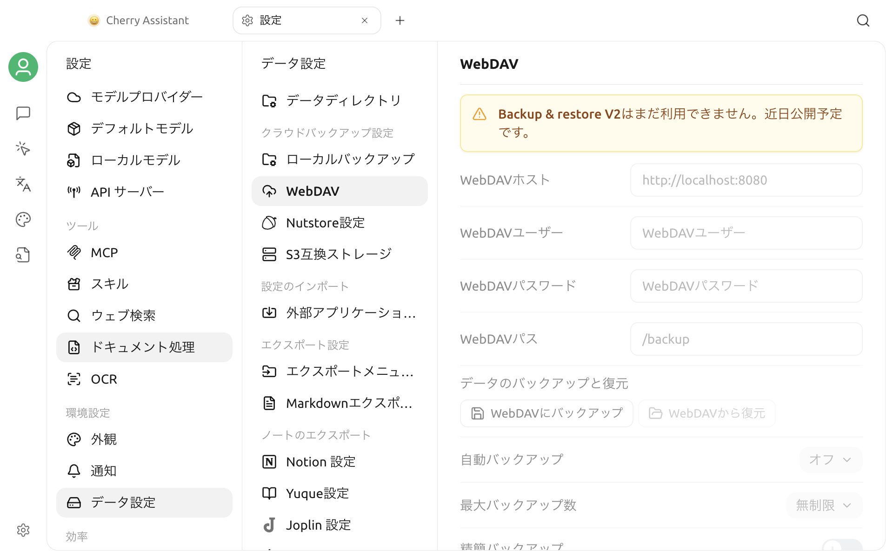

# WebDAV バックアップ

現在のバージョンでは **設定 > データ設定 > WebDAV** からページを開けますが、画面には **「Backup & Restore V2 はまだ利用できません。近日公開予定です。」** と表示されます。


現在のバージョンでは、このページから WebDAV バックアップを作成、復元、自動管理できません。表示されている設定項目は、機能が利用可能であることを意味しません。


## 現在のページに表示される項目

ページには、次の設定と操作が用意されています。

- WebDAV ホスト、ユーザー、パスワード、パス
- WebDAV へのバックアップと WebDAV からの復元
- 自動バックアップの間隔と最大バックアップ数
- 簡易バックアップのオプション

これらの入力欄、ボタン、スイッチは現在利用できません。ページを開いても WebDAV 接続は確立されず、サーバーアドレスや認証情報の確認にも使用できません。

## 利用上の注意

- 現在はこのページに実際の WebDAV 認証情報を入力せず、重要なデータの保護にも使用しないでください。
- 旧バージョンの画面や古い手順に基づいて、バックアップ、復元、自動バックアップを実行しないでください。
- 今後のバージョンで機能が有効になった後は、アプリの有効状態、リリースノート、このページの最新版を確認してください。
