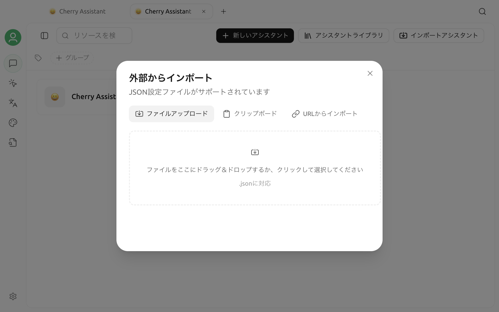

# アシスタントの購読とインポート


現在の Cherry Studio V2 コミュニティ版には、永続的な「アシスタント購読」やリモートテンプレートの自動更新機能はありません。旧ガイドの購読 URL は継続的に同期されません。現在利用できる代替機能は、1 回限りの **インポートアシスタント**です。


インポートすると、JSON 内のアシスタントがローカルのアシスタント一覧へコピーされます。その後リモート JSON が変更されても、インポート済みのアシスタントは自動更新されません。

## インポートアシスタントを開く

1. サイドバーまたは起動台から **チャット**を開きます。
2. アシスタントとトピック一覧のその他メニューを開き、**アシスタントを管理**を選択します。
3. 管理画面の上部にある **インポートアシスタント**をクリックします。
4. **外部からインポート**ダイアログで次のいずれかを選びます。
   - **ファイルアップロード：** ローカルの `.json` ファイルを選択します。
   - **クリップボード：** JSON を貼り付けます。
   - **URLからインポート：** 対応する Raw GitHub または Raw Gist URL から JSON を取得します。



URL インポートは 1 回限りのダウンロードで、購読として保存されません。現在受け付けるのは `raw.githubusercontent.com` と `gist.githubusercontent.com` の HTTP(S) URL だけです。GitHub のファイルプレビューページ、通常の Gist ページ、その他のウェブサイトの URL は拒否されます。

## JSON 形式

単一のオブジェクトまたはオブジェクトの配列をインポートできます。各アシスタントには少なくとも `name` と `prompt` が必要です。

```json
{
  "name": "ドキュメントレビューアシスタント",
  "emoji": "📝",
  "description": "構成、用語、実行可能性を確認します",
  "prompt": "製品ドキュメントをレビューし、具体的で実行可能な改善案を提示してください。",
  "group": ["執筆"]
}
```

`emoji`、`description`、`group` は省略できます。インポートデータにモデル情報がない場合、Cherry Studio は現在のデフォルト会話モデルを使用します。ファイル、クリップボードの内容、URL のレスポンスは 5 MB 以下である必要があります。

## インポート済みアシスタントを更新する

リモートの内容が更新された場合は、もう一度インポートします。再インポートしてもローカルのアシスタントがリモートの内容へ継続的に関連付けられることはなく、別のローカルコピーが作成される場合があります。インポート後に管理画面で名前、グループ、プロンプトを確認し、必要に応じて古いコピーを削除してください。

チームでテンプレートを配布する場合は、バージョン管理できる JSON ファイルを用意し、ファイル名またはアシスタントの説明にバージョンを記載してください。旧バージョンの購読動作には依存しないでください。

## セキュリティ上の注意

- 信頼できる提供元からのみインポートし、完全なプロンプトを事前に確認します。
- API Key、Token、内部アドレス、個人情報をアシスタント JSON に含めないでください。
- インポート後にデフォルトモデル、ナレッジベース、ツール、MCP の設定を確認してから、機密データを扱います。
- URL インポートに失敗する場合は、Raw コンテンツの URL であること、レスポンスが JSON であること、サイズ制限内であることを確認します。

アシスタントの作成と管理については[アシスタントライブラリ](../cherrystudio/preview/agents.md)を参照してください。インポートできない場合は、[フィードバックと提案](../question-contact/suggestions.md)から Cherry Studio のバージョン、インポート方法、伏字にしたサンプル、エラー内容を送信してください。
