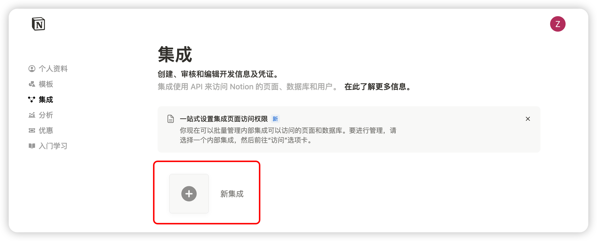
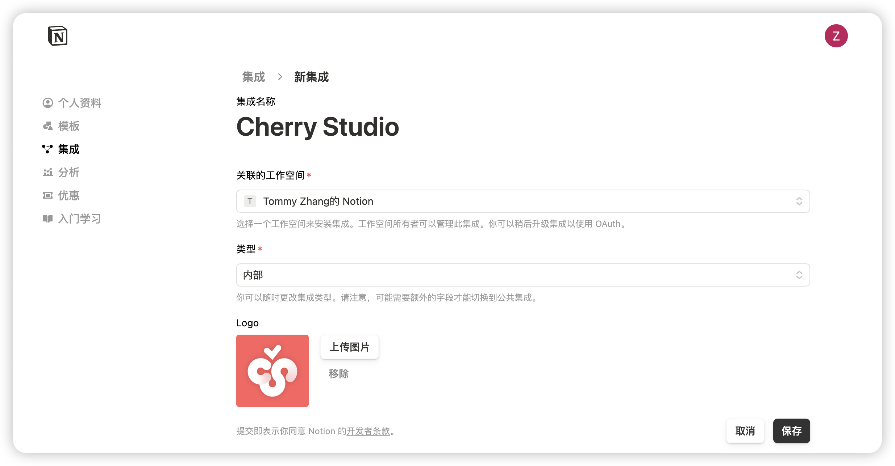

# Notion 設定チュートリアル


このドキュメントはAIによって中国語から翻訳されており、まだレビューされていません。


Cherry Studio はトピックを Notion のデータベースにインインポートする機能をサポートしています。

## ステップ 1

[Notion Integrations](https://www.notion.so/profile/integrations) を開いてアプリケーションを作成します

<figure><figcaption>
プラス記号をクリックしてアプリケーションを作成
</figcaption></figure>

## ステップ 2

アプリケーションを作成します

<figure><figcaption>
アプリケーション情報を入力
</figcaption></figure>

名前：Cherry Studio  
タイプ：最初のオプションを選択  
アイコン：この画像を保存してください

<figure><figcaption></figcaption></figure>

## ステップ 3

シークレットキーをコピーして Cherry Studio の設定に貼り付けます

<figure><figcaption>
シークレットキーをコピー
</figcaption></figure>

<figure><figcaption>
シークレットキーをデータ設定に入力
</figcaption></figure>

## ステップ 4

[Notion](https://www.notion.so/) で新しいページを作成し、下部でデータベースタイプを選択。名前を Cherry Studio と入力し、図のように接続します

<figure><figcaption>
新しいページを作成しデータベースタイプを選択
</figcaption></figure>

<figure><figcaption>
ページ名を入力し、APP に接続を選択
</figcaption></figure>

## ステップ 5

<figure><figcaption>
データベース ID をコピー
</figcaption></figure>

Notion データベースの URL が以下の形式の場合：  
https://www.notion.so/\<long\_hash\_1>?v=\<long\_hash\_2>

Notion データベース ID は `<long_hash_1>` の部分です

<figure><figcaption>
データベース ID を入力し「チェック」をクリック
</figcaption></figure>

## ステップ 6

`ページタイトルフィールド名` を入力：  
・英語インターフェースの場合は `Name`  
・中国語インターフェースの場合は `名称`

<figure><figcaption>
ページタイトルフィールド名を入力
</figcaption></figure>

## ステップ 7

おめでとうございます！Notion の設定が完了しました ✅ これで Cherry Studio のコンテンツを Notion データベースにエクスポートできます

<figure><figcaption>
Notion にエクスポート
</figcaption></figure>

<figure><figcaption>
エクスポート結果を確認
</figcaption></figure>