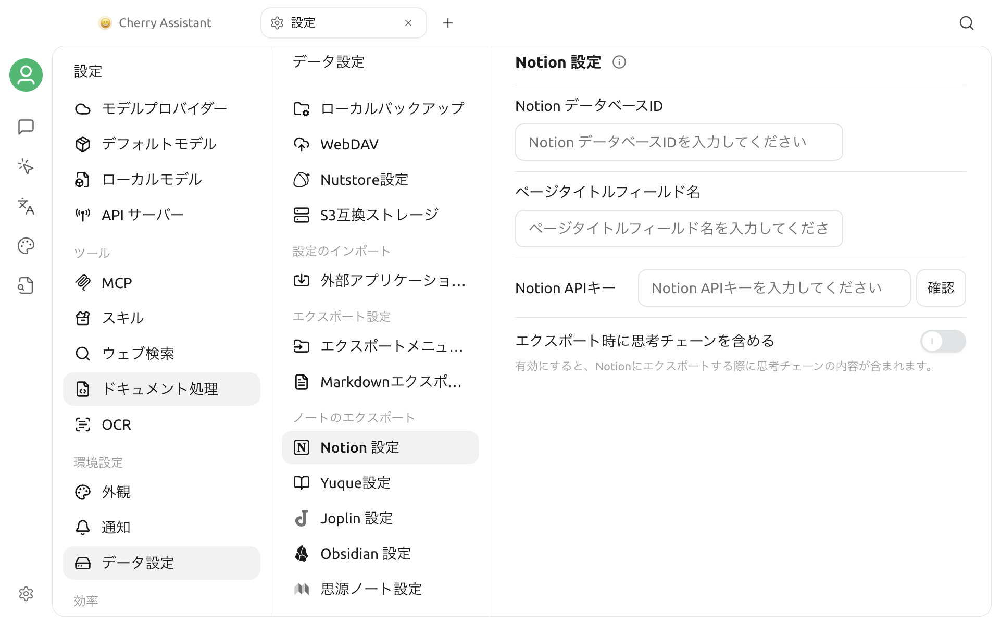

# Notion の設定とエクスポート

Cherry Studio V2 は、トピックまたは単一メッセージを Notion データベースへエクスポートできます。エクスポートするたびに対象データベースへ新しいページが作成され、変換された内容がページ本文へ書き込まれます。

設定画面は **設定 > データ設定 > Notion 設定**にあります。**設定 > データ設定 > エクスポートメニュー設定**は「Notion にエクスポート」項目の表示だけを制御し、接続情報の入力には使用しません。


Notion Token は接続のアクセス認証情報です。スクリーンショット、フィードバック、共有設定に Token 全文を表示したり、公開ページへ書き込んだりしないでください。


## 設定手順の概要

接続には次の 4 項目が必要です。

1. Notion で Workspace の内部インテグレーションを作成する。
2. 対象データベースを作成し、そのインテグレーションへ共有する。
3. データベース ID とタイトルプロパティ名を取得する。
4. Cherry Studio に 3 つのパラメーターを入力し、検出を実行する。

## Notion の内部インテグレーションを作成する

1. [Notion Integrations](https://www.notion.so/profile/integrations)を開きます。
2. 新しい内部インテグレーションを作成します。
3. エクスポート先の Workspace を選択します。
4. `Cherry Studio` など、識別しやすい名前を設定します。
5. 少なくともコンテンツの読み取りと挿入を許可します。
6. 保存後、内部インテグレーション Token をコピーします。

内部インテグレーションは選択した Workspace だけに属します。対象データベースが別の Workspace にある場合は、そこで利用可能なインテグレーションを別途作成またはインストールします。

Notion の画面や用語は変更される場合があります。作成入口が異なる場合は、[Notion 公式の内部インテグレーションガイド](https://developers.notion.com/guides/get-started/internal-connections)を参照してください。

## 対象データベースを作成する

Cherry Studio のエクスポートページを受け取るデータベースを Notion で作成します。テーブル、リスト、ボードなど、どのビューでもかまいませんが、リンクビューや通常のページではなく、基盤がデータベースである必要があります。

データベースには少なくとも 1 つの **Title** 型プロパティが必要です。新しいデータベースには通常、`Name` というタイトル列があり、「タイトル」「名前」などに変更できます。


Cherry Studio の「ページタイトルフィールド名」は、Notion の表示言語ではなく、実際のプロパティ名で決まります。日本語画面でも `Name` の場合があり、英語画面でも別の名前へ変更できます。


## データベースをインテグレーションへ共有する

Token を作成しただけでは、任意のページへアクセスできません。対象データベースのアクセス権をインテグレーションへ付与します。

1. 対象データベースの元ページを開きます。
2. 右上のページメニューまたは共有設定を開きます。
3. **Connections / 接続を追加**を選びます。
4. 作成した内部インテグレーションを検索して選択します。
5. データベースの接続一覧に表示されることを確認します。

Notion Developer Portal のインテグレーションにある **Content access** から対象ページを追加することもできます。どちらの方法でも、元データへアクセスできないリンクビューだけではなく、データベース自体を許可してください。

Notion の公式説明では、インテグレーションへ共有されていないデータベースに対して、API は「権限がない」ではなく 404 を返すことがあります。

## データベース ID を取得する

対象データベースをブラウザーで開き、リンクをコピーします。例：

```text
https://www.notion.so/workspace/Tasks-0123456789abcdef0123456789abcdef?v=...
```

データベース ID は `?` より前にある 32 桁の識別子です。

```text
0123456789abcdef0123456789abcdef
```

ハイフン付きの UUID として表示される場合もあります。次はコピーしないでください。

- `v=` の後にあるビュー ID
- Web ページの URL 全文
- 通常の親ページの ID
- リンクデータベースビューに含まれる、元データベース以外の識別子

リンクにタイトルのプレフィックスがある場合は、最後の部分に含まれる 32 桁の ID を取得します。判断できない場合は、データベースをフルページで開いてからリンクを再度コピーしてください。

## ページタイトルフィールド名を取得する

対象データベースのプロパティで **Title** 型の列を確認し、名前をそのままコピーします。

例：

| Notion での実際のプロパティ名 | Cherry Studio への入力値 |
| --- | --- |
| `Name` | `Name` |
| `名称` | `名称` |
| `Title` | `Title` |
| `对话标题` | `对话标题` |

名前では文字、空白、大文字と小文字が区別されます。データベース名、ページ名、通常のテキストプロパティを入力しないでください。

## Cherry Studio で接続する

**設定 > データ設定 > Notion 設定**を開きます。



順番に入力します。

1. **Notion データベース ID**
2. **ページタイトルフィールド名**
3. **Notion APIキー**

**Notion APIキー**入力欄の横にある**確認**をクリックします。成功すると次を確認できます。

- Token が有効
- Cherry Studio が Token で対象データベースを読み取れる
- Database ID のデータベースがインテグレーションへ共有されている

検出では「ページタイトルフィールド名」の正しさを確認せず、テストページも作成しません。成功後も実際のエクスポートを 1 回実行してください。

## 思考内容をエクスポートするか選ぶ

**エクスポート時に思考チェーンを含める**を有効にすると、利用可能な場合にメッセージ内の思考または推論内容も Notion へ書き込まれます。

無効にすると通常の回答だけをエクスポートします。次の場合は無効のままにすることを推奨します。

- エクスポートを顧客へ共有、または公開する
- 思考内容に下書き、内部情報、表示したくない中間過程が含まれる
- 最終回答だけを保存したい

この設定で、モデルが元から持っていない思考内容が生成されることはありません。

## Notion エクスポートメニューを有効にする

チャットメニューに「Notion にエクスポート」がない場合：

1. **設定 > データ設定 > エクスポートメニュー設定**を開きます。
2. **Notion にエクスポート**を有効にします。
3. チャットへ戻り、トピックまたはメッセージのエクスポートメニューを再度開きます。

この設定はメニュー表示だけを制御し、Token、権限、データベース設定の問題は修復しません。

## 最初のエクスポートを実行する

まず機密情報を含まない短いチャットでテストしてください。

1. トピックまたは単一メッセージのメニューを開きます。
2. **Notion にエクスポート**を選択します。
3. 「Notion へのエクスポートに成功しました」と表示されるまで待ちます。
4. 対象データベースを開きます。
5. 新しいページのタイトル、段落、コードブロック、リスト、数式が想定どおりか確認します。

Cherry Studio はトピックまたはメッセージのタイトルからデータベースページを作成します。タイトルが 32 文字を超えると短縮され、省略記号が追加されます。

Notion エクスポートは Cherry Studio の Markdown 変換処理を使用します。**設定 > データ設定 > Markdown エクスポート**の数式記号、モデル情報、引用処理など、一部の設定も結果へ影響する場合があります。

## 権限とデータの境界

- Cherry Studio は Token で Notion API を直接呼び出し、ブラウザーで Notion へログインする必要はありません。
- インテグレーションは、明示的に許可されたページとデータベースだけへアクセスできます。
- エクスポートでは対象データベースへ新しいページと本文ブロックを追加し、同名ページを統合または上書きしません。
- Cherry Studio でチャットを削除しても、Notion へエクスポート済みのページは自動削除されません。
- Notion で権限を取り消す、または Token を削除すると、以降のエクスポートは失敗しますが、既存ページは残ります。

## よくある質問

### API Key または Database ID が未設定と表示される

Notion シークレットとデータベース ID が空でないことを確認します。データベース URL 全文を ID 入力欄へ貼り付けないでください。

### 401 または Token が無効と表示される

Token が不完全、取り消し済み、または別の Workspace 用である可能性があります。Notion Integrations で状態を確認し、Token を再度コピーしてください。

### 403 が返る

インテグレーションにコンテンツの読み取りと挿入権限があることを確認します。検出にはデータベースの読み取り、実際のエクスポートにはページ作成と内容追加が必要です。

### ブラウザーでは開けるデータベースに 404 が返る

通常、データベースがインテグレーションへ共有されていないか、ビュー ID または通常ページ ID が入力されています。対象データベースを Connections へ追加し、データベース ID をコピーし直してください。

### 検出は成功するがエクスポートできない

最も多い原因は**ページタイトルフィールド名**の不一致です。対象データベースの Title 型プロパティ名であり、データベースのタイトルではないことを確認します。インテグレーションにコンテンツ挿入権限があることも確認してください。

### ページは作成されたが本文がない、または形式が不正

エクスポート処理が完全に終了するまで待ち、Notion を更新します。複雑な Markdown、入れ子の内容、Notion API の制限で一部ブロックが影響を受ける場合があります。短いテキストでテストし、Cherry Studio の Markdown エクスポート設定を確認してください。

### チャットメニューに Notion がない

**設定 > データ設定 > エクスポートメニュー設定**で**Notion にエクスポート**を有効にします。すでに有効な場合は、現在のチャットへ入り直してメニューを確認してください。

解決しない場合は、[フィードバックと提案](../question-contact/suggestions.md)から Cherry Studio のバージョン、Notion のステータスコード、匿名化した Database ID、タイトルフィールド名、エラー全文を送信してください。
