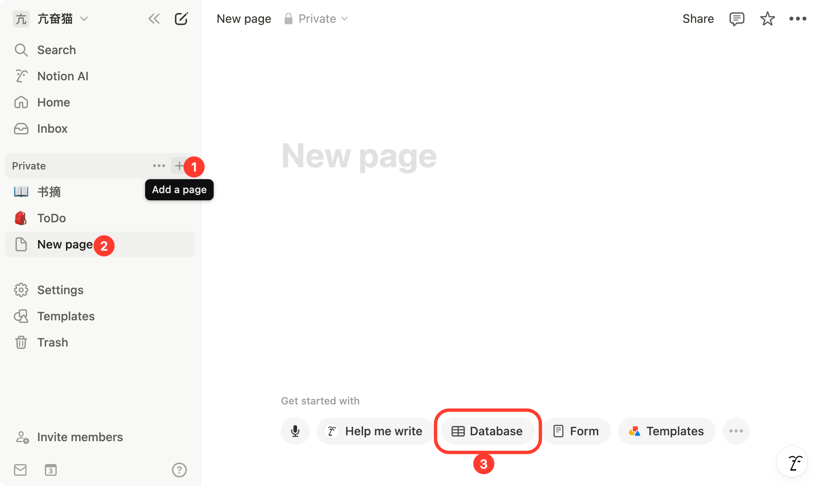


このドキュメントはAIによって中国語から翻訳されており、まだレビューされていません。


# Notion 設定チュートリアル

Cherry Studio はトピックをNotionデータベースにインポートする機能をサポートしています。

## ステップ1

ウェブサイト [Notion Integrations](https://www.notion.so/profile/integrations) を開き、インテグレーションを作成します

<figure><figcaption>
プラス記号をクリックしてインテグレーションを作成
</figcaption></figure>

## ステップ2

インテグレーションを作成します

<figure><figcaption>
アプリケーション情報を入力
</figcaption></figure>

名前: Cherry Studio  
タイプ: 最初のオプションを選択  
アイコン: この画像を保存してください  

<figure><figcaption></figcaption></figure>

## ステップ3

シークレットキーをコピーしてCherry Studioの設定に貼り付けます

<figure><figcaption>
シークレットキーをコピー
</figcaption></figure>

<figure><figcaption>
シークレットキーをデータ設定に入力
</figcaption></figure>

## ステップ4

[Notion](https://www.notion.so/) で新しいページを作成し、下部からデータベースタイプを選択します。名称に「Cherry Studio」と入力し、図の手順に従って接続してください

<figure><figcaption>
新規ページを作成しデータベースタイプを選択
</figcaption></figure>

<figure><figcaption>
ページ名を入力しアプリに接続
</figcaption></figure>

## ステップ5

<figure><figcaption>
データベースIDをコピー
</figcaption></figure>

NotionデータベースのURLが以下の形式の場合:

https://www.notion.so/\<long_hash_1>?v=\<long_hash_2>

NotionデータベースIDは `<long_hash_1>` の部分です

<figure><figcaption>
データベースIDを入力してチェックをクリック
</figcaption></figure>

## ステップ6

`ページタイトルフィールド名` を入力:

ウェブサイトが英語表示の場合: `Name`  
ウェブサイトが中国語表示の場合: `名称`

<figure><figcaption>
ページタイトルフィールド名を入力
</figcaption></figure>

## ステップ7

おめでとうございます！Notionの設定が完了しました ✅ Cherry StudioのコンテンツをNotionデータベースにエクスポートできます

<figure><figcaption>
Notionにエクスポート
</figcaption></figure>

<figure><figcaption>
エクスポート結果を確認
</figcaption></figure>