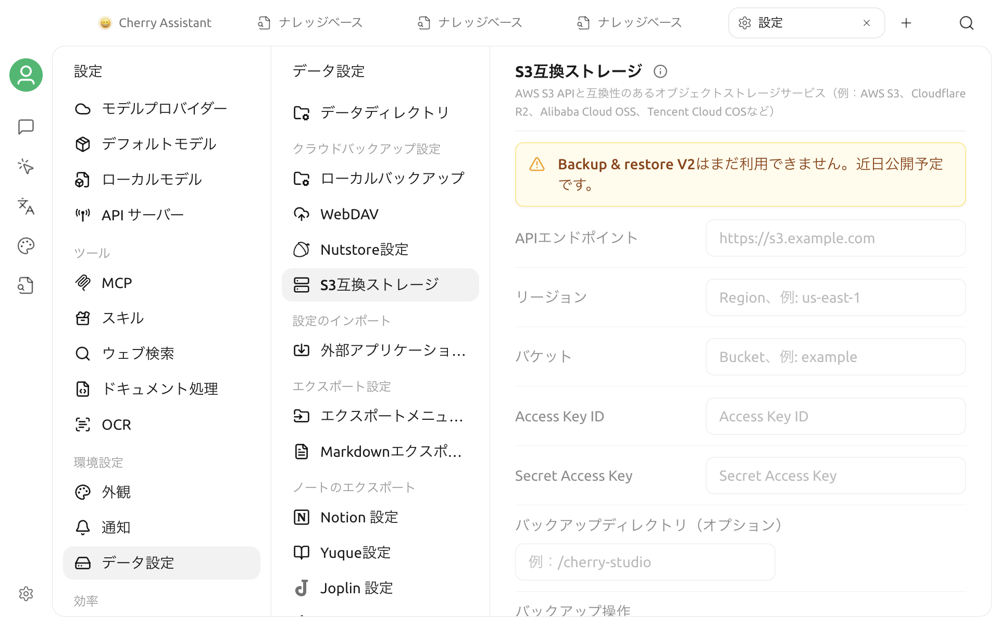

# S3 互換ストレージバックアップ

現在のバージョンでは **設定 > データ > S3 ストレージ** を開けますが、画面には **「Backup & Restore V2 はまだ利用できません」** と明記されています。


現在のバージョンでは、この画面から S3 バックアップの作成、復元、自動管理はできません。設定項目が表示されていても、機能が利用可能という意味ではありません。


## 現在表示される項目

画面には、次の設定と操作が用意されています。

- API エンドポイント、リージョン、バケット
- Access Key ID と Secret Access Key
- 任意のバックアップディレクトリ
- **今すぐバックアップ**と**バックアップを管理**
- 自動同期、最大バックアップ数、スリムバックアップ

これらの入力欄、ボタン、スイッチは現在無効です。画面を開いても S3 接続は確立されず、エンドポイント、バケット、認証情報の検証にも使えません。

## 利用上の注意

- 現在は実際のオブジェクトストレージ認証情報を入力せず、重要なデータの保護をこの画面に依存しないでください。
- 旧バージョンの画面やガイドをもとに、バックアップ、復元、自動同期、バックアップ削除を実行しないでください。
- オブジェクトストレージに既にあるファイルが、この未提供画面から読み取り、変更、削除されることはありません。
- 機能が提供された後は、アプリで有効になった操作、リリースノート、本ページの最新版を確認してください。
