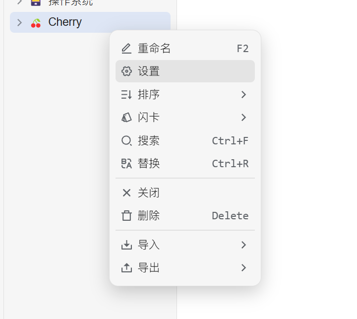


このドキュメントはAIによって中国語から翻訳されており、まだレビューされていません。


# 思源ノート設定チュートリアル

トピックやメッセージを思源ノートにエクスポートする方法を説明します。

## ステップ 1

思源ノートを開き、新しいノートブックを作成します

<figure><figcaption>
新しいノートブックをクリック
</figcaption></figure>

## ステップ 2

ノートブックの設定を開き、「ノートブックID」をコピーします

<figure><figcaption>
ノートブック設定を開く
</figcaption></figure>

<figure><figcaption>
ノートブックIDコピーボタンをクリック
</figcaption></figure>

## ステップ 3

コピーしたノートブックIDを Cherry Studio の設定に貼り付けます

<figure><figcaption>
データ設定にノートブックIDを入力
</figcaption></figure>

## ステップ 4

思源ノートのアドレスを入力します

* **ローカル**\
  通常は `http://127.0.0.1:6806`
* **自己ホスト型**\
  あなたのドメイン `http://note.domain.com`

<figure><figcaption>
思源ノートのアドレスを入力
</figcaption></figure>

## ステップ 5

思源ノートの `API トークン` をコピーします

<figure><figcaption>
思源ノートトークンをコピー
</figcaption></figure>

Cherry Studio の設定に貼り付け、接続を確認します

<figure><figcaption>
データベースIDを入力しチェックをクリック
</figcaption></figure>

## ステップ 6

設定が完了しました ✅ Cherry Studio のコンテンツを思源ノートにエクスポートできるようになります

<figure><figcaption>
思源ノートにエクスポート
</figcaption></figure>

<figure><figcaption>
エクスポート結果を確認
</figcaption></figure>