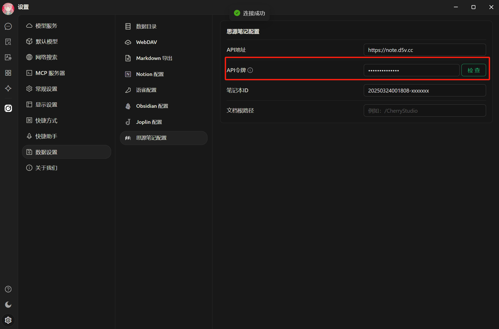
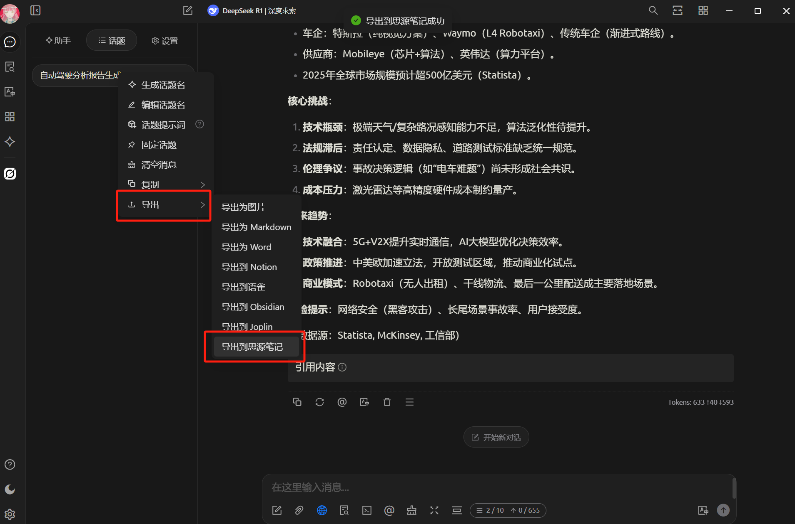


このドキュメントはAIによって中国語から翻訳されており、まだレビューされていません。


# 思源ノート設定チュートリアル

トピックやメッセージを思源ノートにエクスポートすることができます。

## ステップ1

思源ノートを開き、新しいノートブックを作成します

<figure><figcaption>
新規ノートブックを作成をクリック
</figcaption></figure>

## ステップ2

ノートブックの設定を開き、`ノートブックID`をコピーします

<figure><figcaption>
ノートブック設定を開く
</figcaption></figure>

<figure><figcaption>
ノートブックIDをコピーボタンをクリック
</figcaption></figure>

## ステップ3

コピーしたノートブックIDを Cherry Studio の設定に貼り付けます

<figure><figcaption>
ノートブックIDをデータ設定に記入
</figcaption></figure>

## ステップ4

思源ノートのアドレスを入力します

* **ローカル環境**\
  通常は `http://127.0.0.1:6806`
* **自己ホスティング**\
  あなたのドメイン `http://note.domain.com`

<figure><figcaption>
あなたの思源ノートアドレスを入力してください
</figcaption></figure>

## ステップ5

思源ノートの `APIトークン` をコピーします

<figure><figcaption>
思源ノートのトークンをコピー
</figcaption></figure>

Cherry Studio の設定に貼り付けて確認します

<figure><figcaption>
データベースIDを記入してチェックをクリック
</figcaption></figure>

## ステップ6

おめでとうございます。思源ノートの設定が完了しました ✅ これでCherry Studioの内容をあなたの思源ノートにエクスポートすることができます

<figure><figcaption>
思源ノートにエクスポート
</figcaption></figure>

<figure><figcaption>
エクスポート結果を確認
</figcaption></figure>