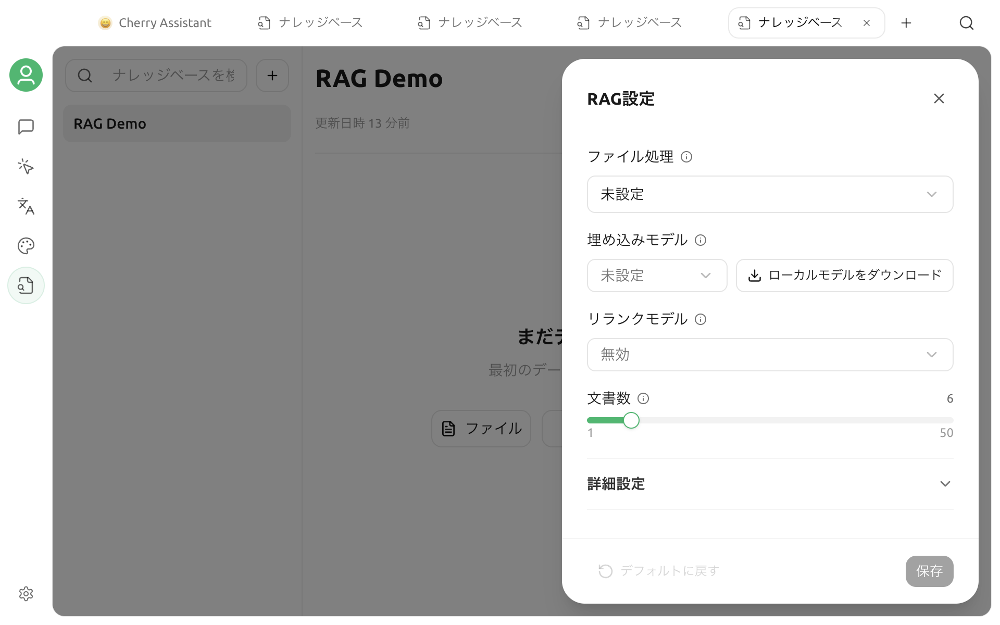

# Embedding モデル

Embedding モデルはテキストをベクトルへ変換し、意味に基づいて関連資料を検索できるようにします。担当するのは検索であり、最終回答の生成ではありません。チャット、Embedding、Rerank はそれぞれ別のモデル能力です。

## 新しいナレッジベースのデフォルト動作

新規作成ダイアログで入力するのは名前と、任意のグループだけです。この画面では Embedding モデルを選択しません。

- ローカル Embedding モデルが未ダウンロードの場合、ナレッジベースは **BM25** モードで作成されます。BM25 はキーワードで検索し、ベクトルを生成せず、Embedding API も呼び出しません。
- ローカル Embedding モデルがすでにダウンロード済みの場合、新しいナレッジベースはそのモデルと固定の次元数を自動的に使用し、最初からベクトルインデックスを作成します。

したがって、Embedding モデルがなくても資料の追加と検索は可能です。意味検索が必要になった時点で、ナレッジベース設定から有効にできます。

## 意味検索を有効にする

対象のナレッジベースを開き、右上の**設定**をクリックして、**Embedding モデル**で次のいずれかを選択します。

### ローカルモデルを使用する

**ローカルモデルをダウンロード**をクリックします。ダウンロードが完了すると、Cherry Studio は内蔵のローカル Embedding モデルを自動的に選択して保存し、既存資料のベクトルを補完します。

ローカルモデルでは、資料の断片を外部の Embedding サービスへ送信する必要がありません。初回のダウンロードとインデックス作成には、時間、メモリ、ディスク容量が必要です。現在のプラットフォームがローカル実行に対応していない場合、ダウンロードボタンは表示されません。

### 設定済みのモデルプロバイダーを使用する

有効で **Embedding** 能力を持つモデルを一覧から選ぶこともできます。対象モデルが表示されない場合は、**設定 → モデルサービス**でプロバイダーを設定し、モデル能力が Embedding として登録されていることを確認してください。

保存時に Cherry Studio は短いテスト文字列を送信し、実際のベクトル次元数を取得します。API アドレス、キー、モデル ID、ネットワークのいずれかが利用できない場合、保存は失敗します。推測した次元数が使われることはありません。


DeepSeek、Kimi、GLM、GPT、Claude などの名称だけでは、Embedding 対応かどうかは判断できません。選択できるかどうかはブランドではなく、個々のモデル能力で決まります。


## 既存資料の処理

モデルを変更すると、ナレッジベースの状態に応じて安全な処理が選ばれます。

| 現在の状態 | 処理 |
| --- | --- |
| BM25 のナレッジベースで初めて Embedding を有効にする | 同じナレッジベース内でベクトルを補完。再作成は不要 |
| 空のナレッジベースで Embedding モデルを変更する | 新しい設定を直接保存 |
| ベクトルと資料がある状態で Embedding モデルを変更する | 新旧ベクトルの混在を防ぐため、復元／再構築フローを開始 |

有効化または再構築中は、アプリを終了したり元資料を移動したりしないでください。資料が多いほど処理時間が長くなり、オンラインモデルでは費用も増える場合があります。

## モデルの選び方

次の要素を比較してください。

- **言語対応**：実際の中国語、英語、日本語、ロシア語などの資料で検索精度を試します。
- **プライバシー**：オンラインモデルには資料の断片と検索文が送信されます。機密資料ではローカルモデルを検討します。
- **速度と費用**：初回のインデックス作成、再インデックス、検索でオンライン Embedding API が呼ばれる場合があります。
- **安定性**：モデル ID、出力次元数、API の動作が安定していることを確認します。

ランキングやモデル名だけで決めず、同じ資料と固定した質問を使って、正しい断片が上位に表示されるか比較してください。

## トラブルシューティング

### Embedding モデルの一覧が空

プロバイダーが有効で、モデルが追加済みであり、能力に **Embedding** が含まれていることを確認してください。通常のチャットモデルと Rerank モデルは一覧に表示されません。

### 保存時に次元数の取得が失敗する

プロバイダーの状態、API アドレス、キー、モデル ID、ネットワーク、残高を順に確認してください。保存時には実際の Embedding リクエストが 1 回送信されます。

### BM25 だけを使う場合の制限

BM25 は正確なキーワード、製品名、番号に向いていますが、言い換えや自然な表現の検索は意味検索より弱い傾向があります。まず BM25 で資料の品質を確認し、その後 Embedding モデルを有効にするか判断できます。

### API キーの変更には再構築が必要か

同じモデルと次元数を引き続き使用する場合、通常は不要です。プロバイダーが別のモデルバージョンへルーティングする場合は、検索テストをやり直してください。

詳しいデータフローとローカルファイルの保存場所は、[ナレッジベースのデータ](data.md)を参照してください。

***

### ヘルプとフィードバック

モデルの検出、ダウンロード、インデックス作成で問題が発生した場合は、[フィードバックと提案](../question-contact/suggestions.md)からコミュニティへお問い合わせください。
