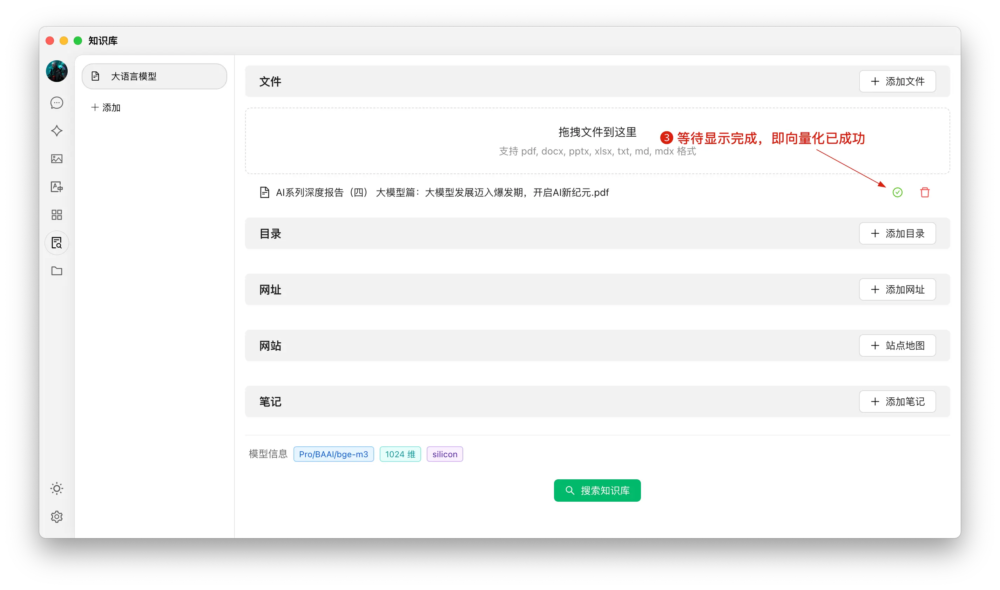


このドキュメントはAIによって中国語から翻訳されており、まだレビューされていません。


# ナレッジベースチュートリアル

バージョン0.9.1で、CherryStudioは待望のナレッジベース機能を提供しました。

以下では、ステップごとにCherryStudioの詳細な使用説明を紹介します。

## 埋め込みモデルの追加

1. モデル管理サービスで「埋め込みモデル」をクリックして迅速にフィルタリングし、必要なモデルを検索します；
2. 必要なモデルを見つけたら、「マイモデル」に追加します。

<figure><figcaption></figcaption></figure>

## ナレッジベースの作成

1. ナレッジベースのエントリー：CherryStudioの左側ツールバーでナレッジベースアイコンをクリックし、管理ページに進みます；
2. ナレッジベースの追加：「追加」をクリックしてナレッジベースの作成を開始します；
3. 命名：ナレッジベースの名前を入力し、bge-m3などの埋め込みモデルを追加すると作成が完了します。

<figure><figcaption></figcaption></figure>

<figure><figcaption></figcaption></figure>

## ファイルの追加とベクトル化

1. ファイルの追加：ファイル追加ボタンをクリックしてファイル選択画面を開きます；
2. ファイルの選択：pdf、docx、pptx、xlsx、txt、md、mdxなどのサポート形式を選択し、開きます；
3. ベクトル化：システムが自動的にベクトル化処理を行い、完了マーク（緑の✓）が表示されたらベクトル化が終了しています。

<figure><figcaption></figcaption></figure>

<figure><figcaption></figcaption></figure>

<figure><figcaption></figcaption></figure>

## 多様なソースからのデータ追加

CherryStudioは複数のデータ追加方法をサポートしています：

1. フォルダーディレクトリ：サポート形式のファイルを含むフォルダー全体を追加でき、自動的にベクトル化されます；
2. URLリンク：https://docs.siliconflow.cn/introduction などのウェブURLをサポート；
3. サイトマップ：https://docs.siliconflow.cn/sitemap.xml などのXML形式サイトマップをサポート；
4. プレーンテキストノート：カスタムコンテンツのプレーンテキスト入力をサポート。


ヒント：

1. ナレッジベースにインポートするドキュメント内のイラストはベクトル変換を一時的にサポートしておらず、手動でテキストに変換する必要があります；
2. ウェブサイトをナレッジソースとして使用する場合、必ずしも成功するとは限りません。一部のサイトには厳しいクローリング防止対策（ログインや認証が必要な場合など）があるため、正確なコンテンツが取得できない可能性があります。作成後にまず検索テストを行うことをお勧めします；
3. 一般的なウェブサイトはサイトマップを提供しており、CherryStudioの[サイトマップ](https://docs.cherry-ai.com/sitemap-pages.xml)のように、通常はルートアドレス（URL）に /sitemap.xml を追加することで情報を取得できます（例: `aaa.com/sitemap.xml`）；
4. サイトマップが提供されていない場合やURLが複雑な場合は、サイトマップXMLファイルを手動で作成できます。ファイルは公的にアクセス可能な直リンクで入力する必要があり、ローカルファイルリンクは認識されません。

> 1) AIにサイトマップファイルを生成させるか、サイトマップHTML生成ツールを作成させる；
> 2) 直リンクはOSS直リンクやオンラインストレージ直リンクなどを使用して生成できます。既存のツールがない場合は、[ocoolAI](https://one.ocoolai.com/login)公式サイトにログインし、トップバーの無料ファイルアップロードツールを使用して直リンクを生成できます。


## ナレッジベースの検索

ファイルのベクトル化が完了すると、クエリを実行できます：

1. ページ下部の「ナレッジベースを検索」ボタンをクリック；
2. 検索内容を入力；
3. 検索結果を表示；
4. 各結果のマッチングスコアを表示。

<figure><figcaption></figcaption></figure>

<figure><figcaption></figcaption></figure>

## 会話でのナレッジベース参照による回答生成

1. 新規トピックを作成し、会話ツールバーで「ナレッジベース」をクリック。作成済みナレッジベースリストが展開されるので、参照したいナレッジベースを選択；
2. 質問を入力して送信すると、モデルが検索結果に基づいた回答を返信；
3. 同時に、参照元データが回答の下に表示され、ソースファイルをすぐに確認できます。

<figure><figcaption></figcaption></figure>

<figure><figcaption></figcaption></figure>