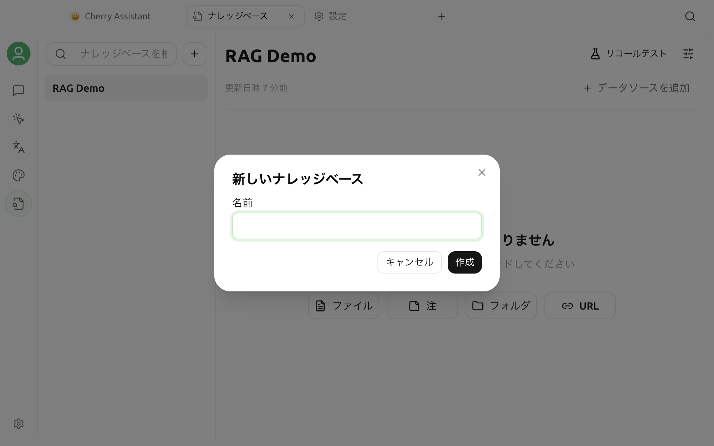

# ナレッジベースチュートリアル

ナレッジベースは、ローカルドキュメントやウェブページを検索可能なリポジトリに整理します。チャット中に、Cherry Studioはまず質問に関連する箇所を見つけ出し、その箇所を現在のモデルに送信して回答を生成させます。

ナレッジベースはモデルの学習や変更は行いません。繰り返しクエリを行う情報、チャット間で再利用したい情報、またはボリュームが大きすぎてすべてのメッセージに添付するのが不便な情報に役立ちます。

このページでは、完全なワークフロー（**ナレッジベースの作成 → 検索設定の確認 → ソースの追加 → 検索テスト → チャットでの利用**）を順を追って説明します。


簡単な概要については、[ナレッジベースの概要](../cherrystudio/preview/knowledge-base.md)から始めることができます。モデルの選択、データストレージ、ドキュメント解析については、それぞれ[埋め込みモデル](emb-models-info.md)、[ナレッジベースデータ](data.md)、[ドキュメント前処理](zhi-shi-ku-wen-dang-yu-chu-li.md)を参照してください。


## はじめに

ナレッジベースを作成する前に埋め込みモデルを設定する必要はありません。埋め込みモデルがない場合、ナレッジベースは BM25 キーワード検索で作成されます。ローカル埋め込みモデルがダウンロード済みの場合は、新しいナレッジベースにそのモデルと次元が自動設定されます。

ベクトル検索またはハイブリッド検索を使用する場合は、**設定 → モデルプロバイダー**で埋め込みモデルを準備し、次を確認してください。

* モデルリストに追加され、有効になっている
* 機能タイプに埋め込みが含まれている
* 正常に機能するAPIエンドポイント、APIキー、およびネットワーク接続がある

通常のチャットモデルを埋め込みモデルの代わりにはできません。利用可能なモデルはプロバイダーの更新により変わるため、このガイドでは特定のオンラインモデルを指定していません。[埋め込みモデル](emb-models-info.md)で選択方法と一般的なオプションを確認してください。

## ナレッジベースの作成

1. 上部のバーから起動台を開き、アプリリストから**ナレッジベース**を選択します。
2. 左側のナビゲーションエリアにある追加ボタンをクリックし、**ナレッジベースの作成**を選択します。
3. 認識しやすい名前を入力します。
4. グループを作成している場合は、このナレッジベースをいずれかのグループに割り当てることができます。

作成ウィンドウには埋め込みモデルの選択項目はありません。ローカル埋め込みモデルがダウンロード済みなら、Cherry Studio が新しいナレッジベースに自動設定します。未ダウンロードの場合は BM25 モードで作成されます。作成後、画面上部の **RAG 設定**で埋め込みモデルと次元を確認または変更できます。


埋め込みモデルと次元がベクトルインデックス形式を決定します。ベクトル検索またはハイブリッド検索を使う場合は、一括インポート前に設定を完了し、少量のソースでテストしてください。後からモデルまたは次元を変更すると再構築が開始されます。


## ソースの追加

ナレッジベースを開いた後、「データソース」エリアの追加ボタンをクリックし、ソースタイプを選択します。

| ソース | 適したコンテンツ | 現在の動作 |
| --- | --- | --- |
| ファイル | 1つ以上のローカルファイル | PDF、DOCX、MD、XLSX、TXT、CSV、EPUBをサポート |
| フォルダー | 1つのディレクトリ内のソースの集合 | ローカルディレクトリを選択して内容を一括インポートします |
| URL | 単一の公開ウェブページ | 完全な `http://` または `https://` アドレスを入力します |
| Sitemap | ウェブサイトからの複数のページ | 直接アクセス可能なSitemapアドレスを入力します |
| メモ | 手動で入力されたテキスト | 現在の V2 の追加画面ではまだ登録できません |

### ファイルのインポート

1. **ファイル**を選択します。
2. ファイルをドラッグするか、クリックしてローカルファイルを選択します。
3. ファイルリストを確認し、送信します。
4. 「データソース」リストに戻り、処理が完了するのを待ちます。

複数のファイルを一度に選択できます。ファイル形式がサポートされていない場合は、先に表のいずれかの形式に変換してください。

### フォルダーのインポート

1. **フォルダー**を選択します。
2. ディレクトリを選択して、システムのファイルアクセス権限を承認します。
3. ディレクトリを確認し、送信します。

フォルダーは、複数のソースをまとめてインポートするのに便利です。インポート後も、「データソース」リストを確認し、必要なすべてのファイルが正常に処理されたことを確認してください。

### ウェブページまたはSitemapのインポート

1. **URL**または**Sitemap**を選択します。
2. 完全で公開アクセス可能なアドレスを入力します。
3. 送信し、ページ抽出とインデックス作成が完了するのを待ちます。

Cherry Studioは、ログインが必要なウェブページ、動的スクリプトに依存してレンダリングされるページ、またはアクセス制限を強制するページからは、使用可能なコンテンツを抽出できない場合があります。Sitemapもアプリから直接アクセス可能である必要があります。インポート後、抽出された結果をプレビューし、検索テストを実行してください。


追加タスクを送信すると、Cherry Studioはバックグラウンドでソースの読み取り、チャンキング、埋め込み処理を続行します。処理中はアプリを終了したり、モデルプロバイダーとの接続を切断しないでください。


## 処理状況の確認

ソースがインデックス化されている間、準備、読み取り、処理、チャンキング、埋め込みなどの段階を経ます。中間ステータスはソースタイプによって異なる場合があり、最終的な成功ステータスは**完了**です。

| ステータス | 意味 | 推奨されるアクション |
| --- | --- | --- |
| 準備中 / 読み取り中 / 処理中 / チャンキング中 / 埋め込み中 | インデックスが構築されています | アプリを起動したままにして待機してください |
| 完了 | ソースは検索可能でチャットで使用できます | まず検索テストを実行してください |
| 失敗 | ソースのインデックス作成が完了しませんでした | エラーを確認し、原因を修正してから再インデックス化してください |

「データソース」リストからは、以下の操作も可能です。

* ファイル、フォルダー、URL、Sitemapによるフィルタリング
* ソース名で検索し、準備ができた数を表示
* 抽出された元のコンテンツのプレビュー
* 完了したソースのチャンクの表示
* 完了または失敗したソースの再インデックス化
* 複数のソースを選択して一括で再インデックス化または削除

元のファイルやウェブページが変更された場合は、**再インデックス化**を使用して検索可能なコンテンツを更新してください。処理中のソースは再インデックス化できませんので、現在のタスクが完了するまで待ってください。

## まず検索テストを実行する

ナレッジベースの最上部には**検索テスト**があります。これは直接検索結果をテストし、チャットを開始する前にソース、チャンキング、検索設定の問題解決に役立ちます。

1. 上部にある検索テストボタンをクリックします。
2. ユーザーが実際に尋ねそうな質問を入力します。
3. 返された箇所、結果数、経過時間、関連性またはランキング情報を確認します。
4. 結果を展開し、その箇所が質問に答えるために必要な元のテキストを含んでいることを確認します。
5. いくつかのバリエーションの質問でテストを繰り返します。

以下の点に注意してください。

* 最初の結果の中に正しいソースが表示されているか
* 各箇所が完全な重要な情報を含んでいるか
* 箇所が長すぎる、短すぎる、または重要な文の途中で分割されていないか
* あまりにも多くの無関係な結果が表示されていないか

検索テストは各ナレッジベースのクエリ履歴を保持するため、同じ質問を再利用して異なる設定を比較できます。検索結果が不正確な場合、チャットモデルも信頼できる回答を提供できない可能性が高いです。

## チャットでナレッジベースを使用する

1. **チャット**を開き、会話を開始します。
2. 入力ボックスのツールエリアにあるナレッジベースボタンをクリックします。
3. 1つ以上のナレッジベースを選択します。
4. ソースに関連する質問を入力して送信します。
5. 回答を読む際は、取得されたナレッジベースの引用が元のソースと一致しているかを確認してください。

ナレッジベースセレクターは複数選択をサポートしており、すべて一度にクリアすることもできます。選択されたナレッジベースは現在のアシスタントに関連付けられ、そのアシスタントを引き続き使用する際に利用可能です。


以下のいずれの場合、ナレッジベースボタンが利用できないか非表示になることがあります。

* 現在のアシスタントまたはツールモードがナレッジベースをサポートしていない場合
* 入力ボックスにファイル添付が既に追加されている場合

添付ファイルがある場合は、ナレッジベースを選択する前に削除してください。


ナレッジベースは関連する箇所のみを提供し、最終的な回答は引き続きチャットモデルによって生成されます。重要な結論については、引用された箇所と元のソースを照合して確認してください。

## RAG設定の調整

ナレッジベース上部の設定ボタンをクリックすると、ドキュメント処理と検索ワークフローを調整できます。

| 設定 | 目的 | 調整ガイダンス |
| --- | --- | --- |
| ファイルプロセッサ | ドキュメントをチャンク化できるテキストに変換します | スキャンされた文書、画像、または複雑なレイアウトの場合はまずここを確認してください |
| チャンクサイズと重複 | 各取得される箇所の範囲を決定します | 変更後は既存のソースは再インデックス化する必要があります |
| 埋め込みモデルと次元 | ベクトルインデックスを生成および保存します | 変更を行うと再構築プロセスが開始されます |
| 検索モード | 検索方法を選択します | まずデフォルトのままにしておき、その後検索テストに基づいて調整してください |
| 結果数 | 返される箇所の数を制御します | 少なすぎると情報が欠落する可能性があり、多すぎるとノイズの原因になります |
| 類似性しきい値 | 十分な関連性のない結果をフィルタリングします | サポートされている検索モードでのみ適用されます |
| ハイブリッド重み | セマンティック検索とキーワード検索のバランスを取ります | ソースに固有名詞が多い場合は注意深くテストしてください |
| リランキングモデル | 初期取得された結果を再度ランク付けします | モデル呼び出しが追加され、待機時間が長くなります |

一度にパラメータカテゴリを一つだけ変更し、同じ質問で検索テストを繰り返してください。これにより、どの変更がどのような効果をもたらしたかを特定しやすくなります。

## よくある質問

### 新しいナレッジベースが BM25 のみになる理由

作成ウィンドウでは埋め込みモデルを選択しません。ローカル埋め込みモデルが未ダウンロードの場合、新しいナレッジベースは BM25 で開始します。ベクトル検索またはハイブリッド検索を使うには、**RAG 設定**で埋め込みモデルを選択します。リストが空の場合は、プロバイダー、機能ラベル、API 設定を確認してください。

### ソースが処理中のままの場合

アプリを起動したままにして待ってください。長時間進捗がない場合は、モデルプロバイダー、ネットワーク、ファイルアクセス権限、ドキュメントプロセッサを確認し、失敗したソースを再インデックス化してください。

### ファイルが失敗ステータスを示す場合

失敗ステータスにカーソルを合わせるとエラーが表示されます。一般的な原因には、サポートされていない形式、読み取り不可能なファイル、アクセスできないウェブページ、または埋め込みサービスへの呼び出し失敗などが含まれます。

### スキャンされたPDFに利用可能なテキストがない場合

スキャンされたPDFは通常画像のみを含んでおり、OCRまたは画像解析をサポートするドキュメント処理方法が必要です。[ドキュメント前処理](zhi-shi-ku-wen-dang-yu-chu-li.md)を参照してください。

### 正しいコンテンツが取得されない場合

ソースのインデックス作成が完了しているか確認してください。次に、元のコンテンツの品質、チャンクサイズ、検索モード、結果数、しきい値、リランキングの設定を順番に確認してください。チャットモデルだけを変更して検索の問題を隠蔽しようとしないでください。

### チャットがナレッジベースを使用しない場合

現在のアシスタントでナレッジベースが選択されているか、ターゲットソースのステータスが「完了」であるか、入力ボックスにファイル添付がないかを確認してください。また、同じ質問を検索テストで先に試して、検索が機能するかどうかを確認することもできます。

## データ、プライバシー、および費用

Cherry Studioはナレッジベースのメタデータとインデックスを管理します。選択されたドキュメント処理、埋め込み、リランキング、チャットサービスに応じて、元のコンテンツまたは抽出されたコンテンツがそれぞれのプロバイダーに送信される場合があります。取得された箇所も、回答を生成する際に現在のチャットモデルに送信されます。

機密情報をインポートする前には、各プロバイダーのデータポリシーとデプロイメント方法を確認してください。インデックスの構築や再構築、リランキング、およびチャット回答の生成にもモデル使用料が発生する場合があります。

ローカルストレージ、バックアップ、クリーンアップの詳細については、[ナレッジベースデータ](data.md)を参照してください。

***

### ヘルプの取得とフィードバックの送信

ナレッジベースの設定や使用中に問題が発生した場合は、[フィードバックと提案](../question-contact/suggestions.md)の情報を使用してコミュニティに連絡してください。
