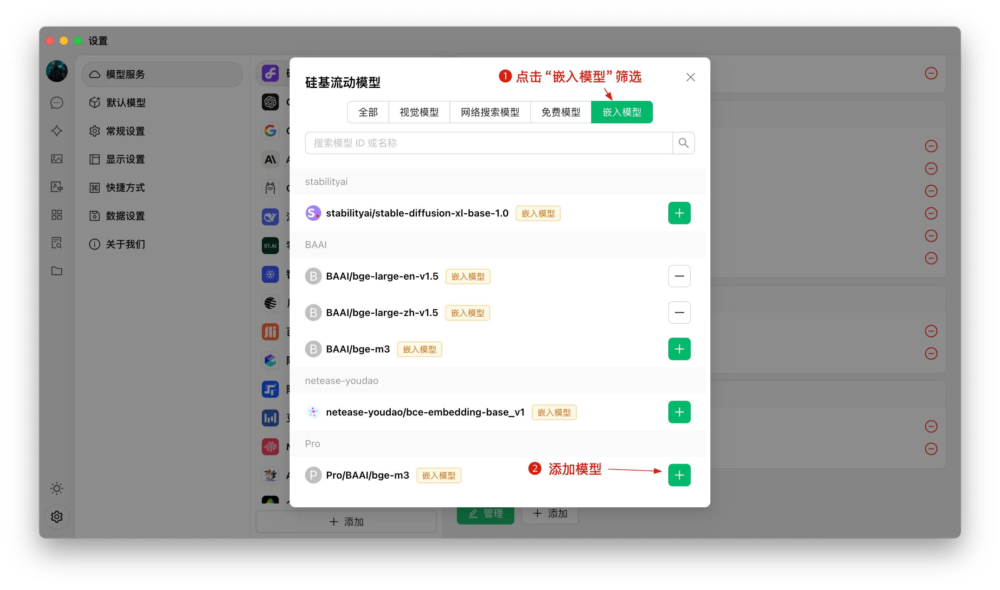


このドキュメントはAIによって中国語から翻訳されており、まだレビューされていません。


# ナレッジベースチュートリアル

バージョン0.9.1で、CherryStudioは待望のナレッジベース機能を実装しました。

以下に、CherryStudioの詳細な使用方法をステップバイステップで説明します。

## 埋め込みモデルの追加

1. モデル管理サービスでモデルを検索し、「埋め込みモデル」で素早くフィルタリングできます
2. 必要なモデルを見つけたら、「マイモデル」に追加します

<figure><figcaption></figcaption></figure>

## ナレッジベースの作成

1. ナレッジベース入口：CherryStudioの左サイドバーにあるナレッジベースアイコンをクリック
2. ナレッジベース追加：「追加」をクリックして新規作成を開始
3. 命名：ナレッジベースの名称を入力し、埋め込みモデルを選択（例: bge-m3）して作成完了

<figure><figcaption></figcaption></figure>

<figure><figcaption></figcaption></figure>

## ファイル追加とベクトル化

1. ファイル追加：「ファイルを追加」ボタンをクリック
2. ファイル選択：PDF、docx、pptx、xlsx、txt、md、mdxなど対応形式のファイルを選択
3. ベクトル化：システムが自動処理し、完了マーク（緑の✓）が表示されれば完了

<figure><figcaption></figcaption></figure>

<figure><figcaption></figcaption></figure>

<figure><figcaption></figcaption></figure>

## 複数ソースからのデータ追加

CherryStudioは多様なデータ追加方法をサポート：

1. フォルダディレクトリ：対応形式のファイルが自動ベクトル化
2. URLリンク：例) [https://docs.siliconflow.cn/introduction](https://docs.siliconflow.cn/introduction)
3. サイトマップ：XML形式サイトマップを指定、例) [https://docs.siliconflow.cn/sitemap.xml](https://docs.siliconflow.cn/sitemap.xml)
4. プレーンテキスト：カスタムテキストを直接入力可能


ヒント：

1. ドキュメント内の画像はベクトル化不可（手動でテキスト変換が必要）
2. URLソースの取得はサイトのセキュリティ設定（ログイン要求等）で失敗する可能性あり
3. サイトマップは通常 `サイトドメイン/sitemap.xml` で取得可能（例: CherryStudioの[sitemap](https://docs.cherry-ai.com/sitemap-pages.xml)）
4. カスタムサイトマップ使用時は公海直リンクが必要（OSSやオンラインストレージを利用可能）。直リンク生成ツールは[ocoolAI](https://one.ocoolai.com/login)で無料提供中

> 1) AIにサイトマップ生成ツールを作成させることも可能
> 2) 直リンク生成には[ocoolAI](https://one.ocoolai.com/login)のファイルアップロードツールを利用


## ナレッジベース検索

ファイルのベクトル化が完了したら検索可能：

1. 画面下部の「ナレッジベース検索」ボタンをクリック
2. 検索クエリを入力
3. 検索結果が表示
4. 各結果にマッチングスコアが表示

<figure><figcaption></figcaption></figure>

<figure><figcaption></figcaption></figure>

## 対話でのナレッジベース参照

1. 新規チャットを開始し、ツールバーのナレッジベースアイコンから参照するベースを選択
2. 質問を送信すると、ナレッジベースを参照した回答が生成
3. 回答下部に参照元ファイルへのリンクが表示

<figure><figcaption></figcaption></figure>

<figure><figcaption></figcaption></figure>