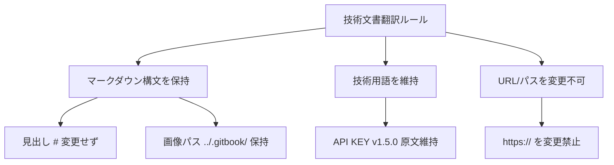


このドキュメントはAIによって中国語から翻訳されており、まだレビューされていません。


# ナレッジベース文書の前処理

ナレッジベース文書の前処理を行うには、Cherry Studioをv1.5.0以上にアップグレードする必要があります。

### OCRサービスプロバイダーの設定

<figure><figcaption></figcaption></figure>

「API KEYを取得」をクリックするとブラウザで申請ページが開きます。「すぐに申請」をクリックしフォームに入力後、取得したAPI KEYを入力欄に入力します。

<figure><figcaption></figcaption></figure>

### ナレッジベース文書前処理の設定

<figure><figcaption></figcaption></figure>

作成済みのナレッジベースで上記の設定を行うと、文書前処理の設定が完了します。

### 文書のアップロード

<figure><figcaption></figcaption></figure>

> 右上の検索機能でナレッジベースの結果を確認できます

### 会話での使用方法

<figure><figcaption></figcaption></figure>

> ナレッジベース利用のヒント: **処理能力の高い**モデルを使用する場合、ナレッジベース検索モードを意図認識に変更すると、質問内容をより正確かつ広範囲に表現できます

### ナレッジベース意図認識の有効化

<figure><figcaption></figcaption></figure>

