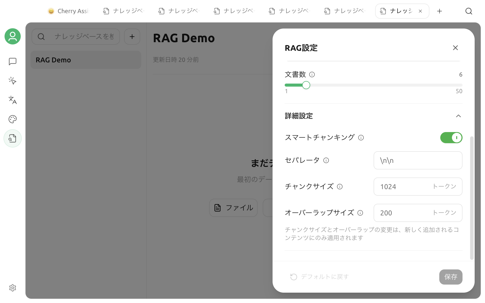

# ドキュメントの前処理

ドキュメントの前処理は、分割とベクトル化の前に PDF、Word、スプレッドシートなどのドキュメントを、検索に適した Markdown テキストへ変換します。主にスキャン資料、複雑なレイアウト、表、多段組みのドキュメントで使用します。

ドキュメントに明確なテキストレイヤーがある場合は、通常 Cherry Studio の組み込み読み取り機能で処理できます。「より高度だから」という理由で、すべてのファイルにオンライン処理をデフォルトで有効にしないでください。まず少量の資料で実際の結果を比較します。

## 処理フロー

ドキュメントプロセッサーを選択していない場合：

1. Cherry Studio が対応ファイルを直接読み取ります。
2. テキストを抽出して分割します。
3. Embedding モデルを呼び出してインデックスを作成します。

ドキュメントプロセッサーを選択した場合：

1. Cherry Studio が選択したプロセッサーへドキュメントを渡します。
2. プロセッサーが Markdown を出力します。
3. Markdown は処理結果としてアプリにより管理されます。
4. Cherry Studio がさらに分割し、インデックスを作成します。


ドキュメントプロセッサーは「ファイルを検索可能なテキストに変換」、Embedding モデルは「テキストをベクトルに変換」、チャットモデルは「検索されたチャンクを基に回答」を担当します。これらは別々の工程です。


## 前処理が必要なドキュメント

ドキュメントプロセッサーの使用を優先的に検討するケース：

* スキャン PDF にコピー可能なテキストがない
* PDF に複雑な表、多段組み、大量の数式が含まれる
* Word、Excel などの組み込み解析結果の構造が崩れている
* 重要な内容が画像またはページレイアウト内にある
* 検索されたチャンクに文字化け、順序の乱れ、大幅な欠落がある

通常は追加処理が不要なケース：

* プレーンテキスト、Markdown、CSV など、構造が明確なテキストファイル
* テキストレイヤーが完全で、レイアウトが単純な PDF
* 組み込み解析後のプレビューと検索テストがすでに正常

前処理ですべての問題が自動的に解決するわけではありません。手書き文字、低解像度スキャン、複雑な数式、入れ子の表は引き続き誤認識される可能性があります。

## V2 が対応する処理能力

Cherry Studio のファイル処理は 2 種類に分かれます。

| 能力 | 入力 | 出力 | ナレッジベースとの関係 |
| --- | --- | --- | --- |
| ドキュメントから Markdown への変換 | ドキュメントファイル | Markdown | ナレッジベースの RAG 設定で選択可能 |
| 画像からテキストへの変換 | 画像 | テキスト | その他の画像 OCR 用。ナレッジベースのドキュメント処理とは異なる |

現在、ナレッジベースへ資料を追加する入口では、画像を独立したデータソースとして扱いません。画像を含む PDF または Office ドキュメントを処理するには、**ドキュメントから Markdown への変換**に対応するプロセッサーを選択してください。

## 選択可能なドキュメントプロセッサー

現在の V2 `main` では、ナレッジベースで次のドキュメントから Markdown への変換プロセッサーを選択できます。

| プロセッサー | 導入方法 | 一般的な設定 |
| --- | --- | --- |
| Mistral OCR | オンライン API | API Key、API Host、モデル |
| MinerU | オンライン API | API Key、API Host |
| Doc2X | オンライン API | API Key、API Host |
| Open MinerU | セルフホストサービス | ローカルまたは LAN の API Host |
| PaddleOCR | API サービスまたはセルフホスト | API Key、API Host、解析モデル |

実際に表示される項目は、現在のシステムとアプリバージョンによって決まります。プロバイダーのアドレス、モデル、申請方法は変わる可能性があるため、**設定 → ドキュメント処理** の最新画面を基準にしてください。


オンラインプロセッサーでは通常、原本ファイルをアップロードする必要があります。契約書、社内資料、個人情報をインポートする前に、プロバイダーのデータポリシー、導入地域、削除方法を確認してください。機密資料ではローカルまたはセルフホストのプロセッサーを優先します。


## ドキュメントプロセッサーを設定する

1. **設定 → ドキュメント処理** を開きます。
2. 左側で、ドキュメントから Markdown への変換に対応するプロセッサーを選択します。
3. プロセッサーの要件に従って API Key を入力します。
4. API Host を確認します。セルフホストサービスでは、実際にアクセス可能なアドレスを入力してください。
5. 画面にモデルオプションがある場合は、サーバーに導入済みのモデルを選択します。
6. **デフォルトに設定** をクリックすると、一般的なドキュメント処理のデフォルトプロセッサーとして使用できます。

API Key の入力欄では複数のキーを管理できます。キーの設定時に、ドキュメント、スクリーンショット、フィードバックログへキーを入れないでください。

### オンラインプロセッサー

オンラインプロセッサーには次の条件が必要です。

* API Key が有効で、アカウントの状態が正常
* API Host がアカウントの地域と一致している
* ネットワークからサービスへアクセスできる
* 現在のモデルがドキュメント解析に対応している
* ファイルサイズと形式がプロバイダーの制限に適合している

### Open MinerU

Open MinerU は、自分で導入した MinerU サービスへ接続するために使用します。デフォルトアドレスはローカルテスト専用です。サービスがコンテナー、リモートホスト、別のポートで動作する場合は、Cherry Studio を実行するデバイスからアクセスできる完全なアドレスを入力してください。

### PaddleOCR

PaddleOCR では解析モデルを設定できます。モデル名はサーバーに導入されたものと一致する必要があります。アプリ画面のプリセットは、対応モデルがサーバーに必ずインストール済みであることを意味しません。

## 画像 OCR とナレッジベースのドキュメント処理

設定画面には、システム OCR、Tesseract、PaddleOCR、Mistral、OpenVINO OCR など、画像からテキストへ変換するプロセッサーが表示される場合もあります。

* システム OCR は対応プラットフォームでのみ表示される
* Tesseract は認識言語を設定できる
* OpenVINO OCR は実行環境が条件を満たす場合にのみ表示される
* PaddleOCR と Mistral は画像とドキュメントの両方に対応する場合がある

これらの画像 OCR 設定は、ナレッジベースのドキュメントから Markdown への変換設定を自動的に置き換えません。ナレッジベースで PDF、DOCX、XLSX などのドキュメントを処理するときは、そのナレッジベースの RAG 設定でドキュメントプロセッサーを選択してください。

## ナレッジベースで有効にする

1. 対象のナレッジベースを開きます。
2. 上部の **RAG 設定** をクリックします。
3. **ファイルプロセッサー** で設定済みのドキュメントプロセッサーを選択します。
4. 設定を保存します。
5. テスト用ドキュメントを 1 つ追加し、状態が完了になるまで待ちます。

新しいナレッジベースでは、デフォルトでファイルプロセッサーを選択しなくてもかまいません。プロセッサーを選択した場合にだけ、対応するドキュメントファイルがドキュメントから Markdown への変換フローに入ります。


ファイルプロセッサーを変更しても、処理済みの資料は自動的に書き換えられません。既存の資料に新しいプロセッサーを適用するには、対象データソースを再インデックスしてください。


## 処理結果を検証する

「完了」状態だけで判断しないでください。少なくとも次の 3 つの手順を実行します。

### 1. ソースをプレビューする

データソース行のその他メニューで **ソースをプレビュー** を選択し、次の項目を確認します。

* タイトルと段落の順序が正しいか
* 表で行と列の関係が保持されているか
* ページのヘッダーとフッターが大量のノイズを生成していないか
* 重要な数値、固有名詞、数式が認識されているか
* ページの欠落、空白、文字化けがないか

### 2. チャンクを確認する

チャンクの詳細を開き、内容が適切な位置で分割されているか確認します。解析結果が完全でも、不適切な分割は検索に影響します。

### 3. 検索テスト

ドキュメント内に実際に存在する質問で検索をテストします。

* 表内の具体的な数値
* 複数の段落にまたがる情報
* 固有名詞と番号
* OCR で混同されやすい文字

正しいテキストが抽出されていない場合は、先にプロセッサーを変更するか、原本ファイルを改善してください。テキストが正しいのに検索結果が悪い場合は、分割と検索設定を調整します。

## プロセッサーの比較方法

代表的なドキュメントを 3～5 件選び、候補の各プロセッサーで同じテストを行います。

| 観点 | 確認する結果 |
| --- | --- |
| 完全性 | ページ、段落、表が欠落していないか |
| 順序 | 多段組みの内容とページ番号が正しい順序か |
| 正確性 | 数字、記号、固有名詞が正しいか |
| 構造 | タイトル、リスト、表が保持されているか |
| 速度 | 1 件および一括処理にかかる時間 |
| 安定性 | 頻繁なタイムアウトや失敗がないか |
| プライバシーと費用 | 原本をアップロードするか、課金方法は何か |

同じプロセッサーでも、ドキュメントの種類により性能が異なる場合があります。契約書、論文、報告書、スキャンしたレシートに同じ設定を使う必要はありません。

## よくある質問

### ナレッジベースにファイルプロセッサーの項目がない

現在開いているのがナレッジベース上部の RAG 設定であることを確認し、アプリのバージョンを確認してください。ナレッジベースにはドキュメントから Markdown への変換に対応するプロセッサーだけが表示され、画像 OCR だけに対応するプロセッサーは表示されません。

### ドキュメント処理が待機中のままになる

リモートプロセッサーはバックグラウンドタスクを使用する場合があります。アプリを実行したままにし、ネットワークとプロバイダーのタスク状態を確認してください。タイムアウトすると資料は失敗と表示されます。設定を修正してから再インデックスできます。

### API Key または Host のエラーが表示される

キーに余分な空白がないか、Host に正しいプロトコルが含まれているか、アカウントの地域が一致するか、セルフホストサービスへ現在のデバイスからアクセスできるかを確認してください。

### スキャン PDF を処理しても空になる

画像からテキストへの変換だけに対応するプロセッサーではなく、ドキュメントから Markdown への変換プロセッサーを選択していることを確認してください。スキャン解像度、ページの向き、プロバイダーが対応する言語も確認します。

### 表の解析結果が崩れる

まずソースのプレビューで、問題が分割ではなくドキュメント処理にあることを確認します。複雑なレイアウトに強いプロセッサーへ変更するか、重要な表をあらかじめより単純な構造のファイルへエクスポートできます。

### プロセッサーを変更しても結果が変わらない

プロセッサーの変更は今後の処理にだけ影響します。既存のデータソースを再インデックスし、新しい処理タスクが完了するまで待ってください。

### 通常の Markdown もオンラインプロセッサーを通るか

ナレッジベースでプロセッサーが選択され、ドキュメントタイプとして認識されたファイルだけが前処理されます。テキストと Markdown ファイルは直接読み取りとインデックス作成のフローに入ります。

## プライバシーと費用

オンラインでのドキュメント処理では、アップロード、解析、保存の費用が発生する場合があります。処理完了後には Embedding モデルも引き続き呼び出されます。Rerank とオンラインチャットモデルを有効にすると、その後の検索と回答にも費用が発生する可能性があります。

完全なデータフローとバックアップに関する推奨事項は、[ナレッジベースのデータ](data.md)を参照してください。

***

### ヘルプとフィードバック

ドキュメント処理、OCR、ナレッジベースのインデックス作成中に問題が発生した場合は、[フィードバックと提案](../question-contact/suggestions.md)の情報を使ってコミュニティへお問い合わせください。
