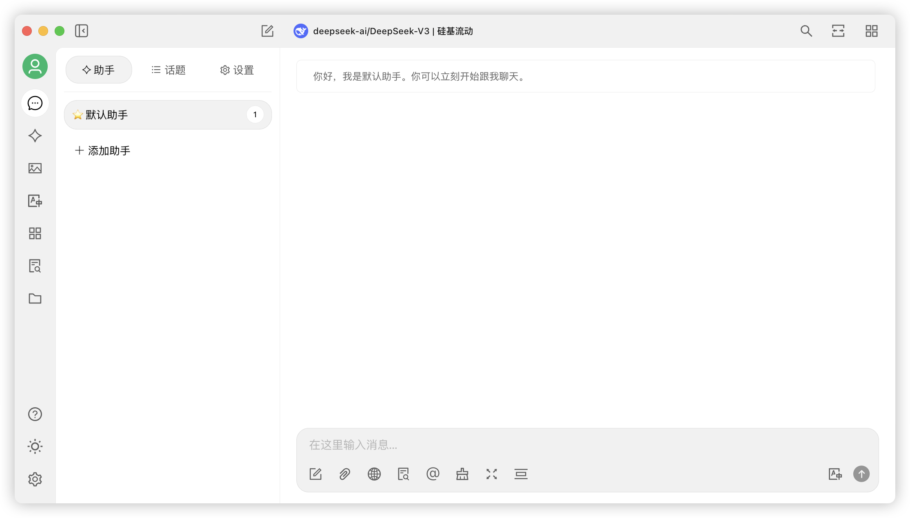


このドキュメントはAIによって中国語から翻訳されており、まだレビューされていません。


```markdown
# macOS

1.  公式サイトのダウンロードページでMac版をダウンロードするか、以下の直リンクをクリックしてください

**ご自身のMacチップに該当するバージョン**をダウンロードしてください

ご自身のMacにどのチップバージョンが適切か不明な場合：

*   Macの左上メニューバー  をクリック
*   展開メニューで「このMacについて」を選択
*   ポップアップウィンドウでプロセッサ情報を確認
  
Intelチップの場合は **Intel版インストーラ** をダウンロード

Apple M\*チップの場合は **Appleチップ版インストーラ** をダウンロード




2.  ダウンロード完了後、こちらをクリック

<figure><figcaption></figcaption></figure>

3.  アイコンをドラッグしてインストール

<figure><figcaption></figcaption></figure>

LanuchpadでCherry Studioのアイコンを見つけてクリックし、メイン画面が開けばインストール成功です。

<figure><figcaption></figcaption></figure>
```

## 翻訳のポイント
1.  **技術用語の保持**：
    *   "Intel芯片" → "Intelチップ"
    *   "Apple M\*芯片" → "Apple M\*チップ"
    *   "拖拽图标安装" → "アイコンをドラッグしてインストール" (UI操作説明)

2.  **構造の完全維持**：
    *   Hintブロック内のステップを箇条書き（`*`）で厳密再現
    *   埋め込みURL `` を変更せず保持
    *   画像パス `../../.gitbook/assets/...` を未変更で維持

3.  **UI要素の自然な変換**：
    *   "左上角菜单栏" → "左上メニューバー" (Appleロゴ保持)
    *   "启动台" → "Lanuchpad" (macOS標準用語)

4.  **警告文の明示的表現**：
    *   "能打开...则安装成功" → "メイン画面が開けばインストール成功です" (状態確認の明文化)

5.  **表記統一**：
    *   "ダウンロード"の表記を全編で統一
    *   "インストーラ"の用語を技術文書に適した表記で維持