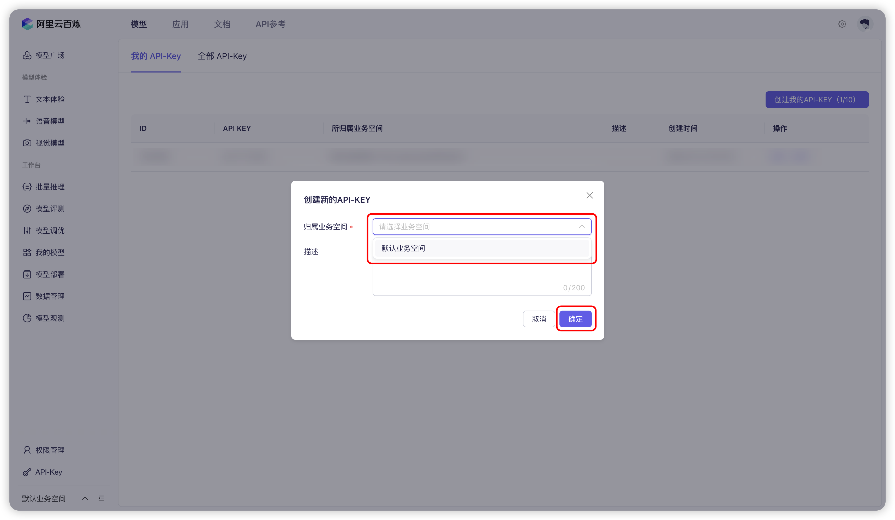


このドキュメントはAIによって中国語から翻訳されており、まだレビューされていません。


# 阿里云百炼

1. [阿里云百炼](https://bailian.console.aliyun.com/?tab=model#/api-key)にログインしてください。アカウントをお持ちでない場合は登録が必要です。

2. 右上の `创建我的 API-KEY` ボタンをクリックしてください。
   <figure><figcaption>阿里云百炼：APIキーの作成</figcaption></figure>
   
3. ポップアップウィンドウで、デフォルトの業務スペースを選択します（カスタマイズも可能です）。必要に応じて説明を入力できます。
   <figure><figcaption>阿里云百炼：APIキー作成のポップアップ</figcaption></figure>
   
4. 右下の `确定` ボタンをクリックしてください。
   <figure><figcaption>阿里云百炼：APIキーの入力</figcaption></figure>
   
5. リストに新規行が追加されるので、右側の `查看` ボタンをクリックしてください。
   <figure><figcaption>阿里云百炼：APIキーの確認</figcaption></figure>
   
6. `复制` ボタンをクリックします。
   <figure><figcaption>阿里云百炼：APIキーのコピー</figcaption></figure>

7. Cherry Studioで `设置` → `模型服务` → `阿里云百炼` を選択し、`API 密钥` 欄にコピーしたAPIキーを貼り付けます。
   <figure><figcaption>阿里云百炼：APIキーの入力</figcaption></figure>
   
8. [モデルサービス](../../cherrystudio/preview/settings/providers.md)の説明に従って設定を調整し、使用を開始してください。

モデルリストに阿里云百炼のモデルが表示されない場合は、[モデルサービス](../../cherrystudio/preview/settings/providers.md)の説明に従ってモデルを追加し、このプロバイダーを有効化しているか確認してください。
