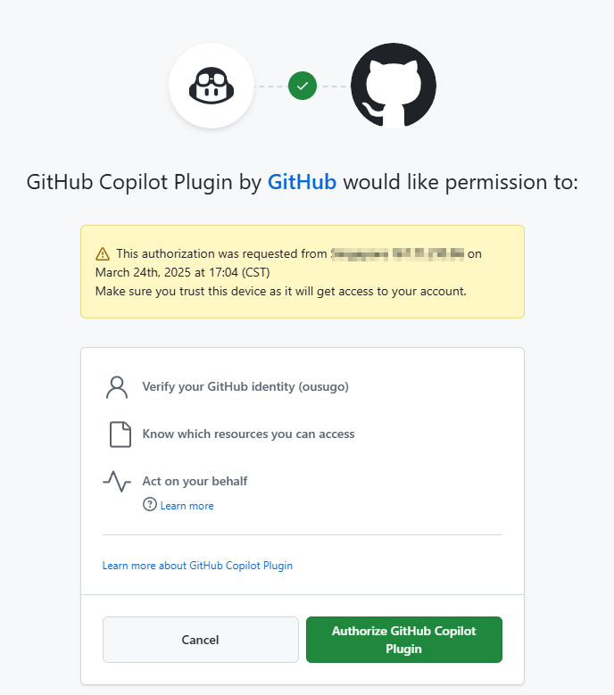


このドキュメントはAIによって中国語から翻訳されており、まだレビューされていません。


# GitHub Copilot

GitHub Copilotを使用するには、まずGitHubアカウントを持ち、GitHub Copilotサービスをサブスクリプションする必要があります。free版のサブスクリプションも可能ですが、free版は最新のClaude 3.7モデルをサポートしていません。詳細は[GitHub Copilot公式サイト](https://github.com/features/copilot)を参照してください。

## Device Codeの取得

「GitHubにログイン」をクリックし、Device Codeを取得してコピーします。

<figure><figcaption>
Device Codeの取得
</figcaption></figure>

## ブラウザでDevice Codeを入力して認証

Device Codeを取得したら、リンクをクリックしてブラウザを開きます。GitHubアカウントでログインし、Device Codeを入力して認証します。

<figure><figcaption>
GitHub認証
</figcaption></figure>

認証が成功したら、Cherry Studioに戻り「GitHubに接続」をクリックします。成功するとGitHubユーザー名とアバターが表示されます。

<figure><figcaption>
GitHub接続成功
</figcaption></figure>

## 「管理」をクリックしてモデルリストを取得

下部の「管理」ボタンをクリックすると、現在サポートされているモデルリストが自動的に取得されます。

<figure><figcaption>
モデルリストの取得
</figcaption></figure>

## よくある質問

### Device Codeの取得に失敗しました。再試行してください

<figure><figcaption>
Device Code取得失敗
</figcaption></figure>

現在のリクエストはAxiosで構築されていますが、Axiosはsocksプロキシをサポートしていません。システムプロキシまたはHTTPプロキシを使用するか、CherryStudioでプロキシを設定せずにグローバルプロキシを使用してください。まずネットワーク接続が正常であることを確認し、Device Codeの取得失敗を防いでください。