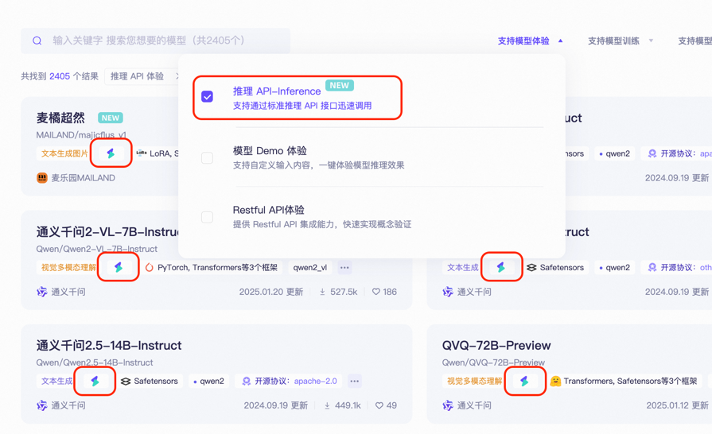

# ModelScope（魔搭）プラットフォーム接続ガイド  


このドキュメントはAIによって中国語から翻訳されており、まだレビューされていません。


## ModelScopeとは？  
> ModelScopeは次世代オープンソースのModel-as-a-Service（MaaS）共有プラットフォームであり、AI開発者に**柔軟で使いやすく低コスト**なワンストップモデルサービスソリューションを提供し、モデルアプリケーションをより簡単にすることを目指しています！  
>  
> **API推論サービス機能**を通じて、プラットフォームはオープンソースモデルを呼び出し可能なAPIインターフェースに標準化し、開発者は軽量・高速で各種AIアプリケーションにモデル機能を統合できます。ツール呼び出しやプロトタイプ開発などの革新的なシナリオをサポートします。  

### コアメリット  
- ✅ **無料枠**：1日あたり**2000回の無料API呼び出し枠**（[課金ルール](##課金と割当てルール)）  
- ✅ **豊富なモデルライブラリ**：NLP/CV/音声/マルチモーダルなど1000+オープンソースモデルをカバー  
- ✅ **即時利用**：デプロイ不要，RESTful APIで迅速に呼び出し可能  

---

## Cherry Studio接続手順  
### ステップ1：ModelScope APIトークンの取得  
1. **プラットフォームにログイン**  
   - [ModelScope公式サイト](https://modelscope.cn)にアクセス → 右上の**ログイン**をクリック → 認証方式を選択  
     
2. **アクセストークンの作成**  
   - **[アカウント設定 → アクセストークン](https://modelscope.cn/my/myaccesstoken)に移動**  
   - **`新しいトークン`**をクリック → 説明を記入 → **生成されたトークンをコピー**（*下図参照*）  
     
   > 🔑 **重要**：トークン漏洩はアカウントセキュリティに影響します！  

### ステップ2：Cherry Studioの設定  
- **Cherry Studio**を開く → **設定 → モデルサービス → ModelScope**  
- `APIキー`欄にコピーしたトークンを貼り付け  
    
- **`保存`**をクリックして認証完了  

### ステップ3：モデルAPIの呼び出し  
1. **API対応モデルの検索**  
   - [ModelScopeモデルライブラリ](https://modelscope.cn/models)にアクセス  
   - フィルター条件：**`API-Inference`をチェック**（またはモデルカードの`API`アイコンを確認）  
     
   > API-Inferenceがカバーするモデル範囲は、主にモデルが魔搭コミュニティで受けている注目度（「いいね」やダウンロードデータ等を参照）で判断されます。そのため、より強力で注目度の高い次世代オープンソースモデルがリリースされると、サポート対象モデルリストも継続的に更新されます。  
2. **モデルIDの取得**  
   - 対象モデル詳細ページに移動 → **Model ID**をコピー（例: `damo/nlp_structbert_sentiment-classification_chinese-base`）  
     
3. **Cherry Studioに入力**  
   - モデルサービス設定ページの`モデルID`欄にID入力 → タスクタイプを選択 → 設定完了  
     

---

## 課金と割当てルール  
### 重要事項  
- 🎫 **無料枠**：各ユーザー **1日2000回のAPI呼び出し**（*公式サイト最新ルールが優先）  
- 🔁 **割当てリセット**：毎日UTC+8 00:00に自動リセット，**日跨ぎ累積やアップグレード不可**  
- 💡 **超過時の処理**：  
  - 当日上限到達後，APIは`429エラー`を返す  
  - 解決策：予備アカウントに切り替え / 他プラットフォームの利用 / 呼び出し頻度の最適化  

### 残高確認方法  
- ModelScopeにログイン → 右上 **`ユーザー名`** → **`API使用状況`**をクリック  
    

> ⚠️ 注意：推論API-Inferenceは1日2000回の無料呼び出し枠です。それ以上の呼び出しが必要な場合は、阿里雲百煉などのクラウドサービスの利用をご検討ください。