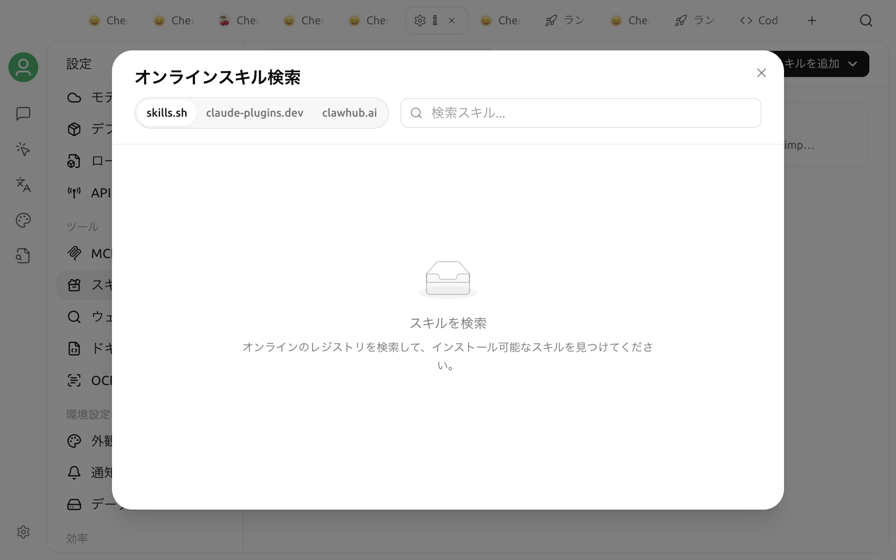

# スキル（Skills）

スキルは、エージェントが必要に応じて読み込む専門的な手順と関連ファイルのまとまりです。特定のタスクを行う手順、形式、ツールの使い方を定義でき、スクリプト、参考資料、リソースファイルも含められます。たとえば、ドキュメントレビュー用のスキルを使えば、チェックリストと納品形式を統一できます。

スキルは基盤モデルを変更するものではなく、単独で動作するアプリでもありません。Cherry Studio V2 では、まずスキルをグローバルスキルライブラリにインストールし、その後、使用する[エージェント](../../advanced-basic/agent.md)ごとに有効にします。同じスキルを複数のエージェントで使用でき、有効・無効の状態はエージェントごとに独立して保存されます。


現在の V2 のスキルはエージェント専用で、通常のアシスタントでは使用できません。グローバルスキルライブラリへのインストールは、すべてのエージェントで自動的に有効になることを意味しません。


## インストールと有効化の違い

| 操作 | 適用範囲 | 結果 |
| :--- | :--- | :--- |
| インストール | グローバルスキルライブラリ | スキルが **設定 → スキル** と[ライブラリ](../../cherrystudio/preview/library.md)に表示されます |
| 有効化 | 1 つのエージェント | スキルがそのエージェントのワークスペースにリンクされ、実行時に検出して使用できるようになります |
| 無効化 | 1 つのエージェント | そのエージェントからだけ削除され、他のエージェントやグローバルのスキルファイルには影響しません |
| アンインストール | グローバル | スキルファイルを削除し、有効にしていたすべてのエージェントからも削除します |

Cherry Studio に付属する組み込みスキルは、新しいエージェントを作成したときにデフォルトで有効になります。その後、各エージェントで変更した有効・無効の選択は保持されます。アプリが組み込みスキルを更新しても、この選択はリセットされません。

## オンラインマーケットからインストールする

1. **設定 → スキル** を開きます。
2. 右上の検索ボックスに、必要な機能を入力します。
3. `claude-plugins`、`skills.sh`、`clawhub` のタブを切り替えて結果を確認します。
4. 結果をクリックし、説明、著者、配布元、統計情報を確認します。
5. **インストール** をクリックします。

オンラインからのインストールにはネットワーク接続が必要です。`claude-plugins` または `skills.sh` からインストールする場合は、システムで Git を実行できる必要があり、対応するリポジトリから取得されます。`clawhub` では、スキルパッケージをダウンロードしてインストールします。

新しくインストールしたサードパーティ製スキルはグローバルスキルライブラリに追加されるだけで、すべてのエージェントで自動的に有効にはなりません。続けて「エージェントで有効にする」の手順を行ってください。

## ローカルファイルからインストールする

**設定 → スキル** では、次の方法でインストールできます。

* **ZIPファイルからインストール** をクリックして、アーカイブを選択する
* **ディレクトリからインストール** をクリックして、スキルのディレクトリを選択する
* ZIP ファイルまたはディレクトリを、ページのインストール領域にドラッグ＆ドロップする

ローカルパッケージには `SKILL.md` が必要です。このファイルにはスキル名、説明、主要な指示が記載されます。スキルには `scripts/`、`references/`、`assets/` などの関連ディレクトリを含めることもできます。

[ライブラリ](../../cherrystudio/preview/library.md)のスキルカテゴリにあるインポートボタンから、ZIP ファイルまたはディレクトリをインストールすることもできます。現在、ライブラリではインストール済みスキルの閲覧とローカルインポートだけを行えます。オンラインマーケットを検索する場合は、**設定 → スキル** を開いてください。


サードパーティ製スキルには、コマンド、スクリプト、またはエージェントに外部サービスへのアクセスを要求する指示が含まれる場合があります。インストール前に配布元を確認し、インストール後はファイルツリーで `SKILL.md` とスクリプトの内容を読んでください。信頼できるワークスペースでのみ有効にしてください。


## エージェントにスキルをインストールまたは作成させる

すべてのエージェントは、組み込みのスキル管理ツールを使用できます。たとえば、エージェントに次のように依頼できます。

> 製品ドキュメントの確認に適したスキルを検索し、配布元と用途を説明してください。私が確認してからインストールしてください。

チャットからインストールする場合、エージェントはマーケットを検索してスキルをインストールし、そのスキルを現在のエージェントだけで有効にします。他のエージェントには影響しません。

エージェントに新しいスキルを作成させることもできます。エージェントはスキルディレクトリを初期化し、`SKILL.md` と必要な関連ファイルを作成してから、グローバルスキルライブラリに登録し、現在のエージェントで有効にします。作成後は、**設定 → スキル** でファイル内容を確認し、小さなタスクで動作を検証してください。

## エージェントで有効にする

1. [ライブラリ](../../cherrystudio/preview/library.md)を開き、**エージェント** に移動します。
2. 保存済みのエージェントを編集します。
3. **機能拡張** セクションで **スキル** タブを選択します。
4. 追加ボタンをクリックし、グローバルスキルライブラリからスキルを選択します。
5. 設定を保存し、新しいタスクで動作を確認します。

スキルの有効・無効の状態はエージェントごとに保存されます。1 つのエージェントでスキルを無効にするには、同じ場所からそのスキルを削除してください。

実行時、Cherry Studio は有効なスキルを、エージェントの最初のワークスペースディレクトリにある `.claude/skills/` へリンクします。そのため、エージェントにはアクセス可能なワークスペースディレクトリが必要です。同名の場所に Cherry Studio が管理するリンクではなく通常のディレクトリがすでに存在する場合、有効化は失敗します。


スキルを有効にしても、すべてのメッセージで強制的に使用されるわけではありません。エージェントはスキル名、説明、現在のタスクから読み込むかどうかを判断します。特定のスキルを必ず使用する必要がある場合は、プロンプトでスキル名を明示してください。


## 表示とアンインストール

**設定 → スキル** でインストール済みのスキルを選択すると、ファイルツリー全体を確認できます。Markdown ファイルはそのまま表示され、スクリプトなどのテキストファイルはコードとして表示されます。

サードパーティ製スキルは、右クリックメニュー、詳細ページの削除ボタン、または複数選択モードから一括でアンインストールできます。組み込みスキルはここではアンインストールできませんが、エージェントごとに無効にできます。

アンインストールはグローバル操作です。スキルファイルに加え、すべてのエージェントのワークスペースにある対応リンクと有効化の記録も削除されます。1 つのエージェントだけでスキルを使用しない場合は、アンインストールではなく無効化してください。

## スキルと MCP の違い

| 機能 | スキル | [MCP](../../advanced-basic/mcp/) |
| :--- | :--- | :--- |
| 主な内容 | 作業手順、プロンプトの指示、スクリプト、参考資料 | MCP Server が公開する呼び出し可能なツールまたはデータ |
| 常駐サービスが必要か | 通常は不要 | MCP Server によります |
| 主な用途 | 執筆手順、チェックリスト、生成ルールの標準化 | データベースの検索、外部 API の呼び出し、他システムの操作 |

スキルから、MCP ツールをいつ、どのように呼び出すかをエージェントに指示できます。両方を同時に有効にすることもできます。

## スキルが機能しない場合

次の項目を順に確認してください。

1. スキルがグローバルスキルライブラリに表示されているか。
2. インストールだけでなく、現在のエージェントで有効になっているか。
3. 現在のエージェントに有効なワークスペースディレクトリが設定されているか。
4. `.claude/skills/` に同名の通常ディレクトリがあり、リンクと競合していないか。
5. `SKILL.md` の名前と説明から、エージェントが現在のタスクに必要なスキルだと判断できるか。

スキルファイルを変更した直後は、新しいセッションを開始してもう一度確認してください。エージェントの管理ツールで作成または変更したスキルファイルはそのまま反映されるため、追加のパッチ適用や再インストールは必要ありません。
