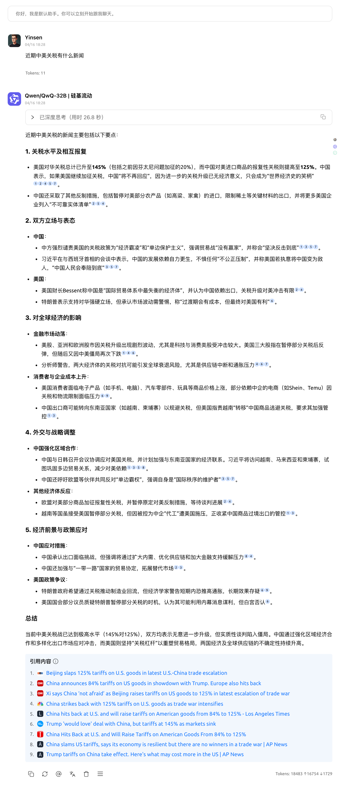


このドキュメントはAIによって中国語から翻訳されており、まだレビューされていません。


# 無料ネット検索モード

Cherry Studioには強力なウェブ検索機能が内蔵されており、対話中に最新のネット情報をリアルタイムで取得できます。以下の手順で簡単に有効化・使用できます：

***

### 有効化手順

1. **設定メニューを開く**
   * Cherry Studioアプリを起動します。
   * メイン画面で、左下にある**設定（Settings）**アイコンまたはメニューオプションをタップします。
       <figure><figcaption></figcaption></figure>

2. **ウェブ検索設定にアクセス**
   * 設定メニュー内で**ウェブ検索**設定を選択します。
       <figure><figcaption></figcaption></figure>

3. **検索エンジンの選択**
   * 「ウェブ検索」設定ページで**検索サービスプロバイダ**オプションを探します。
   * ドロップダウンリストから希望の検索エンジンを選択：
     * **Bing**：マイクロソフト提供。グローバルアクセス性が良好。
     * **Baidu**：中国ユーザー向け。中国本土でカバレッジが広い。
     * **Google**：国際情報に強いグローバルリーダー。
   * **⚠️重要**：**Google**を選択する場合、Googleサービスへ**安定してアクセス可能なネットワーク環境**であることを確認してください。接続問題が発生した場合は他のプロバイダへの切替やプロキシ設定を確認してください。
       <figure><figcaption></figcaption></figure>

4. **検索拡張モードの確認**
   * **検索拡張モード**オプションを探します。
   * トグルスイッチまたはチェックボックスが**有効**状態であることを確認します。このモードは検索結果の関連性と深さを最適化します。
       <figure><figcaption></figcaption></figure>

5. **対話画面でのネット検索起動**
   * 設定を完了後、Cherry Studioの**チャット画面**に戻ります。
   * メッセージ入力欄の**ツールバー**に注目します。
   * **ネット検索アイコン🌐**をタップします。
   * アイコンが**ハイライト表示**されれば有効化完了。この状態で送信したメッセージはネット検索をトリガーします。
       <figure><figcaption></figcaption></figure>

6. **検索開始！**
   * アイコンが有効状態のまま、検索したい**キーワード・質問・指示**を入力します。
   * 通常通りメッセージを送信。Cherry Studioが選択した検索エンジンで検索し、取得したネット情報を回答に統合します。
       <figure><figcaption></figcaption></figure>

***

### ✨ 重要な注意点とテクニック

* **検索結果数**:
  * デフォルトでは**約6件**の要約結果が返されます（速度と情報量のバランス設定）。
  * 設定で項目数調整が可能な場合、**結果数を増やす**ことで情報の網羅性が向上します。
      <figure><figcaption></figcaption></figure>

* **パフォーマンス制限**:
  * 結果数を増やすと**処理時間が増加**し、**応答速度が低下**します。
  * 過剰なネットコンテンツ取得は**コンテキスト長制限を超え**、情報欠落・回答途切れ・エラーの原因となります。

* **推奨事項**:
  * 初期利用時はデフォルト設定を維持
  * 情報不足を感じたら待機時間許容範囲内で結果数を調整
  * リアルタイム情報不要時はツールバーの検索アイコンを再度タップして**無効化**し、不要な検索/遅延を回避

***

これでCherry Studioのネット検索機能を活用する方法をマスターしました。最新情報の取得、事実確認、未知の探索にぜひご活用ください！