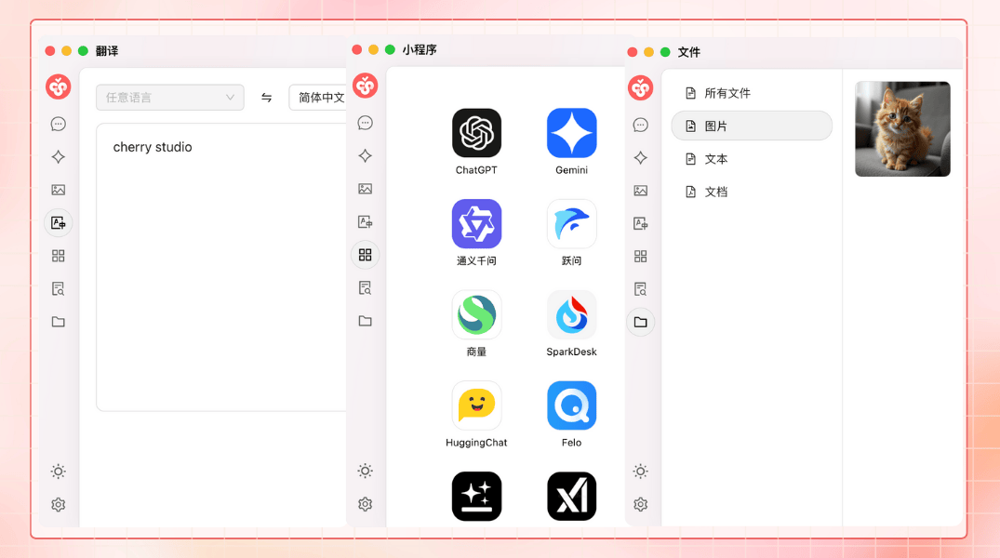
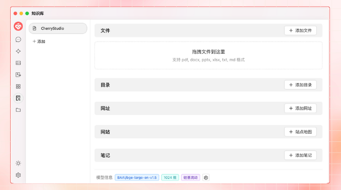


이 문서는 AI에 의해 중국어에서 번역되었으며 아직 검토되지 않았습니다。


# 프로젝트 소개

<figure><figcaption></figcaption></figure>

저희 소셜 계정을 팔로우하세요: [트위터(X)](https://x.com/CherryStudioAPP)、[샤오홍슈](https://www.xiaohongshu.com/user/profile/662b6853000000000b031d9a)、[웨이보](https://weibo.com/u/7975656228)、[빌리빌리](https://space.bilibili.com/3546657515898892)、[틱톡](https://www.douyin.com/user/MS4wLjABAAAAmw9A54m5J0hHVMQY5eGrVJ-EHDoOS0hgJ6M1F9MN2Tn2V163A0xrC4_KVzfmQSxC)

커뮤니티 가입하기: [QQ 그룹(575014769)](https://qm.qq.com/q/lo0D4qVZKi)、[텔레그램](https://t.me/CherryStudioAI)、[디스코드](https://discord.gg/wez8HtpxqQ)、위챗 그룹(확인하려면 클릭)[^1]

***

Cherry Studio는 멀티모델 대화, 지식 베이스 관리, AI 그림 생성, 번역 등 기능을 통합한 올인원 AI 어시스턴트 플랫폼입니다.\
Cherry Studio의 높은 커스터마이징 디자인, 강력한 확장성 및 사용자 친화적인 경험은 전문가와 AI 애호가에게 이상적인 선택입니다. 초보자부터 개발자까지 Cherry Studio에서 자신에게 맞는 AI 기능을 찾아 업무 효율과 창의성을 향상시킬 수 있습니다.

***

### **핵심 기능 및 특징**

#### **1. 기본 대화 기능**

* **한 질문에 여러 답변**: 동일한 질문에 대해 여러 모델이 동시에 답변을 생성하도록 지원하여 모델 간 비교가 용이합니다. 자세한 내용은 [대화 인터페이스](cherrystudio/preview/chat.md) 참조.

<figure><figcaption></figcaption></figure>

* **자동 그룹화**: 각 어시스턴트의 대화 기록이 자동으로 그룹화되어 관리되므로 기록을 빠르게 찾을 수 있습니다.
* **대화 내보내기**: 전체 또는 일부 대화를 Markdown, Word 등 다양한 형식으로 내보내어 저장 및 공유할 수 있습니다.
* **고도화된 매개변수 커스터마이징**: 기본 매개변수 조정 외에도 사용자 정의 매개변수 입력이 가능하여 개인화된 요구를 충족합니다.

<figure><figcaption></figcaption></figure>

* **어시스턴트 마켓플레이스**: 번역, 프로그래밍, 글쓰기 등 분야별 1000개 이상의 전문 어시스턴트를 내장하고 있으며 사용자 정의 어시스턴트도 지원합니다.

<figure><figcaption></figcaption></figure>

* **다양한 형식 렌더링**: Markdown 렌더링, 수식 렌더링, HTML 실시간 미리보기 등 기능을 지원하여 콘텐츠 표시 효과를 향상시킵니다.

<figure><figcaption></figcaption></figure>

#### **2. 다양한 특수 기능 통합**

* **AI 그림 생성**: 전용 그림 패널을 제공하여 자연어 설명으로 고품질 이미지를 생성할 수 있습니다.

<figure><figcaption></figcaption></figure>

* **AI 미니 프로그램**: 무료 웹 기반 AI 도구를 통합하여 브라우저 전환 없이 바로 사용할 수 있습니다.
* **번역 기능**: 전용 번역 패널, 대화 번역, 프롬프트 번호 등 다양한 번역 시나리오를 지원합니다.
* **파일 관리**: 대화, 그림 생성 및 지식 베이스의 파일을 통합 분류 관리하여 번거로운 검색을 방지합니다.

<figure><figcaption></figcaption></figure>

* **전역 검색**: 기록 및 지식 베이스 콘텐츠를 빠르게 찾아 업무 효율성을 높입니다.

<figure><figcaption></figcaption></figure>

#### **3. 다중 공급자 통합 관리 시스템**

* **공급자 모델 통합**: OpenAI, Gemini, Anthropic, Azure 등 주요 공급자의 모델을 통합 호출할 수 있습니다.
* **모델 자동 획득**: 수동 설정 없이 완전한 모델 목록을 한 번에 가져올 수 있습니다.
* **다중 키 교체**: 여러 API 키를 교체 사용하여 속도 제한 문제를 방지합니다.
* **정확한 아바타 매칭**: 각 모델에 전용 아바타가 자동 매칭되어 식별성을 높입니다.
* **사용자 정의 공급자**: OpenAI, Gemini, Anthropic 등 규격과 호환되는 타사 공급자를 지원합니다.

<figure><figcaption></figcaption></figure>

#### **4. 고도화된 인터페이스 및 레이아웃 커스터마이징**

* **사용자 정의 CSS**: 전역 스타일 커스터마이징을 지원하여 개별적인 인터페이스 스타일을 구현합니다.
* **사용자 정의 대화 레이아웃**: 목록 또는 버블 스타일 레이아웃을 선택할 수 있으며 메시지 스타일(예: 코드 조각 스타일)을 커스터마이징할 수 있습니다.
* **사용자 정의 아바타**: 소프트웨어 및 어시스턴트에 맞춤형 아바타 설정이 가능합니다.
* **사용자 정의 사이드바 메뉴**: 필요에 따라 사이드바 기능을 숨기거나 정렬하여 사용 경험을 최적화할 수 있습니다.

<figure><figcaption></figcaption></figure>

#### **5. 로컬 지식 베이스 시스템**

* **다양한 형식 지원**: PDF, DOCX, PPTX, XLSX, TXT, MD 등 다양한 파일 형식 가져오기를 지원합니다.
* **다양한 데이터 소스**: 로컬 파일, URL, 사이트 맵, 심지어 수동 입력 콘텐츠도 지식 베이스 소스로 사용 가능합니다.
* **지식 베이스 내보내기**: 처리된 지식 베이스를 내보내어 다른 사람과 공유할 수 있습니다.
* **검사 지원**: 지식 베이스 가져오기 후 실시간 검색 테스트로 처리 결과 및 분할 효과를 확인할 수 있습니다.

<figure><figcaption></figcaption></figure>

#### **6. 특수 포커스 기능**

* **빠른 질의응답**: 모든 시나리오(위챗, 브라우저 등)에서 바로 어시스턴트를 호출하여 빠르게 답변을 얻을 수 있습니다.
* **빠른 번역**: 다른 시나리오의 단어나 텍스트를 빠르게 번역할 수 있습니다.
* **콘텐츠 요약**: 긴 텍스트 콘텐츠를 신속하게 요약하여 정보 추출 효율을 높입니다.
* **설명 기능**: 복잡한 프롬프트 없이 모르는 문제를 한 번의 클릭으로 설명할 수 있습니다.

<figure><figcaption></figcaption></figure>

#### **7. 데이터 보장**

* **다중 백업 방안**: 로컬 백업, WebDAV 백업 및 예약 백업을 지원하여 데이터 보안을 보장합니다.
* **데이터 안전**: 로컬 대형 모델과 결합된 완전한 로컬 시나리오를 지원하여 데이터 유출 위험을 방지합니다.

***

### **프로젝트 장점**

1. **초보자 친화적**: 기술 장벽을 낮추어 초보자도 빠르게 시작할 수 있으며 사용자가 작업, 학습 또는 창작에 집중할 수 있도록 합니다.
2. **문서 완성도**: 상세한 사용 설명서와 FAQ 가이드를 제공하여 문제 해결을 지원합니다.
3. **지속적인 업데이트**: 사용자 피드백에 적극 대응하여 기능을 지속적으로 최적화하고 프로젝트 건강한 발전을 보장합니다.
4. **오픈소스 및 확장성**: 오픈소스 코드를 통한 맞춤형 개발 및 확장을 지원하여 개인화된 요구를 충족합니다.

***

### **적용 시나리오**

* **지식 관리 및 조회**: 로컬 지식 베이스 기능을 통해 맞춤형 지식 베이스를 신속히 구축하고 조회할 수 있어 연구 및 교육 분야에 적합합니다.
* **다중 모델 대화 및 창작**: 다중 모델 동시 대화를 지원하여 정보 수집 또는 콘텐츠 생성에 유용합니다.
* **번역 및 업무 자동화**: 내장된 번역 어시스턴트 및 파일 처리 기능으로 다국어 커뮤니케이션이나 문서 작업이 필요한 사용자에게 적합합니다.
* **AI 그림 및 디자인**: 자연어 설명을 통해 이미지를 생성하여 창의적인 디자인 요구를 충족시킵니다.

### Star History

## 저희 소셜 계정을 팔로우하세요

<table data-view="cards"><thead><tr><th></th><th data-hidden data-card-cover data-type="files"></th><th data-hidden data-card-target data-type="content-ref"></th></tr></thead><tbody><tr><td><a href="https://www.xiaohongshu.com/user/profile/662b6853000000000b031d9a?xsec_token=YB_1nKvlH4r5hPYVVbbsNHF8Y6n6AKlm5-DaggPCtd2DQ%3D&#x26;xsec_source=app_share&#x26;xhsshare=CopyLink&#x26;appuid=662b6853000000000b031d9a&#x26;apptime=1738627324&#x26;share_id=ace5db41b5954fab8d98a2a7865a62bc&#x26;share_channel=copy_link">샤오홍슈</a></td><td><a href=".gitbook/assets/1.png">1.png</a></td><td><a href="https://www.xiaohongshu.com/user/profile/662b6853000000000b031d9a?xsec_token=YB_1nKvlH4r5hPYVVbbsNHF8Y6n6AKlm5-DaggPCtd2DQ%3D&#x26;xsec_source=app_share&#x26;xhsshare=CopyLink&#x26;appuid=662b6853000000000b031d9a&#x26;apptime=1738627324&#x26;share_id=ace5db41b5954fab8d98a2a7865a62bc&#x26;share_channel=copy_link">https://www.xiaohongshu.com/user/profile/662b6853000000000b031d9a?xsec_token=YB_1nKvlH4r5hPYVVbbsNHF8Y6n6AKlm5-DaggPCtd2DQ%3D&#x26;xsec_source=app_share&#x26;xhsshare=CopyLink&#x26;appuid=662b6853000000000b031d9a&#x26;apptime=1738627324&#x26;share_id=ace5db41b5954fab8d98a2a7865a62bc&#x26;share_channel=copy_link</a></td></tr><tr><td><a href="https://b23.tv/hIfGgDW">빌리빌리</a></td><td><a href=".gitbook/assets/3.png">3.png</a></td><td><a href="https://b23.tv/hIfGgDW">https://b23.tv/hIfGgDW</a></td></tr><tr><td><a href="https://weibo.com/u/7975656228">웨이보</a></td><td><a href=".gitbook/assets/2.png">2.png</a></td><td><a href="https://weibo.com/u/7975656228">https://weibo.com/u/7975656228</a></td></tr><tr><td><a href="https://v.douyin.com/ifTpX4X7">틱톡</a></td><td><a href=".gitbook/assets/4.png">4.png</a></td><td><a href="https://v.douyin.com/ifTpX4X7">https://v.douyin.com/ifTpX4X7</a></td></tr><tr><td><a href="https://x.com/CherryStudioAPP?t=DYR0ulaLur-bO4Us3bG79A&#x26;s=05">트위터(X)</a></td><td><a href=".gitbook/assets/5.png">5.png</a></td><td><a href="https://x.com/CherryStudioAPP?t=DYR0ulaLur-bO4Us3bG79A&#x26;s=05">https://x.com/CherryStudioAPP?t=DYR0ulaLur-bO4Us3bG79A&#x26;s=05</a></td></tr></tbody></table>

[^1]: 