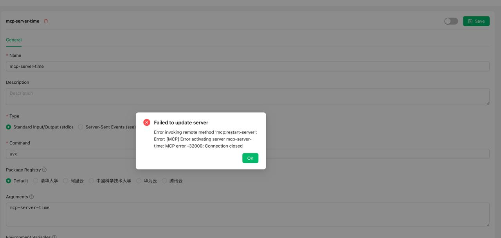


이 문서는 AI에 의해 중국어에서 번역되었으며 아직 검토되지 않았습니다。


```markdown
# 자주 묻는 질문

### 1. mcp-server-time

<figure><figcaption><p>오류 스크린샷</p></figcaption></figure>

**해결 방법**

"매개변수"란에 다음을 입력하세요:

```
mcp-server-time
--local-timezone
<당신의 표준 시간대, 예: Asia/Shanghai>
```