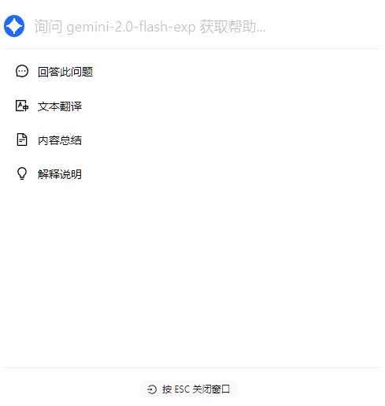


이 문서는 AI에 의해 중국어에서 번역되었으며 아직 검토되지 않았습니다。


# 빠른 도우미

빠른 도우미는 Cherry Studio에서 제공하는 편리한 도구로, 모든 애플리케이션에서 즉시 질문, 번역, 요약 및 설명과 같은 AI 기능에 빠르게 접근할 수 있도록 합니다.

### 빠른 도우미 활성화

1. **설정 열기:** `설정` > `바로가기` > `빠른 도우미`로 이동합니다.
2. **스위치 활성화:** `빠른 도우미`에 해당하는 버튼을 찾아 켭니다.

<figure><figcaption>
빠른 도우미 활성화 예시
</figcaption></figure>

3. **바로가기 키 설정 (선택사항):**
   * Windows 기본 단축키: <kbd>Ctrl</kbd> + <kbd>E</kbd>
   * macOS 기본 단축키: <kbd>⌘</kbd> + <kbd>E</kbd>
   * 충돌 방지나 사용 습관에 맞추어 사용자 정의 단축키를 설정할 수 있습니다.

### 빠른 도우미 사용 방법

1. **호출:** 어떤 애플리케이션에서든 설정한 단축키(또는 기본 단축키)를 눌러 빠른 도우미를 엽니다.
2. **상호작용:** 빠른 도우미 창에서 다음 작업을 직접 수행할 수 있습니다:
   * **빠른 질문:** AI에 어떤 질문이든 바로 질문
   * **텍스트 번역:** 번역할 텍스트 입력
   * **내용 요약:** 긴 텍스트를 요약
   *   **개념 설명:** 설명이 필요한 개념이나 용어 입력

       <figure><figcaption>
빠른 도우미 인터페이스 예시
</figcaption></figure>
3. **닫기:** <kbd>ESC</kbd> 키를 누르거나 빠른 도우미 창 외부 아무 곳이나 클릭하여 닫습니다.


빠른 도우미는 [글로벌 기본 대화 모델](settings/default-models.md#mo-ren-zhu-shou-mo-xing)을 사용합니다.


### 팁 및 활용 방법

* **단축키 충돌:** 기본 단축키가 다른 애플리케이션과 충돌하는 경우 단축키를 변경하세요.
* **추가 기능 탐색:** 문서에 언급된 기능 외에도 코드 생성, 스타일 변환 등 더 많은 작업을 지원할 수 있습니다. 사용 과정에서 계속 탐색해 보세요.
* **피드백 및 개선:** 사용 중 문제가 발생하거나 개선 사항이 있을 경우 Cherry Studio 팀에 즉시 [피드백](../../../question-contact/suggestions.md)하세요.