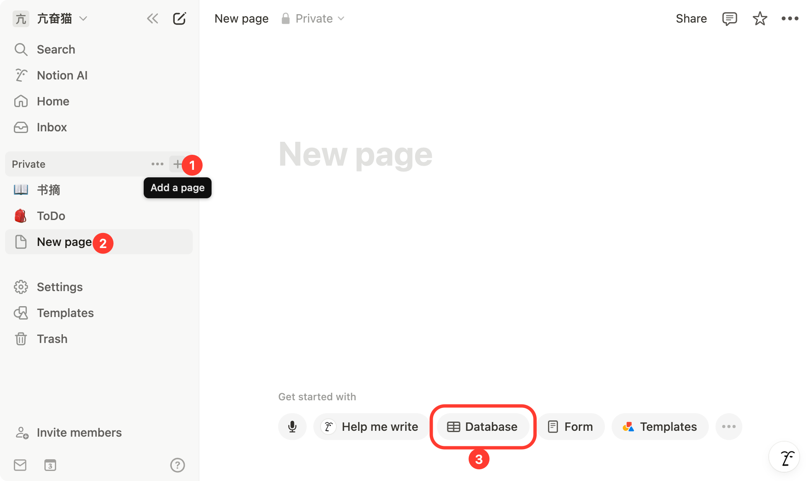
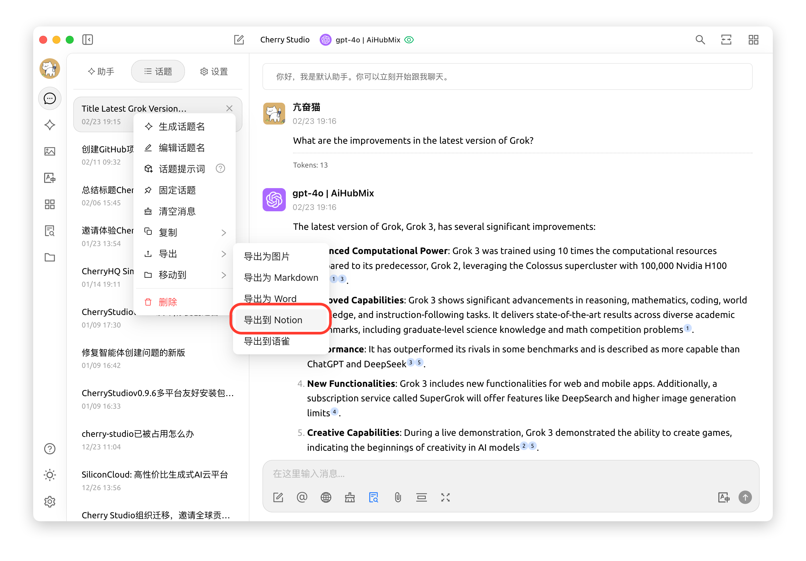


이 문서는 AI에 의해 중국어에서 번역되었으며 아직 검토되지 않았습니다。


# Notion 설정 튜토리얼

Cherry Studio는 대화 내용을 Notion 데이터베이스로 가져오는 기능을 지원합니다.

## 첫 번째 단계

[Notion Integrations](https://www.notion.so/profile/integrations) 웹사이트에서 통합 앱 생성하기

<figure><figcaption>
+ 아이콘 클릭하여 앱 생성
</figcaption></figure>

## 두 번째 단계

새로운 앱 생성하기

<figure><figcaption>
응용 프로그램 정보 입력
</figcaption></figure>

이름: Cherry Studio  
유형: 첫 번째 옵션 선택  
아이콘: 이 이미지 저장 가능  

<figure><figcaption></figcaption></figure>

## 세 번째 단계

생성된 보안 키를 복사하여 Cherry Studio 설정에 입력

<figure><figcaption>
보안 키 복사 클릭
</figcaption></figure>

<figure><figcaption>
데이터 설정란에 보안 키 입력
</figcaption></figure>

## 네 번째 단계

[Notion](https://www.notion.so/) 웹사이트에서 새 페이지 생성 후 데이터베이스 유형 선택. 이름은 Cherry Studio로 지정하고 화면 지시에 따라 연결

<figure><figcaption>
새 페이지 생성 후 데이터베이스 유형 선택
</figcaption></figure>

<figure><figcaption>
페이지 이름 입력 후 앱 연결 선택
</figcaption></figure>

## 다섯 번째 단계

<figure><figcaption>
데이터베이스 ID 복사
</figcaption></figure>

Notion 데이터베이스 URL이 다음과 같은 형식이라면:  
`https://www.notion.so/<long_hash_1>?v=<long_hash_2>`  
Notion 데이터베이스 ID는 `<long_hash_1>` 부분입니다

<figure><figcaption>
데이터베이스 ID 입력 후 확인 클릭
</figcaption></figure>

## 여섯 번째 단계

`페이지 제목 필드명` 입력:  
- 웹사이트가 영문인 경우 `Name`  
- 웹사이트가 한글인 경우 `이름`

<figure><figcaption>
페이지 제목 필드명 입력
</figcaption></figure>

## 일곱 번째 단계

축하합니다! Notion 설정이 완료되었습니다 ✅ 이제 Cherry Studio 내용을 Notion 데이터베이스로 내보낼 수 있습니다

<figure><figcaption>
Notion으로 내보내기
</figcaption></figure>

<figure><figcaption>
내보내기 결과 확인
</figcaption></figure>