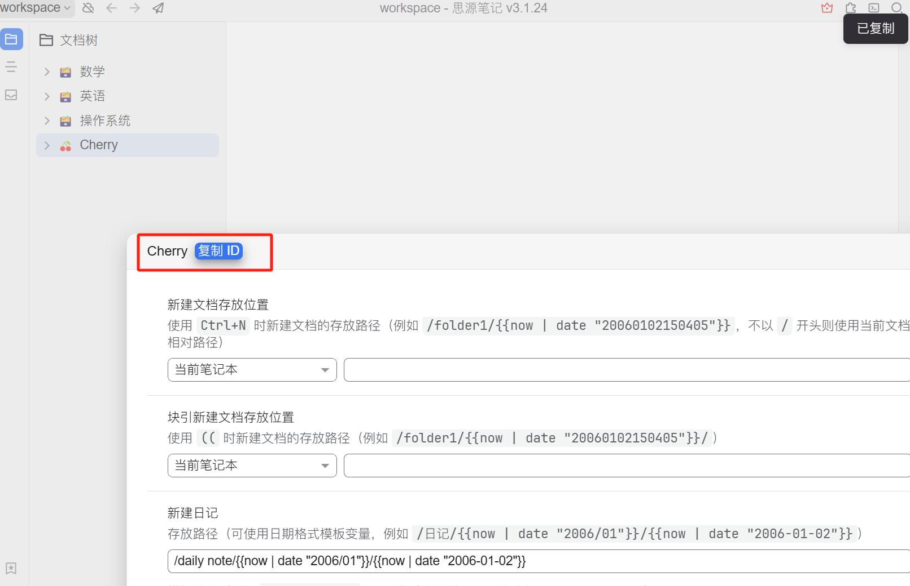
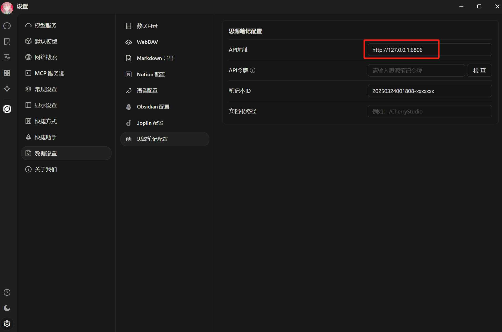
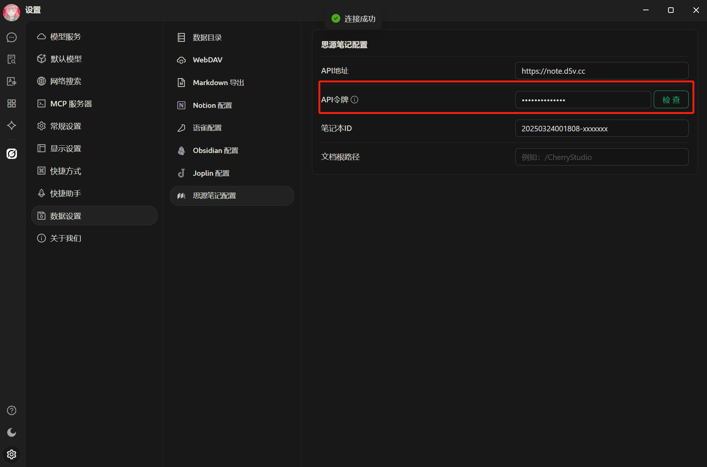
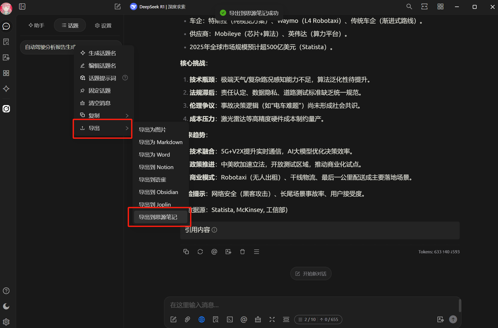


이 문서는 AI에 의해 중국어에서 번역되었으며 아직 검토되지 않았습니다。


# SiYuan Note 구성 튜토리얼

주제와 메시지를 SiYuan Note로 내보내기를 지원합니다.

## 1단계

SiYuan Note를 열고 새 노트북 생성

<figure><figcaption>
새 노트북 생성 클릭
</figcaption></figure>

## 2단계

노트북 설정 열고 `노트북 ID` 복사

<figure><figcaption>
노트북 설정 열기
</figcaption></figure>

<figure><figcaption>
노트북 ID 복사 버튼 클릭
</figcaption></figure>

## 3단계

노트북 ID를 Cherry Studio 설정에 입력

<figure><figcaption>
데이터 설정에 노트북 ID 입력
</figcaption></figure>

## 4단계

SiYuan Note 주소 입력

* **로컬**\
  일반적으로 `http://127.0.0.1:6806`
* **자체 호스팅**\
  사용자 도메인 `http://note.domain.com`

<figure><figcaption>
SiYuan Note 주소 입력
</figcaption></figure>

## 5단계

SiYuan Note `API 토큰` 복사

<figure><figcaption>
SiYuan Note 토큰 복사
</figcaption></figure>

Cherry Studio 설정에 입력 후 확인

<figure><figcaption>
데이터베이스 ID 입력 후 확인 클릭
</figcaption></figure>

## 6단계

축하합니다! SiYuan Note 구성이 완료되었습니다 ✅ 이제 Cherry Studio 콘텐츠를 SiYuan Note로 내보낼 수 있습니다

<figure><figcaption>
SiYuan Note로 내보내기
</figcaption></figure>

<figure><figcaption>
내보내기 결과 확인
</figcaption></figure>