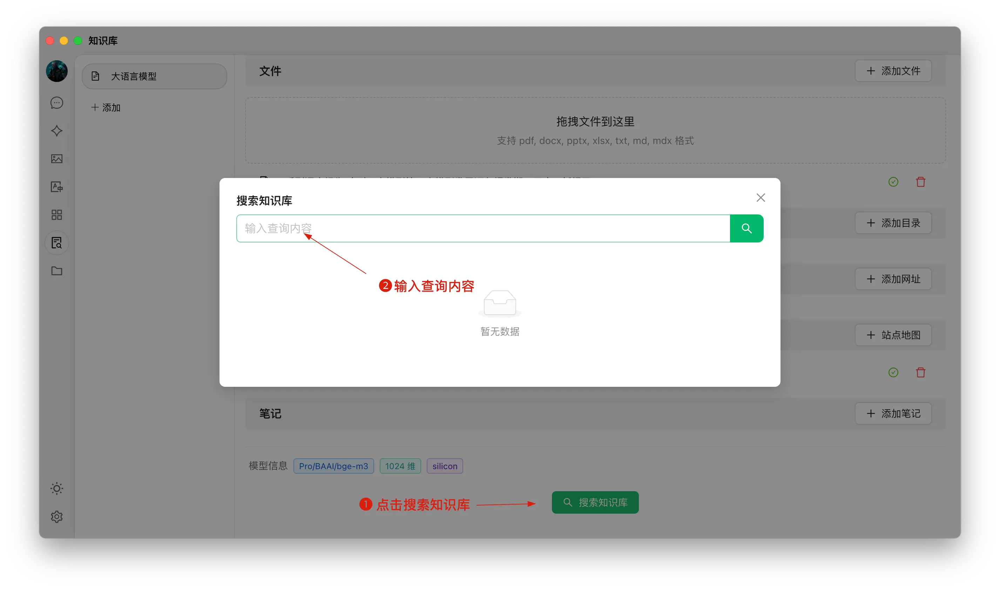


이 문서는 AI에 의해 중국어에서 번역되었으며 아직 검토되지 않았습니다。


# 지식베이스 튜토리얼

0.9.1 버전에서 CherryStudio는 기대하던 지식베이스 기능을 도입했습니다.

아래에서는 단계별로 CherryStudio의 상세 사용 방법을 설명드리겠습니다.

## 임베딩 모델 추가

1. 모델 관리 서비스에서 모델을 찾을 때 "임베딩 모델"을 클릭하여 빠르게 필터링할 수 있습니다.
2. 필요한 모델을 찾아 내 모델에 추가합니다.

<figure><figcaption></figcaption></figure>

## 지식베이스 생성

1. 지식베이스 접근 방법: CherryStudio 왼쪽 도구 모음에서 지식베이스 아이콘을 클릭하면 관리 페이지로 이동합니다.
2. 지식베이스 추가: "추가" 버튼을 클릭하여 지식베이스 생성을 시작합니다.
3. 이름 지정: 지식베이스 이름을 입력하고 임베딩 모델을 추가합니다(bge-m3 예시). 이렇게 하면 생성이 완료됩니다.

<figure><figcaption></figcaption></figure>

<figure><figcaption></figcaption></figure>

## 파일 추가 및 벡터화

1. 파일 추가: 파일 추가 버튼을 클릭하여 파일 선택 창을 엽니다.
2. 파일 선택: 지원되는 파일 형식(pdf, docx, pptx, xlsx, txt, md, mdx 등)을 선택하고 엽니다.
3. 벡터화: 시스템이 자동으로 벡터화 처리를 진행합니다. 완료 표시(녹색 ✓)가 나타나면 벡터화가 완료된 것입니다.

<figure><figcaption></figcaption></figure>

<figure><figcaption></figcaption></figure>

<figure><figcaption></figcaption></figure>

## 다양한 출처의 데이터 추가

CherryStudio는 여러 형태의 데이터 추가를 지원합니다:

1. 폴더 디렉터리: 전체 폴더를 추가할 수 있으며, 지원되는 형식의 파일은 자동으로 벡터화됩니다.
2. 웹사이트 링크: [https://docs.siliconflow.cn/introduction](https://docs.siliconflow.cn/introduction)와 같은 URL을 지원합니다.
3. 사이트맵: [https://docs.siliconflow.cn/sitemap.xml](https://docs.siliconflow.cn/sitemap.xml)과 같은 XML 형식 사이트맵을 지원합니다.
4. 순수 텍스트 노트: 사용자 정의 평문 입력을 지원합니다.


참고 사항:

1. 지식베이스로 가져온 문서의 삽화는 아직 벡터 변환을 지원하지 않으며, 수동으로 텍스트로 변환해야 합니다.
2. 웹사이트를 지식베이스 출처로 사용할 경우 항상 성공하는 것은 아닙니다. 일부 사이트는 스크래핑 방지 기술이 강화되어 있거나(로그인/권한 필요) 정확한 내용 획득이 어려울 수 있습니다. 생성 후 검색 테스트를 권장합니다.
3. 일반 사이트는 CherryStudio의 [sitemap](https://docs.cherry-ai.com/sitemap-pages.xml)처럼 사이트맵을 제공합니다. 보통 사이트 루트 주소 끝에 `/sitemap.xml`을 추가하면 확인할 수 있습니다(예: `aaa.com/sitemap.xml`).
4. 사이트맵이 없거나 주소 체계가 복잡한 경우 직접 사이트맵 XML 파일을 만들 수 있습니다. 파일은 공개 네트워크에서 접근 가능한 직링크 형태로 입력해야 하며, 로컬 파일 링크는 인식되지 않습니다.

> 1) AI로 사이트맵 파일 생성 또는 사이트맵 HTML 생성 도구 제작 가능
> 2) 직링크 생성 시 OSS 직링크나 네트워크 디스크 링크를 활용할 수 있습니다. 도구가 없는 경우 [ocoolAI](https://one.ocoolai.com/login) 공식 사이트 로그인 후 상단 메뉴의 무료 파일 업로드 도구를 이용해 직링크를 생성하세요.


## 지식베이스 검색

파일의 벡터화가 완료되면 검색이 가능합니다:

1. 페이지 하단의 "지식베이스 검색" 버튼을 클릭합니다.
2. 검색할 내용을 입력합니다.
3. 검색 결과가 표시됩니다.
4. 각 결과의 일치 점수가 함께 표시됩니다.

<figure><figcaption></figcaption></figure>

<figure><figcaption></figcaption></figure>

## 대화 시 지식베이스 참조 답변 생성

1. 새 대화 주제를 생성하고 대화 도구 모음에서 "지식베이스"를 클릭하면 생성된 지식베이스 목록이 표시됩니다. 참조할 지식베이스를 선택하세요.
2. 질문을 입력하고 전송하면 모델이 검색 결과를 기반으로 답변을 생성합니다.
3. 동시에 참조 데이터 출처가 답변 아래 표시되며, 원본 파일을 빠르게 확인할 수 있습니다.

<figure><figcaption></figcaption></figure>

<figure><figcaption></figcaption></figure>