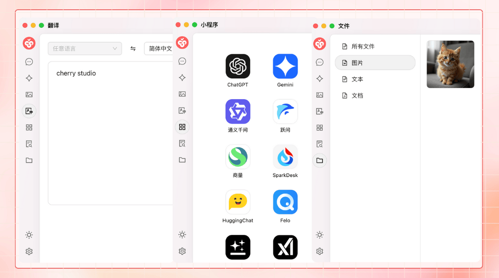
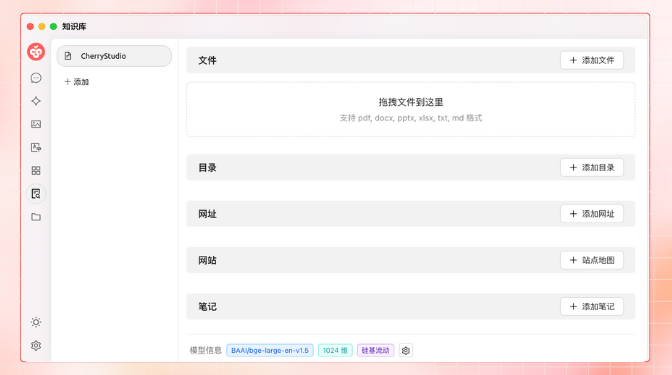

# Introdução ao Projeto


Este documento foi traduzido do chinês por IA e ainda não foi revisado.


## Introdução do Projeto

<figure><figcaption></figcaption></figure>

Siga nossas contas sociais: [Twitter (X)](https://x.com/CherryStudioAPP), [Xiaohongshu](https://www.xiaohongshu.com/user/profile/662b6853000000000b031d9a), [Weibo](https://weibo.com/u/7975656228), [Bilibili](https://space.bilibili.com/3546657515898892), [Douyin](https://www.douyin.com/user/MS4wLjABAAAAmw9A54m5J0hHVMQY5eGrVJ-EHDoOS0hgJ6M1F9MN2Tn2V163A0xrC4_KVzfmQSxC)

Junte-se à nossa comunidade: [Grupo QQ (575014769)](https://qm.qq.com/q/lo0D4qVZKi), [Telegram](https://t.me/CherryStudioAI), [Discord](https://discord.gg/wez8HtpxqQ), [Grupo WeChat](#user-content-fn-1)[^1]

***

O Cherry Studio é uma plataforma completa de assistente de IA que integra múltiplas funções, incluindo conversas com vários modelos, gerenciamento de base de conhecimento, pintura com IA, tradução e muito mais. Com design altamente personalizável, recursos de expansão poderosos e experiência amigável para os utilizadores, o Cherry Studio é a escolha ideal para utilizadores profissionais e entusiastas de IA. Quer seja um utilizador iniciante ou desenvolvedor, todos podem encontrar funções de IA adequadas para melhorar a eficiência e criatividade do trabalho.

***

#### **Funcionalidades e Características Principais**

**1. Recursos Básicos de Conversação**

* **Respostas Múltiplas para uma Única Pergunta**: Suporta a geração simultânea de respostas por múltiplos modelos para a mesma pergunta, permitindo comparações detalhadas entre modelos. Consulte [Interface de Conversação](cherrystudio/preview/chat.md).

<figure><figcaption></figcaption></figure>

* **Agrupamento Automático**: Os registros de conversa de cada assistente são agrupados automaticamente para facilitar a pesquisa rápida.
* **Exportação de Conversas**: Permite exportar conversas completas ou parciais para múltiplos formatos (Markdown, Word, etc.).
* **Parâmetros Altamente Personalizáveis**: Além dos parâmetros básicos, permite configurações personalizadas para atender necessidades específicas.

<figure><figcaption></figcaption></figure>

* **Mercado de Assistentes**: Oferece milhares de assistentes profissionais para tradução, programação, escrita e outros campos, além de permitir assistentes personalizados.

<figure><figcaption></figcaption></figure>

* **Renderização de Múltiplos Formatos**: Suporta renderização Markdown, fórmulas matemáticas e visualização HTML em tempo real.

<figure><figcaption></figcaption></figure>

**2. Integração de Recursos Exclusivos**

* **Pintura com IA**: Painel especializado para geração de imagens de alta qualidade usando descrições em linguagem natural.

<figure><figcaption></figcaption></figure>

* **Mini Programas de IA**: Diversas ferramentas de IA para web integradas, sem necessidade de alternar entre navegadores.
* **Recursos de Tradução**: Painel dedicado de tradução, tradução em conversas e tradução de prompts.
* **Gestão de Arquivos**: Arquivos de conversas, pinturas e base de conhecimento organizados em categorias unificadas.

<figure><figcaption></figcaption></figure>

* **Pesquisa Global**: Localização rápida de histórico e conteúdo da base de conhecimento.

<figure><figcaption></figcaption></figure>

**3. Mecanismo de Gestão Unificada para Multi Fornecedores**

* **Agregação de Modelos**: Suporte unificado para modelos de OpenAI, Gemini, Anthropic, Azure e outros fornecedores.
* **Obtenção Automática de Modelos**: Lista completa de modelos disponível com um clique.
* **Rotação de Múltiplas Chaves**: Alterna entre várias chaves API para evitar limitações de taxa.
* **Correspondência Precisão de Avatares**: Avatares dedicados correspondidos automaticamente para cada modelo.
* **Fornecedores Personalizados**: Suporta provedores externos compatíveis com padrões OpenAI, Gemini e Anthropic.

<figure><figcaption></figcaption></figure>

**4. Interface e Layout Altamente Personalizáveis**

* **CSS Personalizado**: Permite personalização global de estilos visuais.
* **Layout de Conversação Personalizado**: Escolha entre estilos de lista ou bolhas, com opções de personalização de mensagens.
* **Avatares Personalizados**: Configuração de avatares personalizados para o software e assistentes.
* **Menu Lateral Personalizável**: Ocultar ou reordenar funções na barra lateral conforme necessidade.

<figure><figcaption></figcaption></figure>

**5. Sistema Local de Base de Conhecimento**

* **Suporte a Múltiplos Formatos**: Importa PDF, DOCX, PPTX, XLSX, TXT, MD e outros formatos.
* **Múltiplas Fontes de Dados**: Dados locais, URLs, mapas de sites e conteúdo manual.
* **Exportação de Base de Conhecimento**: Compartilha bases de conhecimento processadas.
* **Verificação de Pesquisa**: Teste em tempo real após importação para verificar resultados e segmentação.

<figure><figcaption></figcaption></figure>

**6. Recursos de Foco**

* **Q\&A Rápido**: Assistente rápido disponível em qualquer contexto (WeChat, navegadores).
* **Tradução Rápida**: Tradução instantânea de palavras ou textos em outros aplicativos.
* **Resumo de Conteúdo**: Síntese rápida de textos longos.
* **Explicações Automáticas**: Gera explicações para perguntas complexas sem necessidade de prompts elaborados.

<figure><figcaption></figcaption></figure>

**7. Garantia de Dados**

* **Múltiplas Opções de Backup**: Backup local, WebDAV e programado.
* **Segurança de Dados**: Modo totalmente local com modelos locais para evitar vazamentos.

***

#### **Vantagens do Projeto**

1. **Fácil para Iniciantes**: Projetado para reduzir barreiras técnicas, adequado para iniciantes.
2. **Documentação Completa**: Documentos detalhados de uso e guias de solução de problemas.
3. **Atualizações Contínuas**: Equipe ativa na implementação de feedback dos utilizadores.
4. **Código Aberto e Extensibilidade**: Permite personalização via código fonte aberto.

***

#### **Cenários de Aplicação**

* **Gestão e Consulta de Conhecimento**: Construção rápida de bases de conhecimento para pesquisa e educação.
* **Diálogos e Criação com Múltiplos Modelos**: Geração de conteúdo e obtenção de informações.
* **Tradução e Automação de Escritório**: Processamento de documentos em múltiplos idiomas.
* **Pintura com IA e Design**: Geração de imagens criativas com descrições naturais.

#### Star History

### Siga Nossas Contas Sociais

<table data-view="cards"><thead><tr><th></th><th data-hidden data-card-cover data-type="files"></th><th data-hidden data-card-target data-type="content-ref"></th></tr></thead><tbody><tr><td><a href="https://www.xiaohongshu.com/user/profile/662b6853000000000b031d9a?xsec_token=YB_1nKvlH4r5hPYVVbbsNHF8Y6n6AKlm5-DaggPCtd2DQ%3D&#x26;xsec_source=app_share&#x26;xhsshare=CopyLink&#x26;appuid=662b6853000000000b031d9a&#x26;apptime=1738627324&#x26;share_id=ace5db41b5954fab8d98a2a7865a62bc&#x26;share_channel=copy_link">Xiaohongshu</a></td><td><a href=".gitbook/assets/1.png">1.png</a></td><td><a href="https://www.xiaohongshu.com/user/profile/662b6853000000000b031d9a?xsec_token=YB_1nKvlH4r5hPYVVbbsNHF8Y6n6AKlm5-DaggPCtd2DQ%3D&#x26;xsec_source=app_share&#x26;xhsshare=CopyLink&#x26;appuid=662b6853000000000b031d9a&#x26;apptime=1738627324&#x26;share_id=ace5db41b5954fab8d98a2a7865a62bc&#x26;share_channel=copy_link">https://www.xiaohongshu.com/user/profile/662b6853000000000b031d9a?xsec_token=YB_1nKvlH4r5hPYVVbbsNHF8Y6n6AKlm5-DaggPCtd2DQ%3D&#x26;xsec_source=app_share&#x26;xhsshare=CopyLink&#x26;appuid=662b6853000000000b031d9a&#x26;apptime=1738627324&#x26;share_id=ace5db41b5954fab8d98a2a7865a62bc&#x26;share_channel=copy_link</a></td></tr><tr><td><a href="https://b23.tv/hIfGgDW">Bilibili</a></td><td><a href=".gitbook/assets/3.png">3.png</a></td><td><a href="https://b23.tv/hIfGgDW">https://b23.tv/hIfGgDW</a></td></tr><tr><td><a href="https://weibo.com/u/7975656228">Weibo</a></td><td><a href=".gitbook/assets/2.png">2.png</a></td><td><a href="https://weibo.com/u/7975656228">https://weibo.com/u/7975656228</a></td></tr><tr><td><a href="https://v.douyin.com/ifTpX4X7">Douyin</a></td><td><a href=".gitbook/assets/4.png">4.png</a></td><td><a href="https://v.douyin.com/ifTpX4X7">https://v.douyin.com/ifTpX4X7</a></td></tr><tr><td><a href="https://x.com/CherryStudioAPP?t=DYR0ulaLur-bO4Us3bG79A&#x26;s=05">Twitter (X)</a></td><td><a href=".gitbook/assets/5.png">5.png</a></td><td><a href="https://x.com/CherryStudioAPP?t=DYR0ulaLur-bO4Us3bG79A&#x26;s=05">https://x.com/CherryStudioAPP?t=DYR0ulaLur-bO4Us3bG79A&#x26;s=05</a></td></tr></tbody></table>

[^1]: 
