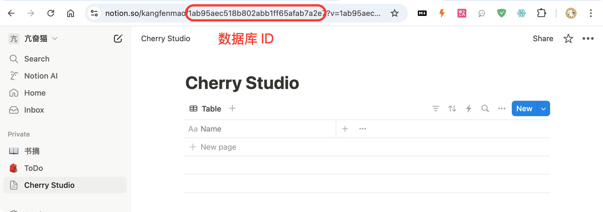

# Tutorial de Configuração do Notion


Este documento foi traduzido do chinês por IA e ainda não foi revisado.


O Cherry Studio suporta a importação de tópicos para o banco de dados do Notion.

## Passo 1

Acesse o site [Notion Integrations](https://www.notion.so/profile/integrations) para criar uma integração

<figure><figcaption>
Clique no ícone "+" para criar uma integração
</figcaption></figure>

## Passo 2

Crie uma integração

<figure><figcaption>
Preencha as informações da integração
</figcaption></figure>

Nome: Cherry Studio  
Tipo: Selecione a primeira opção  
Ícone: Você pode usar esta imagem  

<figure><figcaption></figcaption></figure>

## Passo 3

Copie a chave secreta e cole nas configurações do Cherry Studio

<figure><figcaption>
Clique para copiar a chave secreta
</figcaption></figure>

<figure><figcaption>
Cole a chave secreta nas configurações de dados
</figcaption></figure>

## Passo 4

Acesse o site do [Notion](https://www.notion.so/), crie uma nova página e selecione o tipo "Banco de dados". Nomeie como "Cherry Studio" e conecte conforme ilustrado

<figure><figcaption>
Crie uma nova página selecionando o tipo de banco de dados
</figcaption></figure>

<figure><figcaption>
Digite o nome da página e selecione "Conectar ao APP"
</figcaption></figure>

## Passo 5

<figure><figcaption>
Copie o ID do banco de dados
</figcaption></figure>

Se o URL do seu banco de dados no Notion for semelhante a:  
`https://www.notion.so/<long_hash_1>?v=<long_hash_2>`  
O ID do banco de dados é a parte `<long_hash_1>`

<figure><figcaption>
Preencha o ID do banco de dados e clique em "Verificar"
</figcaption></figure>

## Passo 6

Preencha o `Nome do campo de título da página`:  
• Se sua interface estiver em inglês: `Name`  
• Se sua interface estiver em chinês: `名称`

<figure><figcaption>
Preencha o nome do campo de título da página
</figcaption></figure>

## Passo 7

Parabéns! A configuração do Notion está concluída ✅ Agora você pode exportar conteúdos do Cherry Studio para seu banco de dados

<figure><figcaption>
Exportar para o Notion
</figcaption></figure>

<figure><figcaption>
Verifique os resultados da exportação
</figcaption></figure>