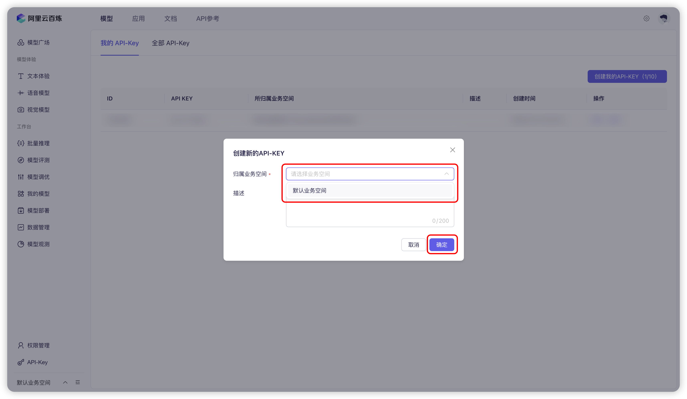

# Aliyun Bailian


Este documento foi traduzido do chinês por IA e ainda não foi revisado.


1. Faça login no [Aliyun Bailian](https://bailian.console.aliyun.com/?tab=model#/api-key). Se você não tiver uma conta do Aliyun, precisará se registrar.

2. Clique no botão `创建我的 API-KEY` no canto superior direito.
  <figure><figcaption>Criação de chave API no Aliyun Bailian</figcaption></figure>
  
3. Na janela pop-up, selecione o espaço de trabalho padrão (ou você pode personalizar) e preencha uma descrição se desejar.
  <figure><figcaption>Janela pop-up de criação de chave API no Aliyun Bailian</figcaption></figure>
  
4. Clique no botão `确定` no canto inferior direito.

5. Você deverá ver uma nova linha na lista. Clique no botão `查看` à direita.
   <figure><figcaption>Visualização de chave API no Aliyun Bailian</figcaption></figure>
   
6. Clique no botão `复制`.
    <figure><figcaption>Cópia de chave API no Aliyun Bailian</figcaption></figure>

7. Acesse o Cherry Studio, navegue para `设置` → `模型服务` → `阿里云百炼`, localize `API 密钥` e cole a chave API copiada.
    <figure><figcaption>Preenchimento de chave API no Aliyun Bailian</figcaption></figure>
    
8. Você pode ajustar as configurações conforme descrito em [Serviço de Modelo](../../cherrystudio/preview/settings/providers.md) e começar a usar.

Se os modelos do Aliyun Bailian não aparecerem na lista, verifique se você adicionou os modelos conforme as instruções em [Serviço de Modelo](../../cherrystudio/preview/settings/providers.md) e se ativou este provedor.
