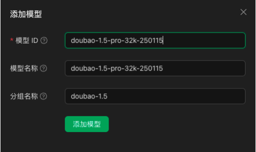


Este documento foi traduzido do chinês por IA e ainda não foi revisado.


# ByteDance (Doubao)

* Faça login no [Volcano Engine](https://console.volcengine.com/)
* Clique diretamente [aqui para acessar](https://console.volcengine.com/ark/region:ark+cn-beijing/openManagement?LLM=%7B%7D)

<figure><figcaption></figcaption></figure>

### Obter Chave API

* Clique em [Gerenciamento de Chave API](https://console.volcengine.com/ark/region:ark+cn-beijing/apiKey) na barra lateral inferior
* Crie uma Chave API

<figure><figcaption></figcaption></figure>

* Após criação bem-sucedida, clique no ícone de olho ao lado da Chave API criada para visualizar e copiar

<figure><figcaption></figcaption></figure>

* Cole a Chave API copiada no CherryStudio e ative o switch do provedor de serviço

<figure><figcaption></figcaption></figure>

### Ativar e adicionar modelos

* Ative os modelos necessários em [Gerenciamento de Ativação](https://console.volcengine.com/ark/region:ark+cn-beijing/openManagement?LLM=%7B%7D\&OpenTokenDrawer=false) no console Ark, onde você pode ativar modelos como a série Doubao e DeepSeek conforme necessário

<figure><figcaption></figcaption></figure>

* Encontre o Model ID correspondente no [documento de lista de modelos](https://www.volcengine.com/docs/82379/1330310#%E6%96%87%E6%9C%AC%E7%94%9F%E6%88%90)

<figure><figcaption></figcaption></figure>

* Acesse as configurações de [Serviços de Modelo](../../cherrystudio/preview/settings/providers.md) no Cherry Studio e localize Volcano Engine
* Clique em Adicionar e cole o Model ID obtido no campo de texto Model ID

<figure><figcaption></figcaption></figure>

* Adicione modelos sequencialmente seguindo este processo

### Endereço da API

Existem dois formatos para o endereço da API:

* Primeiro formato (padrão do cliente): `https://ark.cn-beijing.volces.com/api/v3/`
* Segundo formato: `https://ark.cn-beijing.volces.com/api/v3/chat/completions#`


Não há diferença significativa entre os dois formatos. Mantenha o padrão sem modificações.

Para diferenças entre terminações `/` e `#`, consulte a seção de Endereço API nas configurações do provedor, [clique para acessar](../../cherrystudio/preview/settings/providers.md#api-di-zhi)


<figure><figcaption>
Exemplo cURL da documentação oficial
</figcaption></figure>