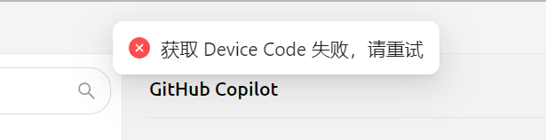

# GitHub Copilot


Este documento foi traduzido do chinês por IA e ainda não foi revisado.


Para usar o GitHub Copilot, você precisa primeiro ter uma conta GitHub e assinar o serviço GitHub Copilot. A assinatura da versão gratuita (free) também é válida, mas observe que a versão gratuita não suporta o modelo mais recente Claude 3.7. Detalhes podem ser encontrados no [site oficial do GitHub Copilot](https://github.com/features/copilot).

## Obter Device Code

Clique em "Login GitHub" para obter e copiar o Device Code.

<figure><figcaption>
Obter Device Code
</figcaption></figure>

## Inserir Device Code no navegador e autorizar

Após obter o Device Code com sucesso, clique no link para abrir o navegador. Faça login na sua conta GitHub, insira o Device Code e conceda a autorização.

<figure><figcaption>
Autorização GitHub
</figcaption></figure>

Após autorização bem-sucedida, retorne ao Cherry Studio e clique em "Conectar GitHub". Após conexão bem-sucedida, seu nome de usuário e avatar do GitHub serão exibidos.

<figure><figcaption>
Conexão GitHub bem-sucedida
</figcaption></figure>

## Clique em "Gerenciar" para obter lista de modelos

Clique no botão "Gerenciar" abaixo para buscar automaticamente pela Internet a lista de modelos atualmente suportados.

<figure><figcaption>
Obter lista de modelos
</figcaption></figure>

## Perguntas frequentes

### Falha ao obter Device Code, tente novamente

<figure><figcaption>
Falha ao obter Device Code
</figcaption></figure>

Atualmente, as solicitações são construídas usando Axios. O Axios não suporta proxies SOCKS. Utilize proxy de sistema ou proxy HTTP, ou simplesmente não configure proxy no CherryStudio usando proxy global. Primeiro, verifique se sua conexão de rede está normal para evitar falhas na obtenção do Device Code.