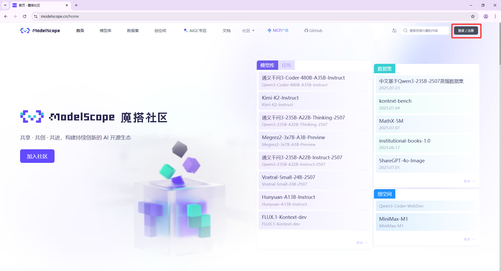
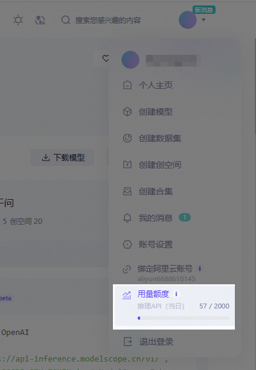

# Guia de Integração da Plataforma ModelScope


Este documento foi traduzido do chinês por IA e ainda não foi revisado.


## O que é o ModelScope?
> O ModelScope é uma nova geração de plataforma de compartilhamento de modelo como serviço (MaaS) de código aberto, dedicada a fornecer soluções **flexíveis, fáceis de usar e de baixo custo** para desenvolvedores de IA, tornando a aplicação de modelos mais simples!
>
> Através da **capacidade de serviço API-Inference**, a plataforma padroniza modelos de código aberto em interfaces API chamáveis, permitindo que desenvolvedores integrem capacidades de modelos em diversas aplicações de IA de forma leve e rápida, suportando cenários inovadores como chamadas de ferramentas e prototipagem.

### Vantagens Principais
- ✅ **Franquia gratuita**: Oferece **2000 chamadas de API gratuitas por dia** ([Regras de cobrança](##regras-de-cobrança-e-quotas))
- ✅ **Biblioteca rica**: Abrange mais de 1000 modelos de código aberto em NLP, CV, voz e multimodalidade
- ✅ **Pronto para uso**: Não requer implantação, acessível via RESTful API

---

## Fluxo de Integração no Cherry Studio
### Passo 1: Obter Token de API do ModelScope
1. **Acessar a plataforma**
   - Visite o [site oficial do ModelScope](https://modelscope.cn) → Clique em **Login** no canto superior direito → Selecione método de autenticação
   
2. **Criar token de acesso**
   - Navegue até **[Configurações de Conta → Tokens de Acesso](https://modelscope.cn/my/myaccesstoken)**
   - Clique em **`Criar Token`** → Preencha a descrição → **Copie o token gerado** (*veja exemplo na imagem abaixo*)
   
   > 🔑 **Importante**: Tokens comprometidos afetam a segurança da conta!

### Passo 2: Configurar o Cherry Studio
- Abra o **Cherry Studio** → **Configurações → Serviços de Modelo → ModelScope**
- Cole o token copiado no campo `Chave de API`
  
- Clique em **`Salvar`** para concluir a autorização

### Passo 3: Invocar a API de Modelo
1. **Encontrar modelos compatíveis com API**
   - Acesse o [Repositório de Modelos do ModelScope](https://modelscope.cn/models)
   - Filtro: **Marque `API-Inference`** (ou identifique pelo ícone `API` no card do modelo)
   
   > Os modelos com API-Inference são incluídos com base na popularidade na plataforma (dados como curtidas e downloads). Portanto, a lista de suporte será atualizada continuamente com novos modelos de código aberto de alta performance.
2. **Obter Model ID**
   - Entre na página de detalhes do modelo-alvo → Copie o **ID do Modelo** (formato: `damo/nlp_structbert_sentiment-classification_chinese-base`)
   
3. **Inserir no Cherry Studio**
   - No painel de configurações de serviço, insira o ID no campo `ID do Modelo` → Selecione o tipo de tarefa → Conclua a configuração
   

---

## Regras de Cobrança e Quotas
### Informações Importantes
- 🎫 **Franquia grátis**: Cada usuário tem **2000 chamadas de API por dia** (*sujeito às regras vigentes no site*)
- 🔁 **Redefinição de quota**: Reinicia automaticamente diariamente às 00:00 UTC+8, **não é acumulável**
- 💡 **Limite excedido**:
  - Ao atingir o limite diário, a API retorna erro `429`
  - Soluções: Alternar conta secundária / Usar outra plataforma / Otimizar frequência de chamadas

### Verificar Saldo Atual
- Faça login no ModelScope → Clique no **`nome de usuário`** → **`Status de Uso da API`**
  

> ⚠️ Atenção: A cota diária gratuita para API-Inference é de 2000 chamadas. Para necessidades maiores, considere serviços como a plataforma Bailian da Alibaba Cloud.