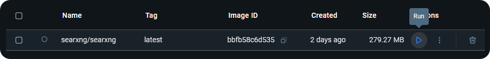
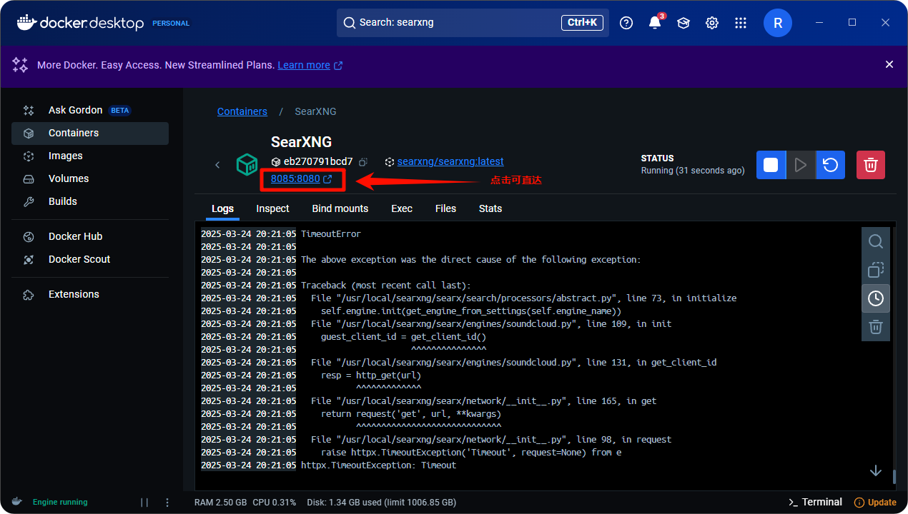
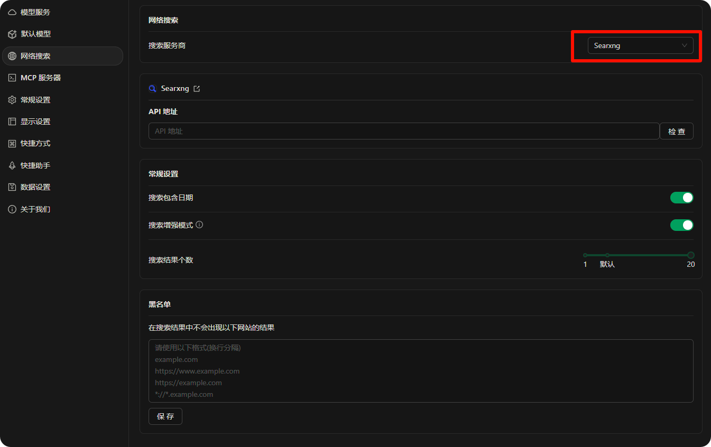
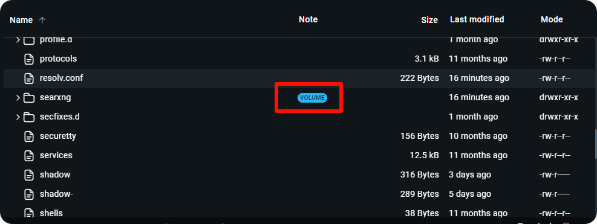
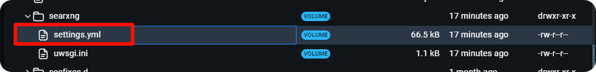
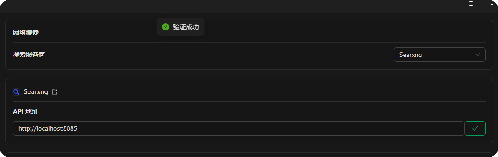
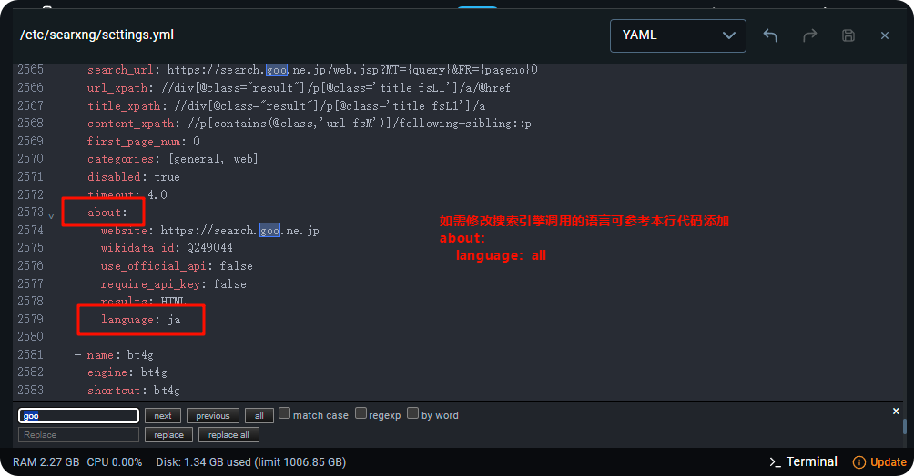

# Implantação e Configuração Local do SearXNG



Este documento foi traduzido do chinês por IA e ainda não foi revisado.



O CherryStudio suporta pesquisa na internet através do SearXNG. O SearXNG é um projeto de código aberto que pode ser implantado localmente ou em servidores, sendo sua configuração ligeiramente diferente de outros métodos que exigem provedores de API.

**Link do projeto SearXNG:** [SearXNG](https://github.com/searxng/searxng)

## Vantagens do SearXNG

* Código aberto e gratuito, sem necessidade de API
* Relativamente mais privado
* Altamente personalizável

## Implantação Local

### 1. Implantação direta com Docker

Como o SearXNG não requer configuração complexa de ambiente (dispensando docker compose) e só precisa de uma porta livre, a maneira mais rápida é implantar via Docker usando uma imagem pré-configurada.

#### 1. Baixar, instalar e configurar o [docker](https://www.docker.com/)

<figure><figcaption></figcaption></figure>

Após instalação, selecione um caminho para armazenamento de imagens:

<figure><figcaption></figcaption></figure>

#### 2. Buscar e baixar a imagem do SearXNG

Digite **searxng** na barra de pesquisa:

<figure><figcaption></figcaption></figure>

Baixar a imagem:

<figure><figcaption></figcaption></figure>

<figure><figcaption></figcaption></figure>

#### 3. Executar a imagem

Após download, vá para a página **images**:

<figure><figcaption></figcaption></figure>

Selecione a imagem baixada e clique em executar:

<figure><figcaption></figcaption></figure>

Abra as configurações para ajustes:

<figure><figcaption></figcaption></figure>

Usando a porta `8085` como exemplo:

<figure><figcaption></figcaption></figure>

Após execução bem-sucedida, clique no link para acessar a interface do SearXNG:

<figure><figcaption></figcaption></figure>

Esta página confirma a implantação bem-sucedida:

<figure><figcaption></figcaption></figure>

## Implantação em Servidor

Como instalar Docker no Windows pode ser complexo, os usuários podem implantar o SearXNG em servidores e compartilhá-lo. Porém, o SearXNG ainda não suporta autenticação nativa, permitindo que terceiros descubram e abusem da sua instância.

Para resolver isso, o Cherry Studio agora suporta [Autenticação Básica HTTP (RFC7617)](https://developer.mozilla.org/zh-CN/docs/Web/HTTP/Guides/Authentication). Se expuser seu SearXNG na internet pública, **configure obrigatoriamente** autenticação via Nginx ou outro proxy reverso. Veja um tutorial simplificado abaixo (requer conhecimento básico de Linux).

### Implantar o SearXNG

Similar à implantação local, use Docker. Assumindo que o Docker CE já está instalado no servidor ([tutorial oficial](https://docs.docker.com/engine/install)), execute estes comandos para instalação limpa em Debian:

```bash
sudo apt update
sudo apt install git -y

# Baixar repositório oficial
cd /opt
git clone https://github.com/searxng/searxng-docker.git
cd /opt/searxng-docker

# Desative se a largura de banda do servidor for baixa
export IMAGE_PROXY=true

# Modificar configurações
cat <<EOF > /opt/searxng-docker/searxng/settings.yml
# see https://docs.searxng.org/admin/settings/settings.html#settings-use-default-settings
use_default_settings: true
server:
  # base_url is defined in the SEARXNG_BASE_URL environment variable, see .env and docker-compose.yml
  secret_key: $(openssl rand -hex 32)
  limiter: false  # can be disabled for a private instance
  image_proxy: $IMAGE_PROXY
ui:
  static_use_hash: true
redis:
  url: redis://redis:6379/0
search:
  formats:
    - html
    - json
EOF
```

Para alterar portas ou reutilizar Nginx existente, edite `docker-compose.yaml` conforme exemplo:

```yaml
version: "3.7"

services:
# Remova esta seção para reutilizar Nginx local
  caddy:
    container_name: caddy
    image: docker.io/library/caddy:2-alpine
    network_mode: host
    restart: unless-stopped
    volumes:
      - ./Caddyfile:/etc/caddy/Caddyfile:ro
      - caddy-data:/data:rw
      - caddy-config:/config:rw
    environment:
      - SEARXNG_HOSTNAME=${SEARXNG_HOSTNAME:-http://localhost}
      - SEARXNG_TLS=${LETSENCRYPT_EMAIL:-internal}
    cap_drop:
      - ALL
    cap_add:
      - NET_BIND_SERVICE
    logging:
      driver: "json-file"
      options:
        max-size: "1m"
        max-file: "1"
# Remova esta seção para reutilizar Nginx local
  redis:
    container_name: redis
    image: docker.io/valkey/valkey:8-alpine
    command: valkey-server --save 30 1 --loglevel warning
    restart: unless-stopped
    networks:
      - searxng
    volumes:
      - valkey-data2:/data
    cap_drop:
      - ALL
    cap_add:
      - SETGID
      - SETUID
      - DAC_OVERRIDE
    logging:
      driver: "json-file"
      options:
        max-size: "1m"
        max-file: "1"

  searxng:
    container_name: searxng
    image: docker.io/searxng/searxng:latest
    restart: unless-stopped
    networks:
      - searxng
    # Porta padrão: 8080. Para usar 8000: "127.0.0.1:8000:8080"
    ports:
      - "127.0.0.1:8080:8080"
    volumes:
      - ./searxng:/etc/searxng:rw
    environment:
      - SEARXNG_BASE_URL=https://${SEARXNG_HOSTNAME:-localhost}/
      - UWSGI_WORKERS=${SEARXNG_UWSGI_WORKERS:-4}
      - UWSGI_THREADS=${SEARXNG_UWSGI_THREADS:-4}
    cap_drop:
      - ALL
    cap_add:
      - CHOWN
      - SETGID
      - SETUID
    logging:
      driver: "json-file"
      options:
        max-size: "1m"
        max-file: "1"

networks:
  searxng:

volumes:
# Remova para reutilizar Nginx local
  caddy-data:
  caddy-config:
# Remova para reutilizar Nginx local
  valkey-data2:
```

Execute `docker compose up -d` para iniciar. Monitore logs com `docker compose logs -f searxng`.

### Configurar Proxy Reverso Nginx e Autenticação Básica HTTP

Se usar painéis como BT.cn ou 1Panel, consulte a documentação para adicionar sites e configurar proxy reverso. Modifique o arquivo Nginx conforme exemplo:

```conf
server
{
    listen 443 ssl;

    # Seu nome de servidor
    server_name search.example.com;

    # Configurações SSL
    ssl_certificate    /path/to/your/cert/fullchain.pem;
    ssl_certificate_key    /path/to/your/cert/privkey.pem;

    # HSTS (opcional)
    # add_header Strict-Transport-Security "max-age=31536000; includeSubDomains; preload";

    location / {
        # Adicione estas duas linhas
        auth_basic "Digite seu nome de usuário e senha";
        auth_basic_user_file /etc/nginx/conf.d/search.htpasswd;

        proxy_http_version 1.1;
        proxy_set_header Connection "";
        proxy_redirect off;
        proxy_set_header Host $host;
        proxy_set_header X-Forwarded-For $proxy_protocol_addr;
        proxy_pass http://127.0.0.1:8000;
        client_max_body_size 0;
    }

    # Logs (opcional)
    # access_log  ...;
    # error_log  ...;
}
```

Supondo que o arquivo Nginx esteja em `/etc/nginx/conf.d`, crie o arquivo de senhas no mesmo diretório:

```bash
echo "example_name:$(openssl passwd -5 'example_password')" > /etc/nginx/conf.d/search.htpasswd
```

Reinicie o Nginx (ou recarregue configurações).

Ao acessar o site, será solicitado login. Use as credenciais definidas para verificar o funcionamento:

<figure><figcaption></figcaption></figure>

## Configurações no Cherry Studio

Após implantar o SearXNG localmente ou em servidor, configure-o no CherryStudio.

Acesse as configurações de pesquisa na internet e selecione Searxng:

<figure><figcaption></figcaption></figure>

Ao inserir o link local, a verificação pode falhar inicialmente:

<figure><figcaption></figcaption></figure>

Isso ocorre porque o formato JSON não está habilitado por padrão. Modifique o arquivo de configuração.

No Docker, acesse a guia **Files** e localize a pasta com tags:

<figure><figcaption></figcaption></figure>

Expanda e navegue até outra pasta marcada:

<figure><figcaption></figcaption></figure>

Localize o arquivo **settings.yml**:

<figure><figcaption></figcaption></figure>

Abra o editor de arquivos:

<figure><figcaption></figcaption></figure>

Na linha 78, adicione o tipo JSON:

<figure><figcaption></figcaption></figure>

Salve e reinicie a imagem:

<figure><figcaption></figcaption></figure>

<figure><figcaption></figcaption></figure>

Agora a verificação no Cherry Studio funcionará:

<figure><figcaption></figcaption></figure>

Use:
- Local: [http://localhost](http://localhost):porta
- Docker: [http://host.docker.internal](http://host.docker.internal):porta

Para instâncias em servidor com autenticação, a verificação retornará erro 401:

<figure><figcaption></figcaption></figure>

Insira as credenciais no cliente:

<figure><figcaption></figcaption></figure>

A verificação agora será bem-sucedida.

### Outras Configurações

O SearXNG já possui capacidades padrão de pesquisa. Para personalizar mecanismos de busca, ajuste manualmente:

Observe que preferências aqui não afetam chamadas de modelos de IA

<figure><figcaption></figcaption></figure>

Configure mecanismos para modelos de IA no arquivo de configurações:

<figure><figcaption></figcaption></figure>

<figure><figcaption></figcaption></figure>

Referência de configuração de idioma:

<figure><figcaption></figcaption></figure>

Para edições extensas, copie o conteúdo para um IDE local, modifique e cole de volta.

## Problemas Comuns de Verificação

### Formato JSON não adicionado

Adicione json em `search.formats`:

<figure><figcaption></figcaption></figure>

### Mecanismos de busca mal configurados

O Cherry Studio seleciona padrões com categorias `web` e `general`. Como o Google é bloqueado na China, force o uso do Baidu:

```
use_default_settings:
  engines:
    keep_only:
      - baidu
engines:
  - name: baidu
    engine: baidu 
    categories: 
      - web
      - general
    disabled: false
```

### Limitação de taxa

Desative o limiter nas configurações:

<figure><figcaption></figcaption></figure>