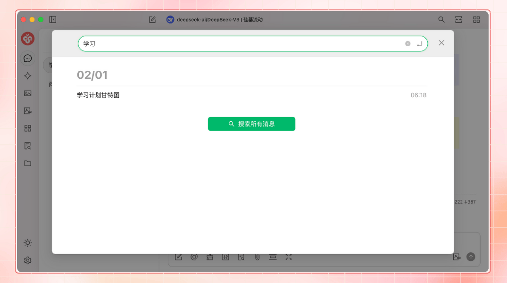
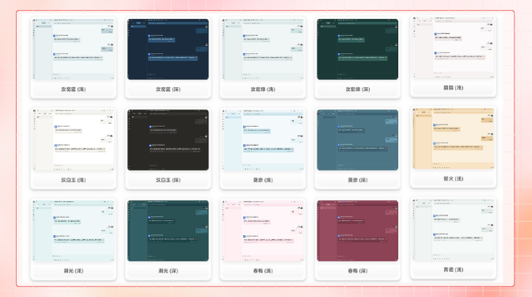

# Введение в проект


Этот документ переведен с китайского языка с помощью ИИ и еще не был проверен.


## Описание проекта

<figure><figcaption></figcaption></figure>

Подписывайтесь на нас в соцсетях: [Твиттер(X)](https://x.com/CherryStudioAPP)、[Сяохуншу](https://www.xiaohongshu.com/user/profile/662b6853000000000b031d9a)、[Вэйбо](https://weibo.com/u/7975656228)、[Bilibili](https://space.bilibili.com/3546657515898892)、[Douyin](https://www.douyin.com/user/MS4wLjABAAAAmw9A54m5J0hHVMQY5eGrVJ-EHDoOS0hgJ6M1F9MN2Tn2V163A0xrC4_KVzfmQSxC)

Присоединяйтесь к нашим сообществам: [QQ группа (575014769)](https://qm.qq.com/q/lo0D4qVZKi)、[Telegram](https://t.me/CherryStudioAI)、[Discord](https://discord.gg/wez8HtpxqQ)、[WeChat группа](#user-content-fn-1)[^1]

***

Cherry Studio - это универсальная платформа AI-ассистента, объединяющая многомодельные диалоги, управление базами знаний, AI-рисование, перевод и другие функции.\
Благодаря высоко настраиваемому дизайну, мощным возможностям расширения и дружелюбному интерфейсу, Cherry Studio является идеальным выбором для профессиональных пользователей и энтузиастов искусственного интеллекта. Независимо от уровня подготовки, каждый найдет в Cherry Studio подходящие AI-функции для повышения производительности и творчества.

***

#### **Основные возможности и особенности**

**1. Базовые функции общения**

* **Один вопрос - несколько ответов**: одновременное получение ответов от нескольких моделей для сравнения их работы (подробнее см. [Интерфейс чата](cherrystudio/preview/chat.md)).

<figure><figcaption></figcaption></figure>

* **Автоматическая группировка**: история диалогов каждого ассистента автоматически группируется для быстрого поиска.
* **Экспорт диалогов**: поддержка экспорта полных или частичных диалогов в различные форматы (Markdown, Word и др.).
* **Расширенные настройки параметров**: кроме базовых настроек, доступны кастомные параметры под индивидуальные нужды.

<figure><figcaption></figcaption></figure>

* **Магазин ассистентов**: встроенные тысячи отраслевых ассистентов (перевод, программирование, написание текстов) с поддержкой пользовательских настроек.

<figure><figcaption></figcaption></figure>

* **Мультиформатный рендеринг**: поддержка Markdown, математических формул, HTML-превью в реальном времени.

<figure><figcaption></figcaption></figure>

**2. Интеграция специализированных функций**

* **AI-рисование**: генерация высококачественных изображений по текстовым описаниям.

<figure><figcaption></figcaption></figure>

* **AI-миниприложения**: встроенные веб-инструменты ИИ без переключения между браузерами.
* **Перевод**: специализированные панели для перевода диалогов, промптов и документов.
* **Управление файлами**: централизованная систематизация файлов из диалогов, рисунков и баз знаний.

<figure><figcaption></figcaption></figure>

* **Глобальный поиск**: быстрый поиск по истории и базам знаний.

<figure><figcaption></figcaption></figure>

**3. Унифицированное управление провайдерами**

* **Агрегация моделей**: поддержка моделей от OpenAI, Gemini, Anthropic, Azure и других провайдеров.
* **Автообновление моделей**: автоматическое получение списков моделей без ручной настройки.
* **Ротация API-ключей**: использование нескольких ключей для обхода лимитов запросов.
* **Персонализированные аватары**: автоматическое присвоение уникальных аватаров моделям.
* **Кастомные провайдеры**: поддержка сторонних сервисов, совместимых с OpenAI/Gemini/Anthropic.

<figure><figcaption></figcaption></figure>

**4. Кастомизация интерфейса**

* **Пользовательские CSS**: глобальная настройка стилей интерфейса.
* **Гибкий макет чата**: выбор между списком или пузырьковым форматом с настройкой стилей сообщений.
* **Индивидуальные аватары**: установка аватаров для ПО и ассистентов.
* **Адаптируемая боковая панель**: скрытие/сортировка элементов панели.

<figure><figcaption></figcaption></figure>

**5. Локальная система баз знаний**

* **Поддержка форматов**: импорт PDF, DOCX, PPTX, XLSX, TXT, MD и других.
* **Разнородные источники**: локальные файлы, веб-сайты, карты сайтов, ручной ввод.
* **Экспорт знаний**: возможность делиться обработанными базами знаний.
* **Поисковая проверка**: тестирование сегментации при импорте.

<figure><figcaption></figcaption></figure>

**6. Специальные инструменты**

* **Быстрые ответы**: мгновенный вызов ассистента из любого контекста (браузер, мессенджеры).
* **Экспресс-перевод**: оперативный перевод слов/текста в сторонних приложениях.
* **Суммаризация**: сжатие длинных текстов.
* **Объяснение контента**: упрощенный анализ сложных материалов без сложных промптов.

<figure><figcaption></figcaption></figure>

**7. Защита данных**

* **Схемы резервирования**: локальное, WebDAV и авторезервное копирование.
* **Безопасность**: полностью локальные сценарии использования с локальными LLM для предотвращения утечек.

***

#### **Преимущества проекта**

1. **Простота освоения**: низкий порог входа для новичков с фокусом на продуктивности.
2. **Детальная документация**: исчерпывающие руководства и FAQ.
3. **Постоянное развитие**: активное внедрение пользовательских предложений.
4. **Открытость и расширяемость**: кастомизация через открытый код.

***

#### **Сценарии применения**

* **Управление знаниями**: создание/поиск персональных баз знаний для исследований и образования.
* **Диалоги и креатив**: параллельное взаимодействие с множеством моделей.
* **Перевод и автоматизация**: встроенные инструменты для мультиязычных задач.
* **AI-рисование и дизайн**: генерация изображений по описаниям.

#### Star History

### Подписывайтесь на нас в соцсетях

<table data-view="cards"><thead><tr><th></th><th data-hidden data-card-cover data-type="files"></th><th data-hidden data-card-target data-type="content-ref"></th></tr></thead><tbody><tr><td><a href="https://www.xiaohongshu.com/user/profile/662b6853000000000b031d9a?xsec_token=YB_1nKvlH4r5hPYVVbbsNHF8Y6n6AKlm5-DaggPCtd2DQ%3D&#x26;xsec_source=app_share&#x26;xhsshare=CopyLink&#x26;appuid=662b6853000000000b031d9a&#x26;apptime=1738627324&#x26;share_id=ace5db41b5954fab8d98a2a7865a62bc&#x26;share_channel=copy_link">Сяохуншу</a></td><td><a href=".gitbook/assets/1.png">1.png</a></td><td><a href="https://www.xiaohongshu.com/user/profile/662b6853000000000b031d9a?xsec_token=YB_1nKvlH4r5hPYVVbbsNHF8Y6n6AKlm5-DaggPCtd2DQ%3D&#x26;xsec_source=app_share&#x26;xhsshare=CopyLink&#x26;appuid=662b6853000000000b031d9a&#x26;apptime=1738627324&#x26;share_id=ace5db41b5954fab8d98a2a7865a62bc&#x26;share_channel=copy_link">https://www.xiaohongshu.com/user/profile/662b6853000000000b031d9a?xsec_token=YB_1nKvlH4r5hPYVVbbsNHF8Y6n6AKlm5-DaggPCtd2DQ%3D&#x26;xsec_source=app_share&#x26;xhsshare=CopyLink&#x26;appuid=662b6853000000000b031d9a&#x26;apptime=1738627324&#x26;share_id=ace5db41b5954fab8d98a2a7865a62bc&#x26;share_channel=copy_link</a></td></tr><tr><td><a href="https://b23.tv/hIfGgDW">Bilibili</a></td><td><a href=".gitbook/assets/3.png">3.png</a></td><td><a href="https://b23.tv/hIfGgDW">https://b23.tv/hIfGgDW</a></td></tr><tr><td><a href="https://weibo.com/u/7975656228">Вэйбо</a></td><td><a href=".gitbook/assets/2.png">2.png</a></td><td><a href="https://weibo.com/u/7975656228">https://weibo.com/u/7975656228</a></td></tr><tr><td><a href="https://v.douyin.com/ifTpX4X7">Douyin</a></td><td><a href=".gitbook/assets/4.png">4.png</a></td><td><a href="https://v.douyin.com/ifTpX4X7">https://v.douyin.com/ifTpX4X7</a></td></tr><tr><td><a href="https://x.com/CherryStudioAPP?t=DYR0ulaLur-bO4Us3bG79A&#x26;s=05">Твиттер(X)</a></td><td><a href=".gitbook/assets/5.png">5.png</a></td><td><a href="https://x.com/CherryStudioAPP?t=DYR0ulaLur-bO4Us3bG79A&#x26;s=05">https://x.com/CherryStudioAPP?t=DYR0ulaLur-bO4Us3bG79A&#x26;s=05</a></td></tr></tbody></table>

[^1]: 
