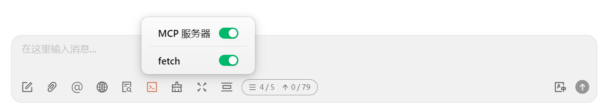


Этот документ переведен с китайского языка с помощью ИИ и еще не был проверен.


# Настройка и использование MCP

<figure><figcaption></figcaption></figure>

1. Откройте настройки Cherry Studio.
2. Найдите опцию `MCP сервер`.
3. Нажмите `Добавить сервер`.
4. Заполните параметры MCP Server ([ссылка для справки](https://github.com/modelcontextprotocol/servers/tree/main/src/fetch)). Может потребоваться указать:
   * Имя: произвольное название, например `fetch-server`
   * Тип: выберите `STDIO`
   * Команда: введите `uvx`
   * Параметры: введите `mcp-server-fetch`
   * (могут быть другие параметры в зависимости от конкретного сервера)
5. Нажмите `Сохранить`.


После настройки Cherry Studio автоматически загрузит необходимый MCP Server - `fetch server`. После завершения загрузки можно начинать использование! Примечание: если mcp-server-fetch не настраивается успешно, попробуйте перезагрузить компьютер.


### Включение службы MCP в окне чата

<figure><figcaption></figcaption></figure>

* После успешного добавления MCP сервера в настройках `MCP сервер`

<figure><figcaption></figcaption></figure>

### **Демонстрация эффекта использования**

<figure><figcaption></figcaption></figure>

Как видно из изображения выше, при использовании функции `fetch` в MCP Cherry Studio лучше понимает намерения пользовательских запросов. Она получает релевантную информацию из сети и предоставляет более точные и полные ответы.