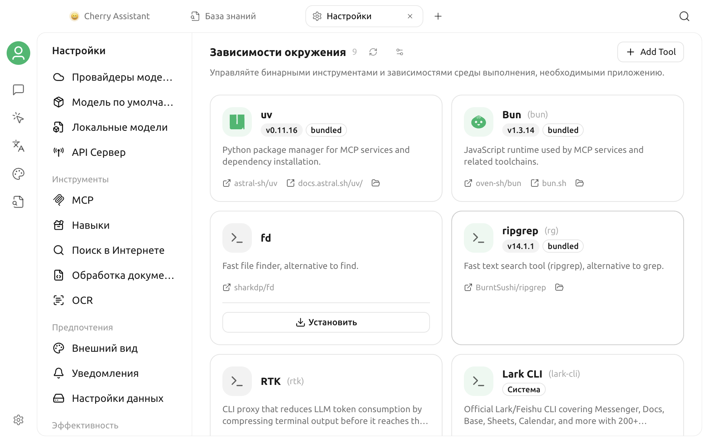

# Установка среды MCP

Cherry Studio позволяет управлять двумя распространёнными средами выполнения MCP:

- **UV** — запускает MCP-серверы Python, использующие `uv` или `uvx`.
- **Bun** — запускает инструменты JavaScript, а если в системе нет NPX, служит резервной средой для некоторых NPX-серверов.


UV и Bun нужны не каждому MCP-серверу. Удалённые серверы SSE / Streamable HTTP, а также большинство встроенных серверов Cherry Studio не зависят от этих сред выполнения. Определяйте необходимую среду по значению `command` в документации сервера.




## Использование встроенного установщика

1. Откройте раздел **Настройки → Зависимости среды**.
2. Найдите **UV** или **Bun**.
3. Для компонента со статусом **Не установлено** нажмите **Установить**.
4. Дождитесь появления статуса **Установлено**.

Если необходимая среда отсутствует, на странице MCP-серверов также появится предупреждение со ссылкой. Нажмите её, чтобы перейти на ту же страницу зависимостей среды.

Встроенный установщик загружает исполняемый файл, подходящий для текущей операционной системы и архитектуры CPU, и сохраняет его в собственном каталоге Cherry Studio:



`C:\Users\<имя_пользователя>\.cherrystudio\bin`



`~/.cherrystudio/bin`



После установки этот каталог можно открыть, нажав значок папки рядом с соответствующей зависимостью.

## Системные команды и собственная среда выполнения

При запуске STDIO-сервера Cherry Studio ищет команды в следующем порядке:

### `uv` и `uvx`

1. Сначала выполняется поиск системной команды `uv` или `uvx` в окружении Login Shell.
2. Если команда не найдена, используется UV, установленный Cherry Studio в `~/.cherrystudio/bin`.

### `npx`

1. Сначала выполняется поиск системной команды `npx` в окружении Login Shell.
2. Если команда не найдена, Cherry Studio пытается запустить пакет с помощью установленного приложением Bun.

Таким образом, можно использовать и UV, UVX или NPX, корректно установленные в системной переменной PATH. Статус «Установлено» на странице **Зависимости среды** проверяет только собственный каталог Cherry Studio и не означает, что системная команда обязательно недоступна.


Если вы только что установили или изменили Node.js, NPX, UV либо UVX в системе, полностью закройте и снова откройте Cherry Studio, чтобы приложение заново прочитало окружение Login Shell.


## Как определить необходимую среду выполнения

Посмотрите конфигурацию, предоставленную разработчиком MCP:

| Команда в конфигурации | Необходимая среда |
| --- | --- |
| `uvx` или `uv` | UV |
| `npx` | NPX из состава Node.js или резервная среда Bun в Cherry Studio |
| `bun` или `bunx` | Bun |
| `node` | Системный Node.js |
| Другая команда | Установите соответствующую программу по документации разработчика |
| Только удалённый URL | Локальная среда выполнения обычно не требуется |

Страница зависимостей среды Cherry Studio не устанавливает Node.js или произвольные сторонние системные команды.

## Ручная установка в качестве запасного варианта

Если загрузка из приложения не удалась, установите среду в системе по её официальной документации:

- [Официальная инструкция по установке UV](https://docs.astral.sh/uv/getting-started/installation/)
- [Официальная инструкция по установке Bun](https://bun.com/docs/installation)
- [Загрузка Node.js](https://nodejs.org/en/download)

После установки проверьте команды в системном терминале:

```bash
uv --version
bun --version
npx --version
```

Достаточно проверить только те команды, которые действительно будут использоваться. После успешной проверки перезапустите Cherry Studio и включите MCP-сервер.

Опытные пользователи также могут поместить исполняемый файл для своей системы и архитектуры в `~/.cherrystudio/bin`; в Windows следует использовать соответствующий каталог пользователя. Не загружайте двоичные файлы из ненадёжных источников.

## Частые вопросы

### Ошибка после нажатия кнопки установки

Проверьте по порядку:

- Доступен ли источник загрузки среды выполнения из текущей сети.
- Не блокируют ли Cherry Studio прокси, брандмауэр или защитное ПО.
- Есть ли разрешение на запись в каталог пользователя.
- Существует ли установочный пакет для вашей операционной системы и архитектуры CPU.
- Достаточно ли свободного места на диске.

### Компонент установлен, но сервер по-прежнему не находит команду

Убедитесь, что в поле **Команда** на странице сведений о сервере правильно указано имя, например `uvx`, а не полная строка вместе с параметрами. Параметры следует вводить построчно в поле **Параметры**.

Если используется системная команда, проверьте её в терминале и перезапустите Cherry Studio. Если используется среда, установленная приложением, откройте каталог зависимостей и убедитесь, что соответствующий исполняемый файл существует.

### UV и Bun установлены, но сервер всё равно не запускается

Среда выполнения лишь запускает программу и не может исправить неверные параметры, отсутствие API Key или сбой самого сервера. Откройте журналы на странице сведений о MCP-сервере и обратитесь к разделу [Частые вопросы о MCP Server](chang-jian-wen-ti.md).

## Связанные документы

- [Руководство по использованию MCP](README.md)
- [Настройка и использование MCP](config.md)
- [Частые вопросы о MCP Server](chang-jian-wen-ti.md)
- [Отзывы и предложения](../../question-contact/suggestions.md)
