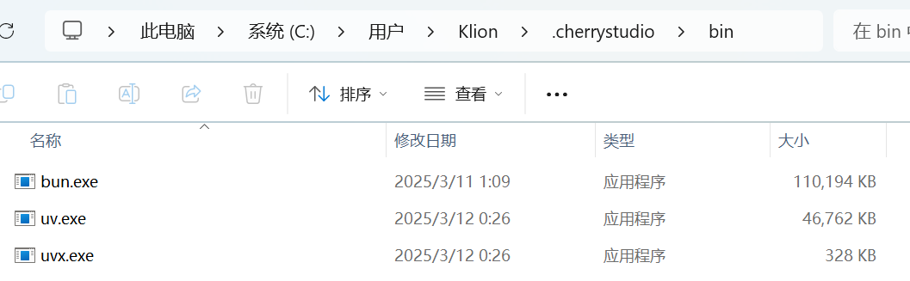

# Установка среды MCP


Этот документ переведен с китайского языка с помощью ИИ и еще не был проверен.


**MCP (Model Context Protocol)** — это открытый протокол, предназначенный для стандартизированной передачи контекстной информации большим языковым моделям (LLM). Подробнее о MCP см. в разделе [#shen-me-shi-mcpmodel-context-protocol](../../question-contact/knowledge.md#shen-me-shi-mcpmodel-context-protocol "mention")

## Использование MCP в Cherry Studio

Ниже на примере функции `fetch` показано, как использовать MCP в Cherry Studio. Детали можно найти в [документации](https://github.com/modelcontextprotocol/servers/tree/main/src/fetch).

### **Подготовка: установка uv и bun**


Cherry Studio использует только встроенные [uv](https://github.com/astral-sh/uv) и [bun](https://github.com/oven-sh/bun) и **не переиспользует** системные установки этих инструментов.


В разделе `Настройки → Сервер MCP` нажмите кнопку `Установить`, чтобы автоматически загрузить и установить компоненты. Поскольку загрузка выполняется напрямую с GitHub, процесс может быть медленным и часто завершается ошибкой. Успешность установки определяется наличием файлов в папках, упомянутых ниже.

<figure><figcaption></figcaption></figure>

**Каталоги установки исполняемых файлов:**

Windows: `C:\Users\用户名\.cherrystudio\bin`

macOS/Linux: `~/.cherrystudio/bin`

<figure><figcaption>
Каталог bin
</figcaption></figure>

**Если установка не выполняется:**

1. Создайте символические ссылки на системные команды в указанных каталогах (если каталоги отсутствуют — создайте их вручную).  
2. Или загрузите исполняемые файлы вручную:
   - Bun: [https://github.com/oven-sh/bun/releases](https://github.com/oven-sh/bun/releases)
   - UV: [https://github.com/astral-sh/uv/releases](https://github.com/astral-sh/uv/releases)