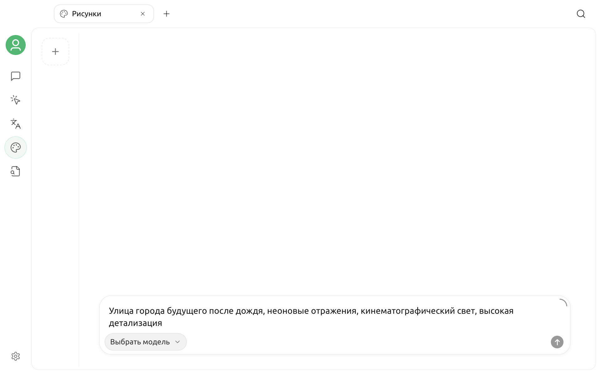

# Рисунки



«Рисунки» — это отдельное рабочее пространство Cherry Studio для генерации изображений. Оно использует уже настроенных провайдеров и модели, позволяя на одной странице выбрать модель для изображений, ввести промпт, настроить поддерживаемые моделью параметры и управлять изображениями, созданными в текущей задаче.


На странице «Рисунки» отображаются только доступные модели с поддержкой генерации изображений. Набор вариантов зависит от текущей версии приложения, включённых провайдеров и конфигурации моделей, поэтому ориентируйтесь на список непосредственно в приложении.


## Подготовка к работе

Чтобы использовать «Рисунки», нужна как минимум одна доступная модель для генерации изображений:

1. Откройте `Настройки` → `Провайдеры моделей`.
2. Включите провайдера и укажите необходимый API-ключ или настройте подключение.
3. Убедитесь, что для провайдера добавлена модель с поддержкой генерации изображений.

Если провайдер ещё не настроен, сначала ознакомьтесь с разделом [Настройка провайдеров моделей](../../pre-basic/providers/README.md).

## Как открыть «Рисунки»

Нажмите `+` справа на верхней панели вкладок, чтобы открыть **Запуск**, а затем выберите **Рисунки**.

Страница состоит из трёх основных областей:

| Область | Назначение |
| --- | --- |
| Левая панель настроек | Выбор провайдера и модели, настройка поддерживаемых текущей моделью параметров генерации |
| Центральный холст | Просмотр состояния генерации и результатов; если модель возвращает несколько изображений, между ними можно переключаться |
| Правая панель истории | Создание новой задачи, переход между записями истории и удаление ненужных записей |

Внизу находится поле для ввода промпта. Выберите модель, составьте описание и запустите генерацию.

## Генерация изображения по тексту

Для генерации по тексту достаточно описать желаемое изображение:

1. Выберите провайдера и модель для генерации изображений на левой панели.
2. Введите промпт в поле внизу.
3. При необходимости настройте размер, соотношение сторон, разрешение и другие параметры.
4. Нажмите кнопку отправки, чтобы начать генерацию.
5. Дождитесь появления результата на центральном холсте.

Например:

```text
Рыжий кот в круглых очках сидит на стопке книг, стиль винтажной масляной живописи, тёплый свет заката, средний план
```

Во время генерации на холсте отображается ход выполнения. Если нужно остановить процесс, отмените текущую задачу. Когда модель возвращает несколько изображений, переключайтесь между ними кнопками «Предыдущее» и «Следующее» на холсте.

## Использование референса или редактирование изображения

Помимо генерации по тексту, некоторые модели поддерживают редактирование, смешивание и другие режимы работы с изображениями. После выбора такой модели в поле промпта появляется кнопка добавления изображения.

Изображение можно:

- выбрать на компьютере;
- перетащить в поле ввода;
- вставить из буфера обмена;
- добавить несколько референсов, если это поддерживает модель.

После добавления изображения опишите, что нужно сохранить и что изменить, затем запустите генерацию. Например:

```text
Сохрани объект и композицию, замени фон на улицу Токио после дождя и добавь отражения неоновых вывесок
```


Если кнопки добавления изображения в поле ввода нет, выбранная модель не поддерживает редактирование изображений. Переключитесь на модель с поддержкой соответствующего режима.


## Настройка параметров генерации

Панель параметров динамически меняется в зависимости от выбранной модели и показывает только те параметры, поддержку которых заявляет эта модель. К распространённым параметрам относятся:

| Параметр | Назначение |
| --- | --- |
| Размер или соотношение сторон | Определяет форму холста и выходной размер изображения |
| Разрешение | Позволяет выбрать чёткость результата, если модель поддерживает такую настройку |
| Количество изображений | Определяет число результатов за одну генерацию |
| Качество, стиль, фон | Настраивает доступные в модели визуальные параметры |
| Seed, Guidance, Steps | Управляют случайностью или процессом генерации; доступны только в некоторых моделях |

Названия параметров, допустимые значения и тарификация могут различаться в зависимости от модели. Если вы не уверены в настройках, сначала выполните одну генерацию со значениями по умолчанию, а затем меняйте параметры по одному. Параметры, которые модель не показывает, добавлять вручную не нужно.

## Управление историей генераций

Правая панель истории предназначена для управления отдельными задачами генерации:

- нажмите `+` вверху, чтобы создать новую пустую задачу;
- нажмите миниатюру, чтобы вернуться к существующей записи;
- если записей много, прокрутите список вниз, чтобы загрузить следующие;
- перед удалением ненужной записи приложение запросит подтверждение.

Результат генерации отображается на центральном холсте. Нажмите изображение, чтобы открыть его в увеличенном виде, а затем используйте доступные в окне просмотра действия для просмотра или сохранения результата.

## Как составить эффективный промпт

У промпта нет обязательного формата, но рекомендуется включить как минимум следующие сведения:

- **Объект**: человек, предмет или сцена;
- **Окружение**: место, время, погода и фон;
- **Визуальный стиль**: фотография, иллюстрация, масляная живопись, 3D и т. д.;
- **Композиция**: крупный план, в полный рост, вид сверху, симметричная композиция и т. д.;
- **Освещение и цвет**: мягкий свет, контровой свет, холодная палитра, низкая насыщенность и т. д.;
- **Ограничения**: какие элементы нужно сохранить или исключить.

Разные модели по-разному интерпретируют язык и структуру промпта. Если результат отклоняется от ожидаемого, сначала уберите противоречащие друг другу требования, а затем постепенно добавляйте детали.

## Частые вопросы

### Не отображаются доступные провайдеры или модели

На странице «Рисунки» перечислены только включённые модели с поддержкой генерации изображений. Проверьте, включён ли провайдер, действителен ли API-ключ, добавлена ли модель, а также правильно ли настроены возможности модели или тип конечной точки.

### Не отображается кнопка добавления изображения

Текущая модель поддерживает только генерацию по тексту либо не сообщает Cherry Studio о возможности редактирования изображений. Переключитесь на модель с поддержкой редактирования и повторите попытку.

### Генерация постоянно завершается ошибкой

Последовательно проверьте:

1. подключение к провайдеру и API-ключ;
2. доступность модели;
3. баланс, квоту или ограничение частоты запросов для аккаунта;
4. не нарушают ли промпт или референс правила провайдера в отношении контента;
5. поддерживает ли модель текущую комбинацию параметров;
6. может ли сеть или прокси обращаться к провайдеру и адресам его изображений.

Подробная ошибка от провайдера обычно помогает понять, связана ли проблема с аутентификацией, квотой, параметрами или ограничениями контента.

### Почему один промпт даёт разные результаты

Генерация изображений обычно содержит элемент случайности. Если модель предоставляет параметр `Seed`, зафиксируйте его значение и не меняйте остальные параметры, чтобы повысить воспроизводимость результата. Если такого параметра нет, различия при повторной генерации нормальны.

## Конфиденциальность и стоимость

Промпт, референсы и параметры генерации отправляются выбранному провайдеру для обработки. Не загружайте конфиденциальные изображения, на обработку которых у вас нет прав, и перед использованием ознакомьтесь с политикой конфиденциальности, правилами в отношении контента и тарифами провайдера. Повышение разрешения, увеличение количества изображений или использование режима редактирования может привести к дополнительным расходам.

***

Если вы столкнулись с проблемой или хотите предложить улучшение, перейдите в раздел [Обратная связь и предложения](../../question-contact/suggestions.md).
