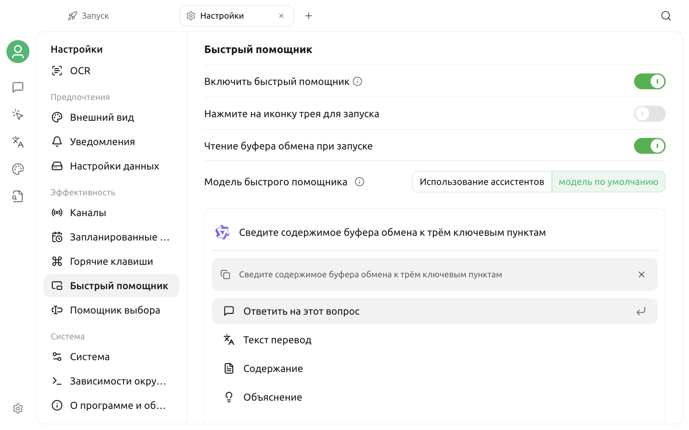

# Быстрый помощник

Быстрый помощник — это небольшое окно, которое можно вызвать поверх других приложений. Оно подходит для разового вопроса, перевода, краткого изложения или объяснения текста без предварительного перехода в главное окно Cherry Studio.


Быстрый помощник и [Ассистент для выделенного текста](selection-assistant.md) — две отдельные функции. Быстрый помощник вызывается глобальным сочетанием клавиш или из системного трея, а ассистент для выделенного текста показывает панель действий после выделения текста.


## Подготовка к работе

Быстрый помощник вызывает уже настроенные модели. Перед включением убедитесь, что доступна хотя бы одна диалоговая модель. Для действия «Перевод текста» также нужно настроить модель перевода.

Соответствующие параметры описаны в разделе [Модели по умолчанию](settings/default-models.md).

## Включение быстрого помощника

1. Откройте **Настройки → Быстрый помощник**.
2. Включите **Включить быстрый помощник**.
3. Выберите, нужно ли включить **Нажмите на иконку трея для запуска**.
4. Выберите, нужно ли включить **Чтение буфера обмена при запуске**.
5. В разделе **Модель быстрого помощника** выберите «Использовать ассистента» или «Модель по умолчанию».

Внизу страницы настроек отображается предварительный просмотр быстрого помощника. С его помощью можно заранее проверить модель и интерфейс.

### Способ выбора модели

| Способ | Фактический результат |
| --- | --- |
| Использовать ассистента | Выбирается существующий ассистент вместе с его системным промптом, моделью и параметрами модели |
| Модель по умолчанию | Конкретный ассистент не применяется, используется текущая модель по умолчанию |

Для действия «Перевод текста» используется отдельно настроенная модель перевода, а не выбранный здесь ассистент.


Для ответов, кратких изложений и объяснений в быстром помощнике отключены веб-поиск, MCP и база знаний. Если нужны эти возможности, используйте [Диалог](chat.md) в главном окне.


## Настройка способа вызова

### Глобальное сочетание клавиш

1. Откройте **Настройки → Горячие клавиши**.
2. Найдите **Быстрый помощник**.
3. Включите это сочетание клавиш.
4. При необходимости измените комбинацию.

Система заранее заполняет следующие комбинации:

* macOS: Command + E
* Windows / Linux: Ctrl + E

Изначально это сочетание отключено. Включение только основного переключателя быстрого помощника не включает глобальное сочетание автоматически.

Подробнее см. в разделе [Настройка горячих клавиш](settings/key-shortcut.md).

### Системный трей

Если включить **Нажмите на иконку трея для запуска**, одно нажатие значка Cherry Studio в трее откроет быстрый помощник. При этом также будет включена функция системного трея.

Даже если запуск одним нажатием отключён, при включённом быстром помощнике можно нажать значок в трее правой кнопкой и выбрать быстрый помощник в меню.

## Открытие и выполнение действия

1. В любом приложении нажмите включённое глобальное сочетание клавиш или воспользуйтесь пунктом в трее.
2. Введите содержимое для обработки.
3. Выберите действие.

| Действие | Назначение |
| --- | --- |
| Ответить на этот вопрос | Отправляет введённый текст модели как обычный вопрос |
| Перевод текста | Предлагает выбрать целевой язык и переводит введённый текст |
| Краткое изложение | Обрабатывает текст с помощью встроенной инструкции для создания краткого изложения |
| Объяснение | Обрабатывает текст с помощью встроенной инструкции для объяснения |

Переключайте действия стрелками вверх и вниз, затем нажмите Enter для выполнения текущего действия.

### Использование содержимого буфера обмена

Если включить **Чтение буфера обмена при запуске**, при каждом показе окна быстрый помощник пытается прочитать новое текстовое содержимое буфера обмена и показывает его как справочный текст.

После этого можно:

* сразу выбрать перевод, краткое изложение или объяснение;
* продолжить ввод инструкции и отправить её вместе с текстом из буфера обмена;
* нажать Backspace на главной странице, чтобы очистить справочный текст из буфера обмена.

Если буфер обмена пуст, содержит не простой текст или система запретила доступ на чтение, подходящий справочный текст в окне не появится.

## Просмотр результата и продолжение вопроса

Ответы, краткие изложения и объяснения отображаются в потоковом режиме. После действия «Ответить на этот вопрос» можно продолжить ввод на странице результата и получить временный диалог.

На странице перевода можно изменить целевой язык, после чего результат создаётся заново с учётом настройки.

Содержимое быстрого помощника является временным сеансом. После возвращения на главную страницу или закрытия окна не следует считать его постоянной историей диалогов из главного окна.

## Действия с окном

| Действие | Результат |
| --- | --- |
| Esc (во время генерации) | Приостанавливает текущую генерацию |
| Esc (страница результата) | Возвращает на главную страницу быстрого помощника |
| Esc (главная страница) | Скрывает окно |
| C (страница результата) | Копирует последний ответ модели |
| Нажатие кнопки закрепления | Оставляет окно поверх остальных и не скрывает его при потере фокуса |
| Нажатие вне окна | Скрывает быстрый помощник, если окно не закреплено |

При следующем открытии окна продолжат использоваться текущий способ выбора модели, переключатель буфера обмена и целевой язык перевода.

## Рекомендации по использованию

* Включите чтение буфера обмена, чтобы быстрее обрабатывать небольшой фрагмент только что скопированного текста.
* Выберите отдельного ассистента, если часто используете заданный стиль или формат.
* Используйте модель по умолчанию, если нужно лишь быстро задать вопрос без дополнительной настройки.
* Для длинных документов, вложений, веб-поиска и материалов базы знаний используйте диалог в главном окне.

## Частые вопросы

### Command + E или Ctrl + E не работают

Убедитесь, что включены и основной переключатель быстрого помощника, и само сочетание клавиш. Если комбинация занята другим приложением, замените её в настройках горячих клавиш.

### Нажатие значка в трее не открывает окно

Убедитесь, что включено **Нажмите на иконку трея для запуска**, и проверьте, не скрыт ли значок Cherry Studio в области системного трея. Также можно нажать значок правой кнопкой и открыть помощник из меню.

### Окно исчезает при нажатии в другом месте

Это нормальное поведение незакреплённого окна. Если нужно сверяться с содержимым другого приложения, нажмите кнопку закрепления в правом нижнем углу.

### Буфер обмена не считывается

Убедитесь, что переключатель включён, буфер обмена содержит простой текст и система разрешает доступ к буферу обмена. Скопируйте новый текст и снова вызовите окно.

### Перевод не выдаёт результат

Действие «Перевод текста» использует модель перевода. Проверьте модель перевода в настройках моделей по умолчанию, состояние провайдера и конфигурацию API.

### База знаний или MCP ассистента не работают

Быстрый помощник намеренно отключает веб-поиск, MCP и базу знаний. Используйте этого ассистента в главном окне.

## Конфиденциальность

Если включено чтение буфера обмена, быстрый помощник считывает текстовое содержимое при показе окна. Соответствующий текст отправляется выбранному провайдеру модели вместе с запросом только после запуска ответа, перевода, краткого изложения или объяснения.

Перед обработкой пароля, ключа или других конфиденциальных данных очистите справочный текст из буфера обмена либо отключите **Чтение буфера обмена при запуске**.

***

### Получение помощи и обратная связь

Если при использовании возникла проблема, свяжитесь с сообществом одним из способов, перечисленных в разделе [Обратная связь и предложения](../../question-contact/suggestions.md).
