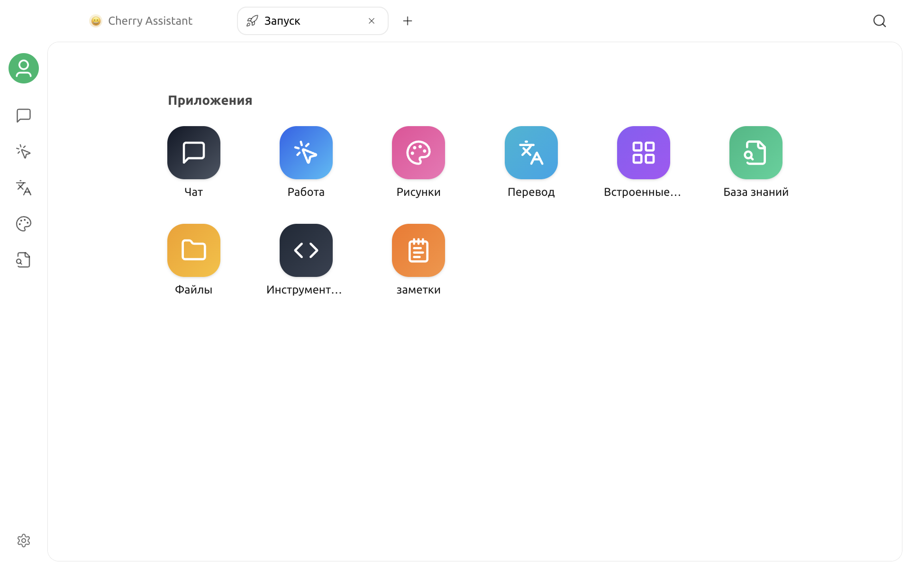

# Запуск

«Запуск» — начальный экран Cherry Studio. Здесь собраны встроенные функции и закрепленные мини-приложения, поэтому с него удобно начинать новую работу и открывать функции в нескольких вкладках.

## Как открыть стартовый экран

После запуска Cherry Studio стартовый экран открывается автоматически. Во время работы вернуться к нему или открыть еще один стартовый экран можно следующими способами:

* Нажмите кнопку «Главная» слева на верхней панели вкладок, чтобы вернуться к уже открытой вкладке «Запуск».
* Нажмите `+` на панели вкладок, чтобы создать новую вкладку. Каждая новая вкладка открывается со стартового экрана.

При выборе приложения на стартовом экране соответствующая рабочая область открывается в текущей вкладке. Чтобы работать с несколькими функциями одновременно, создайте дополнительные вкладки с помощью `+`.

## Доступные приложения

В разделе «Приложения» доступны следующие пункты:

| Приложение | Назначение |
| :--- | :--- |
| Чат | Начинать диалоги и использовать помощников |
| Работа | Создавать и запускать задачи агентов |
| Рисунки | Создавать изображения с помощью графических моделей и управлять ими |
| Перевод | Переводить текст, сопоставляя оригинал и перевод |
| Приложения | Открывать веб-приложения и управлять ими |
| База знаний | Управлять базами знаний, источниками данных и настройками поиска |
| Файлы | Просматривать файлы, которые использовались в Cherry Studio |
| Инструменты кода | Управлять поддерживаемыми инструментами программирования с ИИ и запускать их |
| Заметки | Создавать и упорядочивать заметки в формате Markdown |

Перетаскивайте значки, чтобы изменить порядок встроенных приложений. Щелкните значок правой кнопкой мыши, чтобы закрепить приложение на левой боковой панели или убрать его оттуда. Обязательные пункты, например «Чат», открепить нельзя.

## Раздел встроенных приложений

Закрепленные мини-приложения отображаются под основным разделом «Приложения». Мини-приложения и встроенные приложения сортируются отдельно; перетаскивайте значки мини-приложений, чтобы изменить их порядок в этом разделе.

Чтобы добавить или убрать ярлык, откройте меню нужного приложения на странице «Встроенные приложения» и выберите «Добавить в стартовый экран» или «Удалить из стартового экрана».


Удаление приложения со стартового экрана убирает только его ярлык. Само приложение при этом не удаляется.


## Рекомендации

* Начинайте новую работу со стартового экрана. Чтобы продолжить существующий диалог или задачу, используйте боковую панель или список истории на соответствующей странице.
* Открывайте разные функции в отдельных вкладках, чтобы работать параллельно и не закрывать текущую рабочую область.
* Добавьте часто используемые веб-приложения на стартовый экран, а нужные встроенные функции закрепите на боковой панели.
