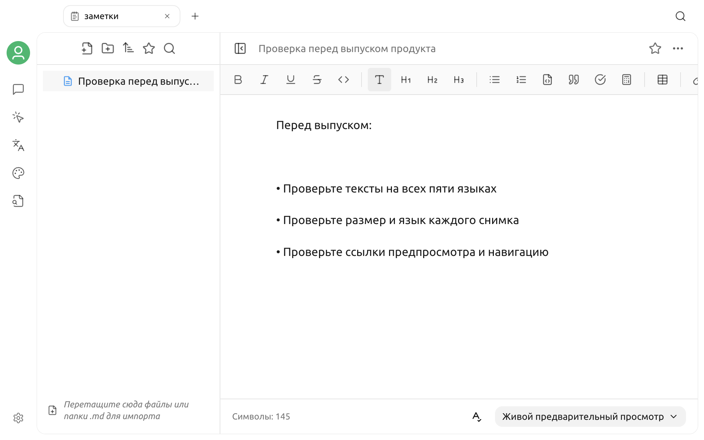

# Заметки

«Заметки» — встроенное рабочее пространство Cherry Studio для Markdown. Каждая заметка сохраняется как локальный файл `.md`, поэтому здесь удобно упорядочивать результаты диалогов, готовить черновики и вести материалы, которые можно открыть в других инструментах для Markdown.


Заметки не становятся контекстом диалога автоматически. Чтобы модель могла находить содержимое заметки, экспортируйте нужную заметку в [Базу знаний](knowledge-base.md).


## Как открыть заметки

1. Нажмите **+** справа на верхней панели вкладок, чтобы открыть новую вкладку стартового экрана.
2. На стартовом экране выберите **Заметки**.

Слева отображаются заметки и папки, а справа — редактор текущей заметки.

## Создание первой заметки

1. Нажмите кнопку **Создать заметку** в верхней части левой панели.
2. Введите название заметки в верхней части страницы.
3. Введите содержимое в редакторе.

После изменения содержимое автоматически сохраняется в текущем файле Markdown. При переключении заметки или выходе со страницы Cherry Studio также попытается сохранить ещё не записанные изменения.


Если файл заметки не удалось прочитать, редактор заблокирует запись, чтобы пустое содержимое не перезаписало исходный файл. При ошибке чтения или сохранения сначала проверьте рабочий каталог и права доступа к файлу.


## Организация заметок по папкам

Нажмите **Новая папка** в верхней части левой панели, чтобы создать каталог в корне или в выбранной папке.

Также можно:

* разворачивать и сворачивать папки;
* перетаскивать заметку или папку в другую папку;
* нажать папку правой кнопкой и создать в ней заметку или вложенную папку;
* переименовать текущую заметку, отредактировав заголовок в верхней части страницы;
* переименовать заметку или папку через контекстное меню в дереве каталогов.

Рабочее пространство заметок считывает только файлы Markdown. Скрытые файлы не отображаются.

## Импорт существующих файлов Markdown

Импортировать материалы можно следующими способами:

* перетащить файл `.md` в дерево каталогов слева;
* перетащить туда папку с файлами Markdown;
* нажать правой кнопкой пустое место слева и выбрать загрузку файла или папки;
* нажать подсказку об импорте в пустом рабочем пространстве заметок и выбрать папку.

При импорте папки исходная структура каталогов по возможности сохраняется. Файлы других форматов пропускаются, а после импорта отображается количество успешно импортированных, пропущенных и не обработанных элементов.

## Редактирование и чтение

В нижней части редактора можно переключаться между тремя режимами:

| Режим | Подходящий сценарий |
| --- | --- |
| Живой предварительный просмотр | Редактирование с помощью панели инструментов с одновременным просмотром форматирования Markdown |
| Режим исходного кода | Непосредственное редактирование исходного кода Markdown |
| Режим чтения | Чтение только отображённого содержимого |

Панель инструментов живого предварительного просмотра содержит распространённые средства форматирования: заголовки, полужирный и курсивный текст, списки, цитаты, код и таблицы. В настоящее время редактор заметок не предлагает команд для вставки изображений и встроенных формул.

Внизу также отображается количество символов. В режиме живого предварительного просмотра кнопка проверки орфографии включает или отключает проверку.

### Отображение страницы

В меню дополнительных действий в правом верхнем углу можно:

* скопировать содержимое текущей заметки;
* быстро экспортировать её в Word;
* ограничить ширину основного текста;
* показать или скрыть оглавление;
* выбрать шрифт по умолчанию или шрифт с засечками;
* выбрать малый, средний или крупный размер шрифта;
* открыть все настройки заметок.

В полных настройках также можно задать представление по умолчанию, режим редактирования по умолчанию, размер шрифта от 10 до 30 px и отображение оглавления.

## Поиск и избранное

### Поиск

Нажмите кнопку поиска в верхней части левой панели и введите ключевое слово. Поиск одновременно проверяет:

* название заметки;
* текст заметки.

Если совпадение найдено в тексте, в результатах отображаются тип совпадения и соответствующая строка. Нажмите совпавшее содержимое, чтобы открыть заметку и перейти к нужному месту.

### Избранное

Открыв заметку, нажмите кнопку со звездой в верхней части страницы, чтобы добавить её в избранное. Раздел избранного в верхней части левой панели показывает только избранные заметки.

### Сортировка

Для дерева каталогов доступны шесть вариантов сортировки:

* название от А до Я;
* название от Я до А;
* время обновления от нового к старому;
* время обновления от старого к новому;
* время создания от нового к старому;
* время создания от старого к новому.

Папки всегда располагаются перед заметками того же уровня.

## Контекстное меню

### Заметка

Нажмите заметку правой кнопкой, чтобы:

* создать название заметки с помощью модели на основе текста;
* переименовать;
* открыть во внешнем приложении;
* добавить в избранное или удалить оттуда;
* экспортировать в базу знаний;
* экспортировать в одном из включённых форматов;
* удалить.

Для автоматического создания названия нужна доступная конфигурация модели. Перед экспортом в базу знаний необходимо создать хотя бы одну базу знаний.

### Папка

Нажмите папку правой кнопкой, чтобы создать вложенную заметку или папку, переименовать, открыть во внешнем приложении или удалить.


При удалении папки также удаляются находящиеся в ней заметки. Перед удалением убедитесь, что нужный каталог сохранён в резервной копии.


## Экспорт заметки

В контекстном меню заметки могут быть доступны следующие варианты экспорта:

* скопировать или экспортировать как изображение;
* Markdown;
* Word;
* Notion;
* Yuque;
* Obsidian;
* Joplin;
* SiYuan.

Фактически отображаемые пункты задаются в разделе **Настройки → Настройки данных → Меню экспорта**. Пункт «Экспорт в Word» в верхнем меню дополнительных действий служит быстрым способом экспортировать текущую заметку.

## Совместное использование с диалогом и базой знаний

### Сохранение из диалога в заметки

Меню экспорта сообщений и тем позволяет сохранять содержимое в рабочем каталоге заметок. Наличие этого пункта зависит от настроек меню экспорта.

### Добавление заметки в базу знаний

1. Сначала создайте базу знаний.
2. Нажмите нужную заметку правой кнопкой в дереве каталогов.
3. Выберите **Экспортировать заметки в базу знаний**.
4. Выберите целевую базу знаний и подтвердите действие.
5. Дождитесь завершения индексации, затем выберите эту базу знаний в диалоге.

Исходная заметка и её копия в базе знаний являются независимыми источниками данных. После изменения заметки её нужно экспортировать повторно или обновить материал в базе знаний.

## Рабочий каталог и резервное копирование

Откройте верхнее меню дополнительных действий и перейдите в раздел **Дополнительные настройки → Настройки данных**, чтобы просмотреть текущий рабочий каталог заметок, выбрать другой или восстановить каталог по умолчанию.


При смене рабочего каталога меняется только путь, из которого Cherry Studio сейчас читает файлы. Файлы Markdown из прежнего каталога не переносятся автоматически. Перед переключением вручную скопируйте исходный каталог или создайте его резервную копию.


Заметки являются обычными файлами Markdown, поэтому их можно защищать с помощью синхронизации файлов, системы контроля версий или программы резервного копирования. Если используется пользовательский рабочий каталог, создавайте отдельную резервную копию этого каталога и не полагайтесь только на резервную копию настроек Cherry Studio.

Если после восстановления в другой системе исходный путь не существует, Cherry Studio возвращается к каталогу заметок по умолчанию. В этом случае вручную скопируйте прежние заметки в новый каталог или снова выберите действительный каталог в настройках.

## Частые вопросы

### Новая заметка не сохраняется

Убедитесь, что рабочий каталог существует и доступен для записи. Если текущий файл не удалось прочитать, Cherry Studio приостановит сохранение, чтобы защитить исходное содержимое.

### После импорта отсутствуют некоторые файлы

Рабочее пространство заметок импортирует только файлы `.md`. Проверьте, имеют ли пропущенные файлы расширение `.md`.

### Поиск не находит только что изменённый текст

Дождитесь завершения автоматического сохранения и повторите поиск. Если файл находится на синхронизируемом диске, убедитесь, что внешняя синхронизация не удерживает и не перезаписывает файл.

### После перехода на другой компьютер заметки пусты

Текст заметок хранится в рабочем каталоге, а не только в настройках. Скопируйте файлы Markdown из исходного каталога на новый компьютер и выберите этот каталог в настройках заметок.

***

### Получение помощи и обратная связь

Если при использовании возникла проблема, свяжитесь с сообществом одним из способов, перечисленных в разделе [Обратная связь и предложения](../../question-contact/suggestions.md).
