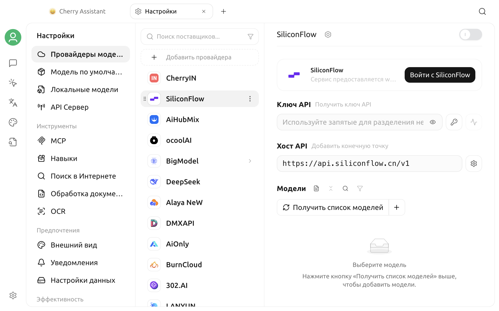

# Настройки приложения

Cherry Studio V2 объединяет параметры моделей, инструменты, предпочтения, управление данными и функции эффективности в центре настроек. Эта страница служит навигацией и не повторяет описание каждого переключателя. Найдите нужный раздел по своей задаче, а затем откройте соответствующую подробную документацию.

## Открытие настроек

Нажмите значок **Настройки** в левом нижнем углу главного окна.

По умолчанию центр настроек открывает **Провайдеры моделей**. У первых пунктов, связанных с моделями, нет заголовка раздела; далее следуют четыре раздела с заголовками:

1. Провайдеры моделей, Модель по умолчанию, Локальные модели и API Сервер.
2. Инструменты.
3. Предпочтения.
4. Эффективность.
5. Система.


Текст и расположение элементов могут немного различаться в зависимости от операционной системы, размера окна и версии. Если функция отсутствует, сначала проверьте версию в разделе **О программе и обратная связь** и убедитесь, что она не доступна только на определенной платформе.


## Пункты моделей

| Пункт | Назначение | Документация |
| --- | --- | --- |
| Провайдеры моделей | Добавление и управление провайдерами, API Key, адресами API, способами подключения и списками моделей | [Настройка провайдеров моделей](providers.md) |
| Модель по умолчанию | Выбор моделей для Ассистента по умолчанию, Быстрого помощника, Перевода и Рисования | [Настройка модели по умолчанию](default-models.md) |
| Локальные модели | Загрузка и удаление локальных компонентов моделей Embedding и OCR | [Локальные модели](local-models.md) |
| API Сервер | Предоставление возможностей моделей Cherry Studio другим приложениям через локальный OpenAI-совместимый интерфейс | [API Сервер](../../../advanced-basic/api-server.md) |

При первом запуске рекомендуется настраивать в следующем порядке:

1. В разделе **Провайдеры моделей** включите провайдера и проверьте подключение.
2. Убедитесь, что нужные модели появились в списке.
3. В разделе **Модель по умолчанию** выберите модели для разных задач.
4. Вернитесь на страницу диалога и отправьте тестовое сообщение.

API Key провайдера моделей является конфиденциальными учетными данными. Не добавляйте реальный Key в снимки экрана, публичные документы и сообщения о проблемах.

## Инструменты

| Пункт | Назначение | Документация |
| --- | --- | --- |
| MCP | Установка и управление инструментами MCP для подключения ассистентов и агентов к внешним возможностям | [Руководство по MCP](../../../advanced-basic/mcp/) |
| Навыки | Управление навыками, доступными агентам | — |
| Поиск в Интернете | Выбор провайдеров поиска по ключевым словам и чтения URL, настройка количества результатов, сжатия и черного списка | [Веб-поиск](../../../websearch/) |
| Обработка документов | Настройка разбора PDF и документов Office | [Обработка документов](../../../pre-basic/settings/doc-process.md) |
| OCR | Настройка распознавания текста на изображениях | [Обработка документов](../../../pre-basic/settings/doc-process.md) |

Доступность сервиса инструментов обычно одновременно зависит от:

- завершена ли настройка самой функции;
- поддерживает ли текущая модель вызов инструментов или соответствующий тип ввода;
- выданы ли ассистенту или агенту права на инструмент;
- доступны ли локальная сеть и сторонний сервис.

Не считайте функцию доступной только потому, что в интерфейсе появился переключатель. После настройки выполните минимальную проверку в реальном диалоге.

## Предпочтения

| Пункт | Назначение | Документация |
| --- | --- | --- |
| Внешний вид | Язык, тема, шрифты, отображение сообщений, математических формул и пользовательский CSS | [Настройки внешнего вида](display.md) |
| Уведомления | Управление уведомлениями приложения | — |
| Настройки данных | Локальный каталог данных, импорт и экспорт, резервные копии, WebDAV, S3 и сервисы заметок | [Настройки данных](../../../data-settings/) |

**Внешний вид**, **Уведомления** и **Настройки данных** теперь являются отдельными пунктами. Параметры запуска, прокси, конфиденциальности и другие системные параметры находятся в разделе **Система**.


Большинство параметров оформления применяется сразу, но после изменения языка, прокси, расположения хранилища и некоторых системных интеграций может потребоваться заново открыть окно или перезапустить приложение. Ориентируйтесь на подсказку рядом с параметром и фактическое поведение интерфейса.


## Эффективность

| Пункт | Назначение | Документация |
| --- | --- | --- |
| Каналы | Получение и отправка сообщений агентами через Feishu, Telegram и другие внешние каналы | [Каналы](../../../advanced-basic/agent-channels.md) |
| Запланированные задачи | Автоматический запуск задач агента по расписанию | [Запланированные задачи](../../../advanced-basic/scheduled-tasks.md) |
| Горячие клавиши | Просмотр, изменение, включение и отключение сочетаний приложения и глобальных сочетаний | [Настройка горячих клавиш](key-shortcut.md) |
| Быстрый помощник | Открытие компактного окна вопроса через глобальное сочетание клавиш или значок в системном трее | [Быстрый помощник](../kuai-jie-zhu-shou.md) |
| Помощник выбора | Перевод, обобщение, объяснение и другие действия с текстом, выделенным в другом приложении | [Помощник выбора](../selection-assistant.md) |

Каналы и задачи по расписанию могут запускать агента вне главного окна или без присутствия пользователя. Перед включением проверьте стоимость модели, права инструментов, доступные данные и условия остановки задачи.

## Система

| Пункт | Назначение | Документация |
| --- | --- | --- |
| Система | Управление запуском, прокси, конфиденциальностью и другими системными параметрами | [Общие настройки](general.md) |
| Зависимости окружения | Просмотр и управление внешними средами выполнения, необходимыми функциям | — |
| О программе и обратная связь | Версия, канал обновлений, официальный сайт, репозиторий с открытым исходным кодом и лицензия | — |

## Рекомендуемый порядок первоначальной настройки

После установки Cherry Studio минимальную настройку можно выполнить в следующем порядке:

1. **Провайдеры моделей**: включите одного провайдера, укажите учетные данные и проверьте подключение.
2. **Модель по умолчанию**: выберите модель Ассистента по умолчанию.
3. **Внешний вид**: выберите язык и тему.
4. **Настройки данных**: проверьте расположение данных и доступные в текущей версии способы экспорта или переноса.
5. **Поиск в Интернете или Обработка документов**: настройте только действительно нужный инструмент.
6. **Горячие клавиши**: исключите конфликт глобального сочетания с другими приложениями.
7. **О программе и обратная связь**: убедитесь, что используется ожидаемая версия.

Не требуется включать все сервисы сразу. Сначала добейтесь стабильной работы обычного диалога, затем по очереди добавляйте поиск в Интернете, MCP, каналы и автоматические задачи. Так проще выявлять причины проблем.

## Проверка после настройки

После изменения параметров их можно быстро проверить следующим образом:

| Изменение | Рекомендуемая проверка |
| --- | --- |
| Провайдер моделей или API Key | Проверьте подключение, затем отправьте короткое сообщение |
| Модель по умолчанию | Создайте новый диалог и проверьте модель в верхней части окна |
| Поиск в Интернете | Включите значок глобуса и задайте вопрос, требующий актуальных сведений |
| Обработка документов | Загрузите небольшой тестовый файл и проверьте результат разбора |
| Прокси | Повторно откройте сервис, которому нужен прокси, и при необходимости перезапустите приложение |
| Горячие клавиши | Фактически нажмите сочетание в целевом окне |
| Данные, импорт или экспорт | Убедитесь, что ожидаемое содержимое появилось в целевом файле или приложении |

## Частые проблемы

### Изменения настроек не применились

Сначала убедитесь, что поле ввода потеряло фокус или была нажата кнопка сохранения либо проверки. Затем заново откройте соответствующую страницу. Для параметров языка, сети, системных разрешений и расположения хранилища перезапустите Cherry Studio.

### Не удается найти пункт из документации

Проверьте:

1. Используется ли недавняя версия Cherry Studio V2 Community Edition.
2. Не доступна ли функция только в определенной операционной системе.
3. Не требуется ли сначала включить провайдера, модель или экспериментальную функцию.
4. Можно ли продолжить прокрутку левой части окна настроек.
5. Не была ли функция перенесена на страницу ассистентов, агентов или приложений.

### Можно ли синхронизировать все настройки с другим устройством

Разные способы резервного копирования охватывают разные данные. Не считайте, что успешная резервная копия обязательно синхронизирует все учетные данные и локальные пути. Перед переносом прочитайте раздел [Настройки данных](../../../data-settings/) и на целевом устройстве проверьте провайдеров моделей, пути и системные разрешения.

***

### Получение помощи и отправка отзыва

Если при настройке возникла проблема, отправьте отзыв через официальные каналы из раздела [Обратная связь и предложения](../../../question-contact/suggestions.md). Рекомендуется указать версию Cherry Studio, операционную систему, название параметра и сообщение об ошибке без конфиденциальных данных.
