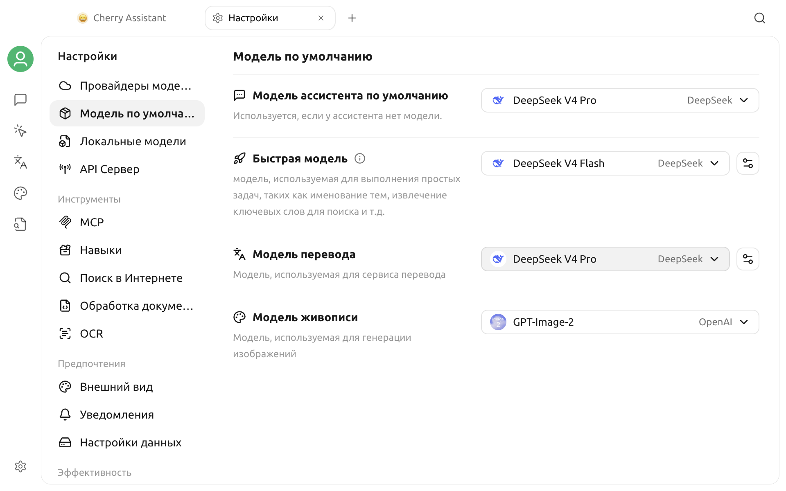

# Настройки моделей по умолчанию

Различные функции Cherry Studio используют модель по умолчанию, если для них не указана отдельная модель. В настоящее время V2 предлагает четыре глобальные роли: **Модель помощника по умолчанию**, **Быстрая модель**, **Модель перевода** и **Модель живописи**.

Они могут использовать одну и ту же модель или быть настроены отдельно по качеству, скорости и стоимости.

## Подготовка к использованию

Прежде чем переходить к настройкам модели по умолчанию, убедитесь:

1. Вы настроили как минимум одного провайдера в **Настройки → Провайдеры моделей**;
2. Целевая модель добавлена к этому поставщику услуг;
3. И поставщик услуг, и модель находятся в состоянии "Включено";
4. Доступность целевой модели подтверждена проверкой подключения или реальным диалогом.

См. [Настройка сервисов моделей](providers.md) для получения инструкций по настройке.


Первые три селектора текстовых моделей отображают только включённые диалоговые модели включённых провайдеров и исключают модели эмбеддингов, переранжирования и модели только для генерации изображений. Селектор модели живописи показывает только модели, распознанные как модели генерации изображений. Если нужной модели нет, проверьте её состояние и метки возможностей в настройках сервисов моделей.


## Открыть настройки модели

Перейдите в:

> **Настройки → Модель по умолчанию**

На странице находятся четыре селектора: модель помощника, быстрая модель, модель перевода и модель живописи. Справа от быстрой модели и модели перевода также доступны дополнительные настройки.

## Четыре модели по умолчанию

| Роль | Основное назначение | На что обратить внимание при выборе |
| --- | --- | --- |
| Модель помощника по умолчанию | Диалоговая модель, когда помощник не указал отдельную модель | Стабильность, следование инструкциям, ежедневные затраты |
| Быстрая модель | Наименование тем, суммаризация заметок, некоторые легковесные внутренние задачи и определение языка с помощью LLM | Быстрый отклик, лаконичный вывод, низкая стоимость |
| Модель перевода | Страница перевода, быстрый перевод и другие функции, использующие единый сервис перевода | Покрытие языков, точность, сохранение формата |
| Модель живописи | Модель генерации изображений по умолчанию для страницы рисования | Поддержка генерации, качество, скорость и стоимость |

## Модель помощника по умолчанию

### Когда использовать

Приоритет модели, используемой ассистентом, обычно следующий:

1. Модель, явно выбранная для текущего помощника;
2. Модель по умолчанию, сохранённая в настройках самого помощника;
3. Глобальная модель помощника по умолчанию.

Поэтому изменение глобальной модели по умолчанию не заменяет модели, отдельно выбранные в настройках существующих помощников.

### Как выбрать

При повседневном использовании следует отдавать предпочтение:

- Стабильности текстового диалога;
- Способности следовать системным подсказкам;
- Длине контекста, достаточной для общих задач;
- Приемлемому лимиту аккаунта и задержке;
- Если часто используются MCP, подключение к сети или агенты, модель должна поддерживать вызов инструментов.

Не назначайте модели возможности только на основании её названия. Поддержка анализа изображений, встроенного доступа к интернету и вызова инструментов должна соответствовать фактическим возможностям сервера.

## Быстрая модель

Быстрая модель предназначена для фоновых или легковесных задач, которым не требуются полные возможности основной диалоговой модели. Например:

- Генерация названия темы на основе недавнего диалога;
- Создание краткого заголовка или резюме для содержимого заметки;
- Определение исходного языка при выборе LLM в функции перевода;
- Другие внутренние процессы приложения, вызывающие быструю модель.

### Рекомендации по выбору

Быстрая модель подходит для:

- Быстрой выдачи первого токена;
- Стабильного следования инструкциям для коротких текстов;
- Надёжной выдачи кратких результатов;
- Низкой стоимости при однократном вызове;
- Независимости от сложных инструментов или очень длинного контекста.

Самая быстрая модель не всегда самая подходящая. Если названия тем часто не соответствуют содержанию, определение языка работает нестабильно или вывод содержит лишние объяснения, можно переключиться на более надёжную легковесную модель.

### Настройки именования тем

Нажав кнопку настроек справа от быстрой модели, вы можете:

- Включить или выключить автоматическое наименование тем;
- Изменить промпт для наименования тем;
- Восстановить стандартный промпт.

После отключения автоматического наименования тем приложение попытается использовать текст первого сообщения в качестве названия темы, а не вызывать быструю модель для генерации названия.

При настройке пользовательского промпта необходимо сохранить переменные, указанные в описании интерфейса. Ошибочное удаление переменных или требование к модели вывести длинный контент может привести к неполному названию темы.

### Связь с определением языка перевода

На странице перевода для определения языка можно выбрать алгоритм или LLM. При выборе LLM будет вызвана быстрая модель.

Некоторые специализированные модели перевода не подходят для определения языка. Например, текущая реализация не позволяет использовать модели типа Qwen-MT для определения языка с помощью LLM. Даже если для перевода выбрана специализированная модель, для роли быстрой модели следует выбрать обычную диалоговую модель.

## Модель перевода

Модель перевода используется для:

- Страницы перевода;
- Перевода в Быстром помощнике;
- Операций перевода в Помощнике выбора;
- Других точек входа, вызывающих унифицированный сервис перевода.

О быстрых точках входа см. [Быстрый помощник](../kuai-jie-zhu-shou.md) и [Помощник выбора](../selection-assistant.md).

### Рекомендации по выбору

Протестировать на вашей языковой комбинации:

- Правильно ли сохраняются имена собственные;
- Не изменяются ли случайно Markdown, код и плейсхолдеры;
- Нет ли пропущенного перевода в длинных текстах;
- Стабилен ли перевод для малораспространенных языков;
- Содержит ли вывод пояснения или предисловие;
- Приемлемы ли стоимость и скорость отклика.

Можно использовать как обычные диалоговые модели, так и специализированные модели перевода, но их возможности и параметры различаются. Тестировать следует на реальном тексте, а не выбирать только по рекламным заявлениям поставщика услуг.

### Дополнительные настройки перевода

Нажав кнопку настроек справа от модели перевода, можно изменить:

- Промпт перевода;
- Пользовательские названия языков, коды и иконки.

После изменения промпта перевода на странице появится кнопка "Восстановить". Эта операция заменит текущий пользовательский промпт.

Переменные целевого языка и исходного текста в промпте перевода должны быть сохранены. Если удалить переменную, модель может не знать, на какой язык переводить, или не получить текст для перевода.

## Модель живописи

Модель живописи — это модель генерации изображений по умолчанию для страницы рисования. Она не переключается автоматически на модель помощника по умолчанию. Если значение не выбрано, сначала включите модель генерации изображений в настройках сервисов моделей, а затем выберите её здесь.

Проверьте используемые размеры, следование промпту, отрисовку текста, скорость и стоимость. В этом селекторе отображаются только модели, которые Cherry Studio распознаёт как модели генерации изображений.

## Рекомендуемые способы настройки

### Простота превыше всего

Для модели помощника, быстрой модели и модели перевода можно использовать одну стабильную универсальную диалоговую модель. Для модели живописи необходимо отдельно выбрать модель генерации изображений.

### Баланс стоимости

| Роль | Рекомендация |
| --- | --- |
| Модель помощника по умолчанию | Самая надёжная основная диалоговая модель для повседневного использования |
| Быстрая модель | Лёгкая диалоговая модель с низкой задержкой и низкой стоимостью |
| Модель перевода | Модель, показавшая наилучшую производительность на комбинации целевых языков |
| Модель живописи | Модель генерации изображений с подходящим качеством, скоростью и стоимостью для типичных задач |

### Приоритет конфиденциальности

Можно выбрать локальные модели, но необходимо убедиться:

- Что локальный сервис запущен;
- Что модель доступна для подключения в Cherry Studio;
- Что оперативная или видеопамять машины достаточна;
- Что скорость перевода и наименования тем приемлема;
- Что соответствующие функции не вызывают одновременно внешнее подключение к сети или сторонние инструменты.

## Проверка после изменений

### Модель помощника по умолчанию

1. Создайте чат или диалог без закрепленной отдельной модели;
2. Проверьте название модели в верхней части;
3. Отправьте короткое сообщение;
4. Если требуются инструменты, выполните дополнительное тестирование вызова инструмента.

### Быстрая модель

1. Включите автоматическое наименование тем;
2. Создайте тему и проведите хотя бы один раунд диалога;
3. Дождитесь обновления названия темы;
4. Проверьте, является ли название лаконичным и релевантным содержанию.

Если используется определение языка с помощью LLM, введите короткий текст на странице перевода и проверьте результат.

### Модель перевода

1. Откройте страницу перевода;
2. Введите тестовый текст, содержащий имена собственные, Markdown или код;
3. Выберите часто используемый целевой язык;
4. Сравните полноту и форматирование перевода;
5. Повторно протестируйте Быстрого помощника или Помощника выбора.

### Модель живописи

1. Откройте страницу рисования;
2. Введите тестовый промпт без конфиденциальных данных;
3. Убедитесь, что изображение успешно создано;
4. Проверьте размер, следование промпту, время и стоимость.

## Часто задаваемые вопросы

### Целевая модель отсутствует в селекторе

Проверьте, включены ли поставщик услуг и модель. Селекторы модели помощника, быстрой модели и модели перевода исключают модели эмбеддингов, переранжирования и модели только для генерации изображений. Селектор модели живописи показывает только модели генерации изображений. Если модель отображается не там, проверьте её метки возможностей в настройках сервисов моделей.

### Выбранная модель стала пустой

Возможно, модель была удалена или отключена, поставщик услуг деактивирован или уникальный ID модели изменился после миграции.

Вернитесь в [Настройки сервисов моделей](providers.md), чтобы повторно загрузить или добавить модели, а затем выберите их снова.

### Изменение модели по умолчанию для помощника не отразилось на существующих помощниках

Это нормальное явление. Если существующий помощник сохранил свою модель, он продолжит отдавать приоритет своему выбору. Вам потребуется вручную изменить каждого помощника или сбросить его индивидуальные настройки модели.

### Автоматическое наименование тем не работает

Убедитесь, что:

- Автоматическое наименование тем включено;
- Быстрая модель все еще существует и включена;
- Провайдер и API-ключ быстрой модели доступны;
- В диалоге достаточно сообщений;
- Название темы не было изменено вручную;
- В пользовательском промпте для именования сохранены все обязательные переменные.

### Модель перевода не найдена

Повторно выберите модель для перевода. Если используется специализированная модель перевода, также необходимо проверить, требуются ли от поставщика услуг специальные параметры или поддерживаются ли соответствующие языковые коды.

### Аномальные расходы на фоновые задачи

Наименование тем, суммаризация заметок, определение языка с помощью LLM и перевод могут создавать отдельные запросы. Можно заменить быструю модель на более дешёвую или отключить ненужное автоматическое наименование тем и определение языка с помощью LLM.

## Данные и безопасность

- Настройки модели по умолчанию не содержат API-ключ; учётные данные управляются сервисом модели;
- При вызове модели соответствующий текст отправляется выбранному поставщику услуг;
- Для именования тем может отправляться текст последних нескольких сообщений;
- Для перевода отправляется текст, который необходимо перевести;
- В случае работы с конфиденциальным контентом следует выбирать поставщика услуг или локальную модель, соответствующие требованиям конфиденциальности.

***

### Получение справки и предоставление обратной связи

Если модель по умолчанию не работает, отправьте сообщение через официальные каналы, указанные в разделе [Обратная связь и предложения](../../../question-contact/suggestions.md). Рекомендуется указать версию Cherry Studio, выбранные модели для четырёх ролей, провайдера, ID модели и обезличенное сообщение об ошибке.
