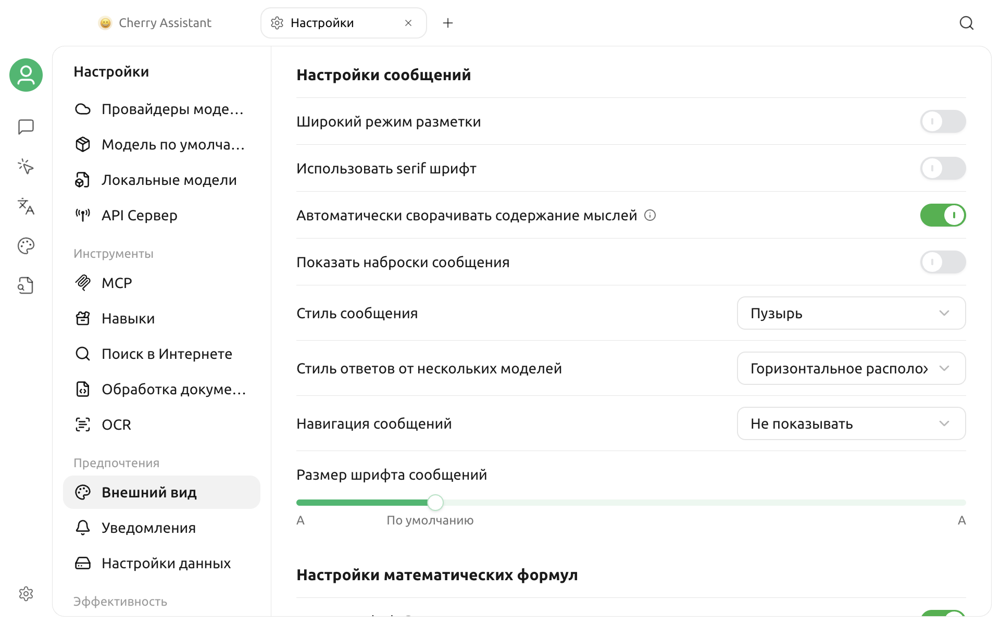

# Настройки внешнего вида

Откройте **Настройки > Внешний вид**. На странице находятся разделы отображения и языка, шрифтов, ввода, сообщений, математических формул, отображения и выполнения кода, а также пользовательского CSS. Здесь описаны тема, масштаб, шрифты, отображение сообщений и математических формул.

## Тема и цвет темы

### Выбор темы

**Тема** предлагает три режима:

| Режим | Эффект |
| --- | --- |
| Светлая | Всегда использовать светлый интерфейс |
| Тёмная | Всегда использовать тёмный интерфейс |
| Системная | Следовать текущей светлой или тёмной теме операционной системы |

Выбор немедленно обновит интерфейс приложения. При использовании **Системной** темы Cherry Studio также будет меняться в соответствии с изменением внешнего вида операционной системы.

### Настройка цвета темы

**Цвет темы** влияет на основные кнопки, состояние выделения и акцентные элементы. Вы можете:

- Выбрать из предустановленных цветов: зелёный, красный, янтарный, синий или фиолетовый.
- Нажать на селектор цвета, чтобы выбрать другой цвет.
- Ввести шестнадцатеричный код в поле ввода, например `#3B82F6`.

Поддерживаются форматы `#RGB` и `#RRGGBB`. При сохранении значение преобразуется в полный шестизначный код в верхнем регистре. Недопустимый цвет не применяется.

Цвет темы по умолчанию — `#00B96B`.


Цвет темы не заменяет полноценную пользовательскую тему. Для изменения других стилей интерфейса используйте [Пользовательский CSS](../../../personalization-settings/css.md) и сохраните исходные стили перед редактированием.


## Опции окна, специфичные для платформы

Некоторые опции отображения доступны только в соответствующей системе:

- **macOS: Прозрачное окно** — переключает прозрачный и непрозрачный стили окна.
- **Linux: Использовать системную строку заголовка** — переключает на системную строку заголовка; после подтверждения приложение перезапустится.

В Windows эти две опции не отображаются. Эффект прозрачности или строки заголовка может зависеть от среды рабочего стола, темы системы и конфигурации видеокарты.

## Масштаб интерфейса

В области **Масштаб** отображается текущее значение:

- Нажмите `-` для уменьшения масштаба.
- Нажмите `+` для увеличения масштаба.
- Нажмите значок сброса, чтобы восстановить масштаб по умолчанию.

Каждая корректировка производится шагом в 10%. Масштаб одновременно влияет на текст, иконки и элементы управления интерфейсом, что не эквивалентно отдельной настройке размера шрифта сообщений чата.

Также можно использовать следующие сочетания клавиш по умолчанию:

| Действие | macOS | Windows / Linux |
| --- | --- | --- |
| Увеличить | `⌘ + =` | `Ctrl + =` |
| Уменьшить | `⌘ + -` | `Ctrl + -` |
| Сброс | `⌘ + 0` | `Ctrl + 0` |

Текущее состояние сочетаний проверяйте в разделе **Настройки > Сочетания клавиш**. Подробнее см. [Настройки сочетаний клавиш](key-shortcut.md).

## Настройка шрифтов

### Глобальный шрифт

**Глобальный шрифт** влияет на обычный текст интерфейса приложения. Селектор считывает доступные системные шрифты и отображает их предварительный просмотр в списке.

Если название шрифта не отображается:

1. Убедитесь, что шрифт установлен в операционной системе.
2. Закройте и снова откройте Cherry Studio, чтобы приложение повторно загрузило список шрифтов.
3. Повторите поиск в селекторе шрифтов.

Нажатие на значок сброса справа восстановит шрифт по умолчанию.

### Шрифт кода

**Шрифт кода** используется для кода и областей, где требуется моноширинное отображение. Выбирайте моноширинный шрифт с символами нужного языка, цифрами и распространёнными знаками, чтобы избежать смещения строк и отсутствующих символов.

Глобальный шрифт и шрифт кода независимы друг от друга; сброс одного не повлияет на другой.


Размер шрифта в сообщениях чата относится к настройкам отображения сообщений и не регулируется здесь отдельно. Используйте масштабирование для общего увеличения или уменьшения интерфейса; используйте глобальный шрифт или шрифт кода, если хотите изменить только стиль шрифта.


## Настройки сообщений

Настройки сообщений управляют компоновкой и чтением содержимого диалога:

- **Широкий режим разметки:** увеличивает доступную ширину сообщения;
- **Использовать шрифт с засечками:** меняет только стиль текста сообщений;
- **Автоматически сворачивать содержание мыслей:** по умолчанию сворачивает рассуждения модели;
- **Показывать наброски сообщений:** добавляет навигацию по структуре длинного диалога;
- **Стиль сообщения:** переключает пузырьковый и другие варианты отображения;
- **Стиль ответов от нескольких моделей:** выбирает свёрнутый, вертикальный, горизонтальный или сеточный вид;
- **Навигация сообщений:** использует отсутствие навигации, кнопки или якоря;
- **Размер шрифта сообщений:** меняет размер текста сообщений без масштабирования всего интерфейса.

Размер шрифта сообщений настраивается в диапазоне 12–22; значение по умолчанию — 14.

## Настройки математических формул

**Включить `$...$`** определяет, будет ли содержимое в одиночных знаках доллара отображаться как встроенная математическая формула. По умолчанию параметр включён. Если сумма в обычном тексте ошибочно отображается как формула, отключите параметр и проверьте сообщение снова.

## Часто задаваемые вопросы

### Тема не меняется сразу после выбора «Системная»

Сначала убедитесь, что операционная система действительно переключилась на другую тему, и проверьте, выбран ли в Cherry Studio режим **Системная**. Если среда рабочего стола неправильно передаёт событие смены системной темы, откройте приложение заново и повторите проверку.

### В списке шрифтов отсутствует только что установленный шрифт

Cherry Studio считывает системные шрифты при входе в настройки. После установки шрифта перезапустите приложение и откройте раздел **Настройки > Внешний вид**.

### Пользовательский CSS вызывает ошибки отображения

Перейдите в **Настройки > Внешний вид > Пользовательский CSS**, временно очистите соответствующие стили и проверьте, восстановилось ли отображение. Селекторы пользовательского CSS могут меняться между версиями, поэтому не следует полагаться на слишком глубокую внутреннюю структуру DOM.

Если проблема сохраняется, отправьте сведения об операционной системе, версии Cherry Studio, значениях настроек отображения и полный скриншот интерфейса через раздел [Обратная связь и предложения](../../../question-contact/suggestions.md).
