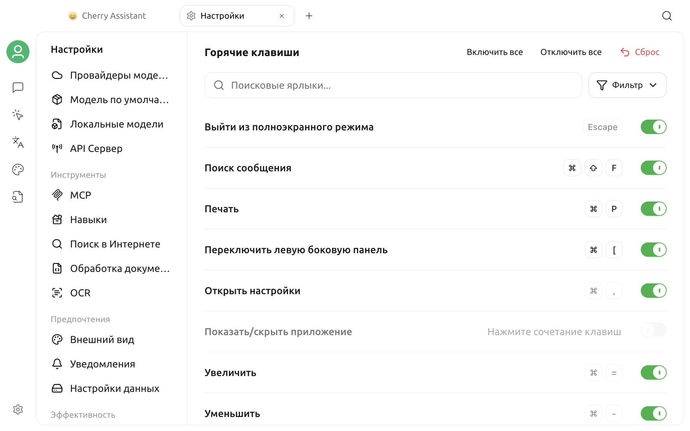

# Настройки сочетаний клавиш

Настройки сочетаний клавиш централизованно управляют клавиатурными операциями в Cherry Studio. Здесь вы можете просмотреть текущие привязки, изменить редактируемые комбинации клавиш, временно отключить какую-либо функцию или сбросить конфигурацию к значениям по умолчанию.


В этом документе `Cmd/Ctrl` означает `Command (⌘)` в macOS и `Ctrl` в Windows и Linux. В интерфейсе отображается клавиша, соответствующая текущей операционной системе.


## Открытие настроек сочетаний клавиш

Перейдите в **Настройки > Горячие клавиши**.

Все сочетания отображаются в одном списке. Нажмите **Фильтр** справа от поиска, чтобы показать все элементы или одну из четырёх категорий:

| Фильтр | Входящие действия |
| --- | --- |
| Глобальное и Окно | Показать или скрыть приложение, открыть настройки, выйти из полноэкранного режима, печать, масштабирование и глобальный поиск |
| Взаимодействие с сообщениями | Поиск, копирование и редактирование сообщений, выбор модели |
| Разговор и темы | Переключение левой и правой панелей, создание и переименование тем |
| Инструменты ИИ-ассистента | Глобальные сочетания для Быстрого помощника и Помощника выбора |

Соответствующее сочетание не отображается, если функция отключена. Элементы Быстрого помощника и Помощника выбора появляются в категории **Инструменты ИИ-ассистента** после включения соответствующей функции.

Поисковая строка дополнительно фильтрует текущую категорию по названию действия или отображаемой комбинации клавиш.

## Изменение сочетаний клавиш

### Настройка или замена сочетания

1. Найдите целевое действие.
2. Нажмите на область клавиш справа; если сочетание не назначено, нажмите **Нажмите сочетание клавиш**.
3. Просто нажмите новую комбинацию клавиш.
4. После проверки комбинация сохраняется и активируется немедленно.

Во время редактирования нажмите `Esc`, чтобы отменить ввод. Допустимое сочетание обычно включает клавишу-модификатор и обычную клавишу, например `Cmd/Ctrl + Shift + M`. `Esc` и клавиши от `F1` до `F12` можно назначить отдельно.

Некоторые системные сочетания клавиш нельзя изменить, например, для открытия настроек, выхода из полноэкранного режима или масштабирования интерфейса. Они все равно будут отображаться в списке, но область клавиш будет неактивна.

### Включение или отключение

Справа от каждого сочетания клавиш есть независимый переключатель:

- Выключение переключателя сохранит назначение клавиши, но действие перестанет реагировать на нажатие.
- После повторного включения сохранится прежнее назначение.
- Для элементов без назначенного сочетания клавиш нельзя просто включить; сначала необходимо настроить комбинацию.

**Включить все** и **Отключить все** применяются только к уже назначенным сочетаниям в текущих результатах фильтра и поиска. Элементы без назначенного сочетания не изменяются.

### Обработка конфликтов

Cherry Studio проверяет два типа конфликтов:

- **Повтор внутри приложения:** Если новое сочетание клавиш уже занято другим активным действием Cherry Studio, в интерфейсе будет отображено название конфликтующего действия, и сохранение будет отклонено.
- **Занято системой или другим приложением:** Если операционная система не может зарегистрировать это сочетание клавиш, в интерфейсе появится красное уведомление: «Это сочетание клавиш занято системой или другим приложением».

При конфликте назначьте одному из действий другое сочетание клавиш. Регистрации могут мешать зарезервированные системные клавиши, сочетания методов ввода, сочетания оконного менеджера и глобальные сочетания других постоянно работающих приложений.

## Текущие сочетания клавиш по умолчанию

Ниже представлена таблица с текущими значениями по умолчанию для Cherry Studio V2. Фактические привязки после обновления могут сохранить ваши предыдущие пользовательские настройки; пожалуйста, руководствуйтесь тем, что отображается в приложении.

### Глобальное и Окно

| Действие | Сочетание клавиш по умолчанию | Статус по умолчанию | Описание |
| --- | --- | --- | --- |
| Выход из полноэкранного режима | `Esc` | Включено | Выходит из полноэкранного режима. |
| Поиск сообщений | `Cmd/Ctrl + Shift + F` | Включено | Открывает глобальный поиск сообщений. |
| Печать | `Cmd/Ctrl + P` | Включено | Печатает текущую страницу. |
| Открыть настройки | `Cmd/Ctrl + ,` | Включено | Открывает окно настроек. |
| Показать / скрыть приложение | Не назначено | Отключено | После настройки можно показывать или скрывать Cherry Studio, когда активным является другое приложение. |
| Увеличить интерфейс | `Cmd/Ctrl + =` | Включено | Увеличивает масштаб интерфейса; также можно использовать цифровую клавиатуру `+`. |
| Уменьшить интерфейс | `Cmd/Ctrl + -` | Включено | Уменьшает масштаб интерфейса; также можно использовать цифровую клавиатуру `-`. |
| Сбросить масштаб | `Cmd/Ctrl + 0` | Включено | Восстанавливает стандартный масштаб. |

### Взаимодействие с сообщениями

| Действие | Сочетание клавиш по умолчанию | Статус по умолчанию | Описание |
| --- | --- | --- | --- |
| Копировать последнее сообщение | `Cmd/Ctrl + Shift + C` | Отключено | Копирует текст последнего сообщения в текущей теме. |
| Редактировать последнее сообщение пользователя | `Cmd/Ctrl + Shift + E` | Отключено | Открывает режим редактирования последнего сообщения пользователя. |
| Поиск сообщений в текущем диалоге | `Cmd/Ctrl + F` | Включено | Ищет сообщения в текущей теме. |
| Выбрать модель | `Cmd/Ctrl + Shift + M` | Включено | Открывает селектор моделей диалога для текущего помощника. |

### Разговор и темы

| Действие | Сочетание клавиш по умолчанию | Статус по умолчанию | Описание |
| --- | --- | --- | --- |
| Переключить левую панель | `Cmd/Ctrl + [` | Включено | Показывает, скрывает или переводит фокус на панель помощника. |
| Создать новую тему | `Cmd/Ctrl + N` | Включено | Создает новую независимую тему в текущем помощнике. |
| Переименовать тему | `Cmd/Ctrl + T` | Отключено | Изменяет название текущей темы. |
| Переключить правую панель | `Cmd/Ctrl + ]` | Включено | Показывает, скрывает или переводит фокус на список тем. |

### Инструменты ИИ-ассистента

| Действие | Сочетание клавиш по умолчанию | Статус по умолчанию | Условие использования |
| --- | --- | --- | --- |
| Быстрый помощник | `Cmd/Ctrl + E` | Отключено | Сначала включите функцию в настройках Быстрого помощника. |
| Включить / выключить Помощник выбора | Не назначено | Отключено | Сначала включите функцию «Помощник выбора». |
| Помощник выбора: получить текст | Не назначено | Отключено | Сначала включите функцию «Помощник выбора». |

Быстрый помощник, Помощник выбора и «Показать / скрыть приложение» являются глобальными сочетаниями клавиш: после привязки и включения они будут реагировать даже если окно Cherry Studio не в фокусе. Большинство других сочетаний клавиш для диалогов и окон действуют только тогда, когда окно Cherry Studio активно.

Настройка самих функций описана в разделах [Быстрый помощник](../kuai-jie-zhu-shou.md) и [Помощник выбора](../selection-assistant.md).

## Сброс настроек по умолчанию

Рядом с изменённым редактируемым сочетанием появится значок восстановления. Нажатие вернёт только этому действию сочетание и состояние включения по умолчанию.

Нажатие **Сбросить** в верхней части страницы и подтверждение приведет к восстановлению настроек по умолчанию для всех сочетаний клавиш. Эта операция перезапишет любые пользовательские привязки, которые вы установили для сочетаний клавиш.

## Часто задаваемые вопросы

### Сочетание клавиш не срабатывает

Проверьте следующее по порядку:

1. Назначено ли сочетание соответствующему действию и включено ли оно.
2. Включена ли соответствующая функция, например Быстрый помощник или Помощник выбора.
3. При активации сочетания клавиш для диалогов находится ли окно Cherry Studio в фокусе.
4. Появляется ли красное уведомление о занятости системы или другого приложения.
5. Не использует ли операционная система, метод ввода или другое постоянно работающее приложение то же сочетание клавиш.

Если после изменений действие по-прежнему не срабатывает, назначьте для проверки редкое сочетание клавиш, а затем попробуйте перезапустить Cherry Studio.

### Почему я не вижу сочетание клавиш для Помощника выбора?

Сочетания клавиш Помощника выбора отображаются только после включения функции. Включите её в разделе **Настройки > Помощник выбора**, затем вернитесь к горячим клавишам.

### Почему «Включить все» не активирует некоторые действия?

Пакетная операция затрагивает только действия с уже назначенными сочетаниями в текущих результатах фильтра и поиска. Для элементов с надписью «Нажмите сочетание клавиш» сначала назначьте комбинацию вручную.

### Как быстро вернуться к настройкам по умолчанию?

Если вы изменили только одну настройку, используйте значок восстановления рядом с этой настройкой; если конфигурация нескольких элементов запутана, используйте кнопку **Сбросить** в верхней части страницы.

Если проблема не устраняется, отправьте версию операционной системы, версию Cherry Studio, конфликтующее сочетание и шаги воспроизведения через раздел [Обратная связь и предложения](../../../question-contact/suggestions.md).
