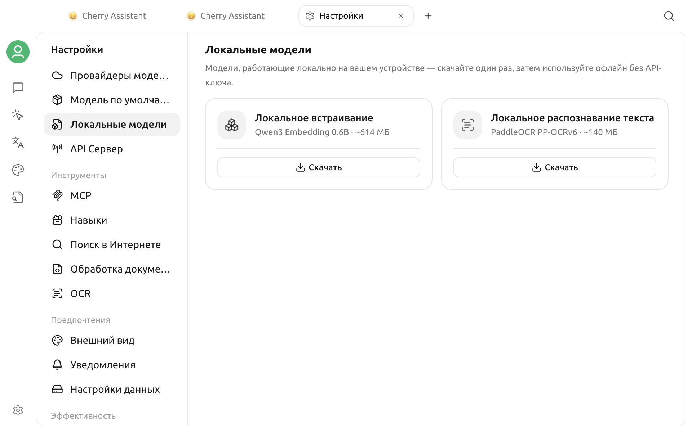

# Локальные модели

Локальные модели работают на вашем устройстве. После загрузки их можно использовать офлайн без API-ключа, однако для первой загрузки требуется подключение к Интернету.

## Как открыть локальные модели

Откройте **Настройки > Локальные модели**. На странице находятся две карточки с назначением, приблизительным размером и текущим состоянием каждой модели.

## Доступные модели

| Модель | Указанный размер | Назначение |
| --- | --- | --- |
| **Локальное встраивание** (Qwen3 Embedding 0.6B) | около 614 МБ | Создание текстовых эмбеддингов для содержимого базы знаний |
| **Локальное распознавание текста** (PaddleOCR PP-OCRv6) | около 140 МБ | Распознавание текста на изображениях |

Локальная OCR-модель обрабатывает только изображения. Она не используется для преобразования документов в Markdown.

## Загрузка и управление

1. Нажмите **Скачать** на карточке нужной модели.
2. Следите за индикатором и процентом загрузки. Чтобы остановить загрузку, нажмите **Отмена**.
3. После завершения на карточке появится состояние **Готов**.
4. Чтобы удалить ненужную модель, нажмите значок удаления в правом верхнем углу её карточки.

На карточке указан приблизительный размер модели. При первой загрузке локальной модели Cherry Studio также может загрузить среду выполнения, общую для обеих моделей, поэтому фактический объём загрузки и занимаемое место могут быть немного больше.

## Ограничения удаления и автоматическое поведение

- После загрузки локальная модель эмбеддингов становится доступна для баз знаний. Если она готова до создания новой базы знаний, новая база использует её по умолчанию.
- Cherry Studio не удаляет локальную модель эмбеддингов, пока её использует хотя бы одна база знаний. Сначала выберите другую модель эмбеддингов в соответствующих базах, затем повторите удаление.
- После загрузки локальная OCR-модель становится обработчиком изображений по умолчанию, только если вы явно не выбрали другой обработчик. После её удаления восстанавливается обработчик платформы по умолчанию.

## Ограничение платформы

Локальные модели не поддерживаются на компьютерах Mac с процессором Intel. На странице появится сообщение **Локальные модели не поддерживаются на этой платформе**, а карточки загрузки будут скрыты.

## Устранение неполадок

### Не удаётся загрузить модель

Проверьте подключение к Интернету и снова нажмите **Скачать**. Неудачная или отменённая загрузка не сохраняется как готовая модель.

### Локальная модель эмбеддингов остаётся после удаления

Эту модель всё ещё использует хотя бы одна база знаний. Измените модель эмбеддингов, затем вернитесь на эту страницу и повторите удаление.

### Не удаётся удалить модель

Откройте эту страницу заново и повторите попытку. Если ошибка сохраняется, проверьте журнал приложения.
