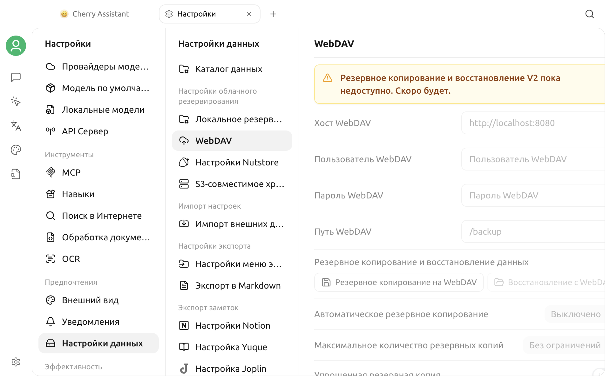

# Резервное копирование WebDAV

Страницу WebDAV можно открыть через **Настройки > Настройки данных > WebDAV**, но в текущей версии отображается сообщение **«Резервное копирование и восстановление V2 пока недоступно. Скоро будет.»**


В текущей версии с этой страницы нельзя создавать, восстанавливать или автоматически управлять резервными копиями WebDAV. Наличие элементов настройки не означает, что функция уже доступна.


## Что сейчас отображается на странице

На странице зарезервированы элементы для:

- хоста, пользователя, пароля и пути WebDAV;
- резервного копирования в WebDAV и восстановления из WebDAV;
- интервала автоматического копирования и максимального числа копий;
- упрощённой резервной копии.

Эти поля, кнопки и переключатели сейчас недоступны. Открытие страницы не устанавливает соединение WebDAV и не позволяет проверить адрес сервера или учётные данные.

## Рекомендации

- Не вводите здесь реальные учётные данные WebDAV и не полагайтесь на эту страницу для защиты важных данных.
- Не выполняйте операции резервного копирования, восстановления или автоматического копирования по инструкциям для старого интерфейса.
- После включения функции в одном из следующих выпусков ориентируйтесь на активное состояние элементов в приложении, примечания к выпуску и последнюю версию этой страницы.
