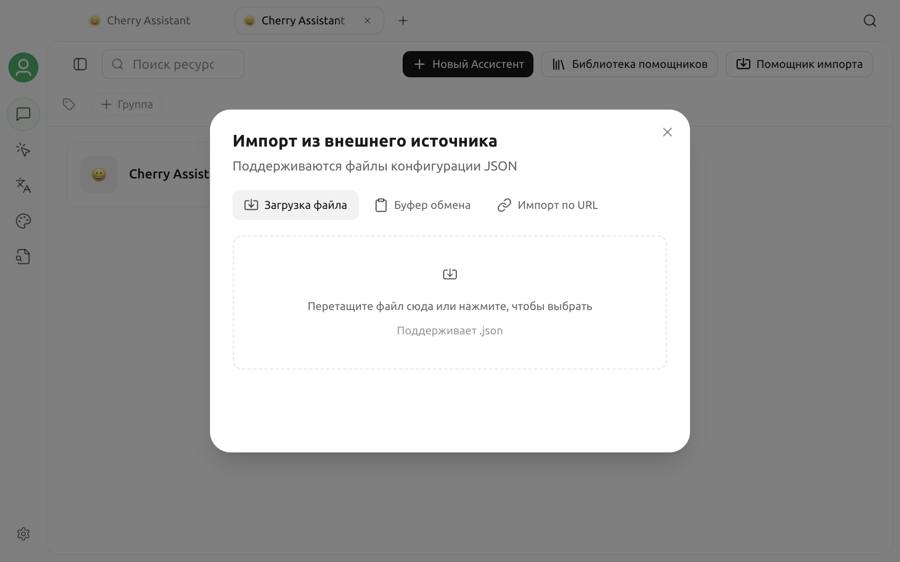

# Подписки на ассистентов и импорт


В Cherry Studio V2 Community Edition больше нет постоянных подписок на ассистентов и автоматического обновления удалённых шаблонов. URL подписки из старых руководств не синхронизируются. Доступная сейчас замена — однократное действие **Помощник импорта**.


При импорте ассистенты из JSON копируются в локальный список. Последующие изменения удалённого JSON не обновляют уже импортированных ассистентов.

## Открытие импорта ассистента

1. Откройте **Чат** на боковой панели или в запуске.
2. Откройте дополнительное меню списка ассистентов и тем, затем выберите **Управление помощниками**.
3. В верхней части страницы управления нажмите **Помощник импорта**.
4. В окне **Импорт из внешнего источника** выберите способ:
   - **Загрузка файла:** выберите локальный файл `.json`;
   - **Буфер обмена:** вставьте JSON;
   - **Импорт по URL:** загрузите JSON по поддерживаемому raw-URL GitHub или Gist.



Импорт по URL выполняет однократную загрузку и не сохраняет подписку. Сейчас принимаются только HTTP(S)-адреса на `raw.githubusercontent.com` и `gist.githubusercontent.com`. Страница предварительного просмотра файла GitHub, обычная страница Gist или URL произвольного сайта будут отклонены.

## Формат JSON

Можно импортировать один объект или массив объектов. Для каждого ассистента обязательны как минимум `name` и `prompt`:

```json
{
  "name": "Ассистент для проверки документации",
  "emoji": "📝",
  "description": "Проверяет структуру, терминологию и применимость инструкций",
  "prompt": "Проверь документацию продукта и предложи конкретные, выполнимые улучшения.",
  "group": ["Документация"]
}
```

Поля `emoji`, `description` и `group` необязательны. Если в импортируемых данных нет информации о модели, Cherry Studio использует текущую модель чата по умолчанию. Файл, содержимое буфера обмена или ответ URL не должны превышать 5 МБ.

## Обновление импортированного ассистента

После изменения удалённого содержимого выполните импорт снова. Повторный импорт не привязывает локального ассистента к удалённому источнику и может создать дополнительную локальную копию. После импорта проверьте имя, группу и промпт на странице управления ассистентами и при необходимости удалите прежнюю копию.

Для распространения шаблонов в команде храните версионируемый JSON-файл и указывайте версию в имени файла или описании ассистента. Не полагайтесь на прежнее поведение подписок.

## Безопасность

- Импортируйте только из доверенных источников и заранее прочитайте промпт полностью.
- Не помещайте API-ключи, Token, внутренние адреса или персональные данные в JSON ассистента.
- После импорта проверьте модель по умолчанию, базу знаний, инструменты и настройки MCP, прежде чем обрабатывать конфиденциальные данные.
- Если импорт по URL не работает, убедитесь, что используется URL raw-содержимого, ответ содержит JSON и размер не превышает ограничение.

Создание и управление ассистентами описано в разделе [«Библиотека ассистентов»](../cherrystudio/preview/agents.md). Если импорт по-прежнему не работает, отправьте через [«Отзывы и предложения»](../question-contact/suggestions.md) версию Cherry Studio, способ импорта, пример со скрытыми конфиденциальными данными и сообщение об ошибке.
