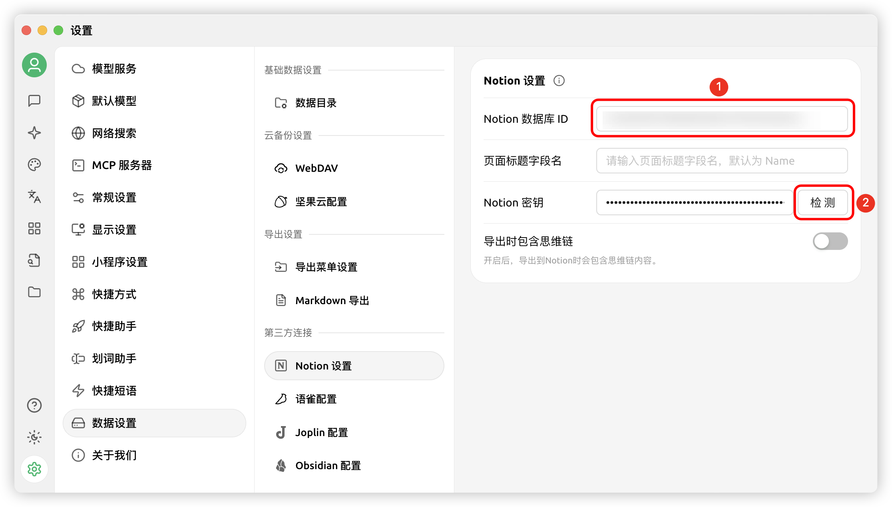


Этот документ переведен с китайского языка с помощью ИИ и еще не был проверен.


# Руководство по настройке Notion

Cherry Studio поддерживает импорт тем в базу данных Notion.

## Шаг 1

Откройте сайт [Notion Integrations](https://www.notion.so/profile/integrations) и создайте интеграцию

<figure><figcaption>
Нажмите "+" для создания приложения
</figcaption></figure>

## Шаг 2

Создайте интеграцию

<figure><figcaption>
Заполните информацию о приложении
</figcaption></figure>

Имя: Cherry Studio  
Тип: выберите первый вариант  
Иконка: можете сохранить это изображение

<figure><figcaption></figcaption></figure>

## Шаг 3

Скопируйте секретный ключ и вставьте в настройки Cherry Studio

<figure><figcaption>
Нажмите "Скопировать секретный ключ"
</figcaption></figure>

<figure><figcaption>
Вставьте ключ в настройки данных
</figcaption></figure>

## Шаг 4

Откройте сайт [Notion](https://www.notion.so/), создайте новую страницу, выберите тип базы данных, назовите её Cherry Studio и подключите как показано

<figure><figcaption>
Создайте новую страницу и выберите тип базы данных
</figcaption></figure>

<figure><figcaption>
Введите имя страницы и выберите "Подключить интеграцию"
</figcaption></figure>

## Шаг 5

<figure><figcaption>
Скопируйте ID базы данных
</figcaption></figure>

Если URL вашей базы данных Notion выглядит так:

https://www.notion.so/\<long\_hash\_1>?v=\<long\_hash\_2>

Тогда ID базы данных Notion - это часть `<long_hash_1>`

<figure><figcaption>
Вставьте ID базы данных и нажмите "Проверить"
</figcaption></figure>

## Шаг 6

Введите `Имя поля заголовка страницы`:

Если ваш интерфейс на английском: введите `Name`  
Если ваш интерфейс на китайском: введите `名称`

<figure><figcaption>
Введите имя поля заголовка страницы
</figcaption></figure>

## Шаг 7

Поздравляем! Настройка Notion завершена ✅ Теперь вы можете экспортировать содержимое Cherry Studio в свою базу данных Notion

<figure><figcaption>
Экспортировать в Notion
</figcaption></figure>

<figure><figcaption>
Просмотреть результат
</figcaption></figure>