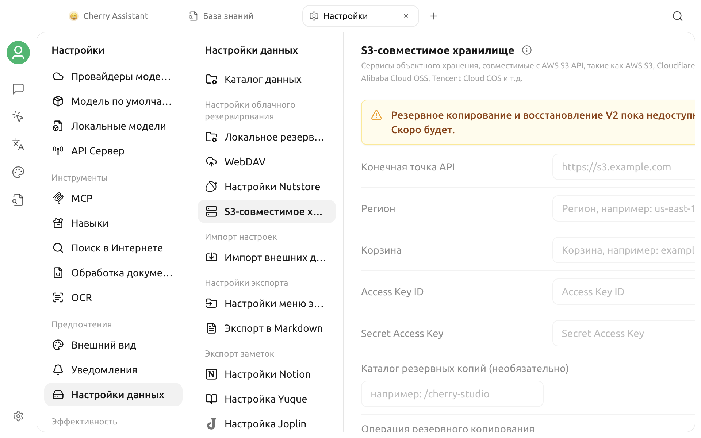

# Резервное копирование в S3-совместимое хранилище

В текущей версии можно открыть **Настройки > Данные > S3-хранилище**, однако на странице явно указано, что **Backup & Restore V2 пока недоступно**.


В текущей версии на этой странице нельзя создавать, восстанавливать или автоматически управлять резервными копиями S3. Наличие полей настройки не означает, что функция уже работает.


## Что сейчас отображается на странице

На странице предусмотрены:

- API endpoint, регион и бакет;
- Access Key ID и Secret Access Key;
- необязательный каталог резервных копий;
- действия **Создать копию сейчас** и **Управление копиями**;
- автоматическая синхронизация, максимальное число копий и облегчённая копия.

Сейчас эти поля, кнопки и переключатели отключены. Открытие страницы не устанавливает соединение с S3 и не позволяет проверить endpoint, бакет или учётные данные.

## Рекомендации

- Не вводите реальные учётные данные объектного хранилища и не полагайтесь на эту страницу для защиты важных данных.
- Не выполняйте резервное копирование, восстановление, автоматическую синхронизацию или очистку копий по старым инструкциям.
- Эта недоступная страница не читает, не изменяет и не удаляет файлы, уже находящиеся в объектном хранилище.
- После появления функции ориентируйтесь на активные элементы приложения, примечания к выпуску и актуальную версию этой страницы.
